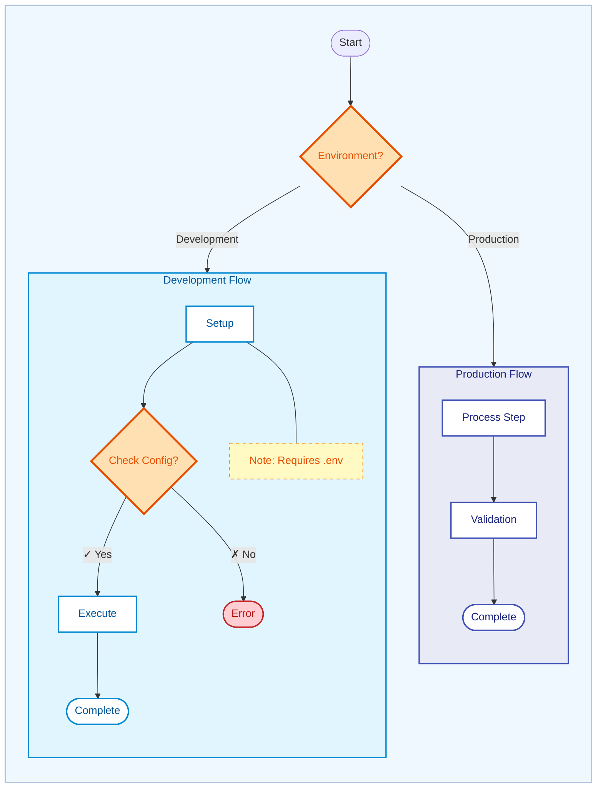

# Diagram Accessibility & WCAG Compliance

> WCAG 2.1 Level AA standards for Mermaid diagrams. Load this skill when creating or reviewing diagrams.

## Color Palette (Material Design, WCAG AA)

| Purpose | Background | Border | Text | Contrast | Use Case |
|---------|------------|--------|------|----------|----------|
| **Production** | `#E8EAF6` | `#3F51B5` | `#1A237E` | 12.6:1 | Production, critical paths |
| **Development** | `#E1F5FE` | `#0288D1` | `#01579B` | 10.8:1 | Dev flows, active processes |
| **Testing** | `#E8F5E9` | `#43A047` | `#1B5E20` | 11.2:1 | Testing, validation |
| **Error/Warning** | `#FFCDD2` | `#C62828` | `#B71C1C` | 9.4:1 | Error states, warnings |
| **Decision** | `#FFE0B2` | `#E65100` | `#E65100` | 8.7:1 | Decision nodes, branching |
| **Info** | `#E0F7FA` | `#00ACC1` | `#006064` | 10.2:1 | Informational content |
| **Notes** | `#FFF9C4` | `#F57C00` | `#E65100` | 8.7:1 | Supplementary details |

**Contrast minimums**: Normal text 4.5:1, Large text 3:1, UI components 3:1. Aim for 7:1+.

---

## Styling Rules

1. **Quote all labels**: `id["Label"]` not `id[Label]`
2. **Multiple visual cues**: Shape + color + text + borders (never color alone)
3. **Stroke width**: 2px standard, 3px for decision diamonds
4. **Decision paths**: Use `|✓ Yes|` and `|✗ No|` symbols
5. **Subgraph styling**: Use direct `style SUBGRAPH_ID fill:...` (not `classDef`)
6. **White nodes**: Force `fill:#FFFFFF` inside colored subgraphs (except Notes)
7. **Nested subgraphs**: Lighter backgrounds, thinner borders (1px) for children
8. **Note nodes**: Dashed borders (`stroke-dasharray: 5 5`), amber text
9. **Outer container**: Wrap complex diagrams in pastel container (`fill:#F0F8FF`)
10. **Comments**: Always comment styling sections for maintainability

---

## Template

---

## Anti-Patterns

❌ Low contrast colors (`#f9f`, `#bdf`), color-only indicators, unquoted labels, default Mermaid colors, pale yellow for decisions, `classDef` for subgraphs, plain "Yes"/"No" without symbols

✅ Material Design palette (8.7:1+), multiple visual cues, quoted labels, explicit styling with comments, ✓/✗ symbols, direct `style` for subgraphs, white nodes inside colored subgraphs, 3px decision diamonds

---

## Checklist

- [ ] All text ≥ 4.5:1 contrast
- [ ] Info conveyed via shape + text + borders (not just color)
- [ ] All labels quoted
- [ ] Material Design palette used
- [ ] 2px borders (3px for decisions)
- [ ] Styling sections commented
- [ ] Tested with color blindness simulator ([Coblis](https://www.color-blindness.com/coblis-color-blindness-simulator/))

---
