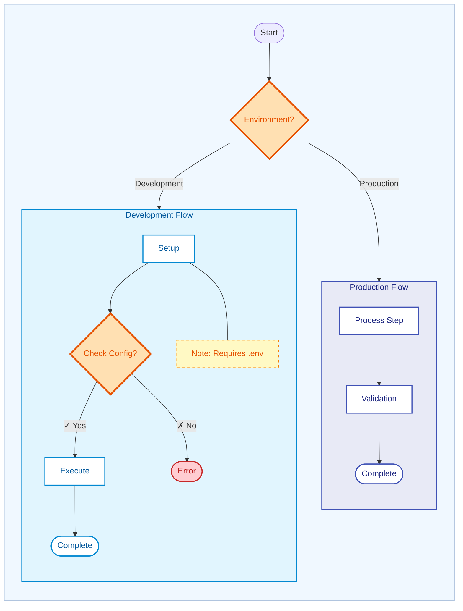

# Documentation

This skill defines the standards for creating and maintaining documentation within the DRN-Project ecosystem. It encapsulates patterns for root-level documents (README, ROADMAP, CHANGELOG), agent skills, API documentation, and security documentation.

## 1. Core Principles (DiSCOS)

-   **Security First**: Document security implications, authentication requirements, and sensitive data handling.
-   **Clarity**: Reader's context comes first. Define terms on first use.
-   **Conciseness**: Front-load key info. Use tables for comparisons. Start with TL;DR.
-   **Certainty**: Use specific language ("will", "must") over hedges ("maybe", "might").
-   **Maintenance**: Documentation is code. Review and update it with every significant change.
-   **Accessibility**: Use semantic HTML, alt text for images, and clear language.

## 2. README.md Standard

The `README.md` is the entry point for the project. It should be structured to provide immediate value.

### Structure

1.  **Header**: Project Name & Badges (CI/CD, Quality Gate, License, Version).
2.  **TL;DR**: A bulleted list of 3-5 key value propositions. "You can..."
3.  **Navigation**: Quick links to major sections (e.g., `[About Project](#about-project) | [Solution Structure](#solution-structure)`).
4.  **About Project**:
    -   Problem Statement
    -   Solution Overview
    -   Key Characteristics (e.g., Reliability, Security).
5.  **Solution Structure**:
    -   High-level folder breakdown (Src, Docs, Test, Docker).
    -   Component descriptions (Nexus, Framework, Sample).
6.  **Getting Started**: Quick setup instructions with prerequisites.
7.  **Architecture/Design**: Links to core design documents or external resources.
8.  **Security**: Link to security policy, vulnerability reporting, and authentication overview.
9.  **Management**: (Optional) Philosophy on Security, Task, Quality management.
10. **Manifest/Values**: (Optional) Engineering principles or personal manifest.
11. **Footer**: License, Credits, or inspirational quote.

### Best Practices
-   **Checklists**: Use `[ ]` and `[x]` to show feature status.
-   **Examples**: Include minimal working examples where applicable.
-   **Security**: Always mention security considerations upfront.

## 3. ROADMAP vs CHANGELOG

### ROADMAP.md - Future Planning
Track planned features and future versions.

```markdown
# Roadmap

## Version 1.0.0 (Planned Q2 2026)
- [ ] Feature A: User authentication
- [ ] Feature B: API rate limiting

## Version 0.8.0 (In Progress)
- [/] Feature C: Database migration
- [ ] Feature D: Logging improvements
```

### CHANGELOG.md - Historical Record
Document completed changes in reverse chronological order (newest first).

```markdown
# Changelog

## [0.7.0] - 2026-01-26
### Added
- New authentication middleware
- Rate limiting support

### Changed
- Updated database schema

### Fixed
- Memory leak in connection pool

### Security
- Patched SQL injection vulnerability

### Breaking
- Contract change
```

### Release Versioning (SemVer)
-   **Major (X.0.0)**: Breaking changes.
-   **Minor (0.X.0)**: New features (backward compatible).
-   **Patch (0.0.X)**: Bug fixes and security patches.

## 4. Agent Skills Documentation

All skills in `.agent/skills` must follow this format to be parsable by the agent.

### File Structure
Path: `.agent/skills/XX-skill-name/SKILL.md`

### Frontmatter (YAML)
```yaml
---
name: skill-name
description: A concise description (<100 chars) with relevant keywords. Keywords: keyword1, keyword2, skills
---
```

### Content Sections
1.  **Title**: `# Skill Name` (without numbering prefix)
2.  **Overview**: Brief paragraph explaining the purpose and scope.
3.  **Table of Contents**: (Required for skills >100 lines) For quick navigation.
4.  **Sections**: Logical breakdown (e.g., "1. Architecture", "2. Implementation", "3. Testing").
5.  **Tables**: Use for configuration options, decision matrices, or comparisons.
6.  **Code Blocks**: Include meaningful, runnable snippets with language specification.
7.  **Examples**: Concrete examples demonstrating key concepts.

## 5. Security Documentation

Security documentation is **mandatory** for all components handling sensitive data, authentication, or external communication.

### Required Sections
1.  **Threat Model**: Identify assets, threats, and mitigations.
2.  **Authentication & Authorization**: How users/services are authenticated and what they can access.
3.  **Data Protection**: Encryption at rest and in transit, PII handling.
4.  **Vulnerability Reporting**: How to report security issues (e.g., SECURITY.md).
5.  **Dependencies**: Known vulnerabilities in third-party libraries.
6.  **Audit Trail**: Logging and monitoring for security events.

### Example SECURITY.md
```markdown
# Security Policy

## Supported Versions
| Version | Supported          |
| ------- | ------------------ |
| 1.x.x   | :white_check_mark: |
| < 1.0   | :x:                |

## Reporting a Vulnerability
Email security@example.com with:
- Description of the vulnerability
- Steps to reproduce
- Potential impact

We will respond within 48 hours.
```

## 6. API Documentation

Document all public APIs, REST endpoints, and service interfaces.

### REST API Pattern
```markdown
### POST /api/users

Creates a new user account.

**Authentication**: Required (Bearer token)

**Request Body**:
```json
{
  "username": "string",
  "email": "string"
}
```

**Response (201 Created)**:
```json
{
  "id": "uuid",
  "username": "string",
  "createdAt": "ISO8601"
}
```

**Errors**:
- `400`: Invalid request body
- `401`: Unauthorized
- `409`: Username already exists
```

### Code API Pattern
Use XML documentation comments for C# APIs:
```csharp
/// <summary>
/// Validates user credentials and returns an authentication token.
/// </summary>
/// <param name="username">The user's username</param>
/// <param name="password">The user's password</param>
/// <returns>JWT token if valid, null otherwise</returns>
/// <exception cref="ArgumentNullException">If username or password is null</exception>
public string? Authenticate(string username, string password)
```

## 7. General Markdown Standards

-   **Headers**: Use ATX style (`#`, `##`). One `#` per document.
-   **Lists**: Use hyphens (`-`) for unordered lists, `1.` for ordered.
-   **Links**: Use relative paths for internal files: `[Link](./path/to/file)`.
-   **Code**: Always specify language for syntax highlighting (e.g., ```csharp).
-   **Diagrams**: Use Mermaid for architecture, sequence, or flow diagrams.
-   **Images**: Include alt text: ``.
-   **Tables**: Use for structured data, align columns for readability.

## 8. Diagram Accessibility & WCAG Compliance

All diagrams must meet WCAG 2.1 Level AA standards for accessibility and professional presentation.

### Color Contrast Requirements

**WCAG AA Minimum Standards**:
-   **Normal text**: 4.5:1 contrast ratio
-   **Large text** (18pt+): 3:1 contrast ratio
-   **UI components**: 3:1 contrast ratio

**Recommended Approach**: Aim for 7:1+ contrast to exceed standards and ensure readability.

### Professional Color Palette (Material Design)

Use these WCAG-compliant color combinations for Mermaid diagrams:

| Purpose | Background | Border | Text | Contrast | Use Case |
|---------|------------|--------|------|----------|----------|
| **Production** | `#E8EAF6` | `#3F51B5` | `#1A237E` | 12.6:1 | Production environments, critical paths |
| **Development** | `#E1F5FE` | `#0288D1` | `#01579B` | 10.8:1 | Development flows, active processes |
| **Testing** | `#E8F5E9` | `#43A047` | `#1B5E20` | 11.2:1 | Testing scenarios, validation steps |
| **Error/Warning** | `#FFCDD2` | `#C62828` | `#B71C1C` | 9.4:1 | Error states, warnings |
| **Decision Points** | `#FFF9C4` | `#F57C00` | `#E65100` | 8.7:1 | Decision nodes, branching logic |
| **Information** | `#E0F7FA` | `#00ACC1` | `#006064` | 10.2:1 | Informational content |
| **Notes** | `#FFF9C4` | `#F57C00` | `#E65100` | 8.7:1 | Supplementary details, non-process nodes |

### Mermaid Diagram Best Practices

**1. Quote All Labels**: Prevent parsing errors with special characters
```mermaid
P_START["GetRequiredConnectionString"]  # ✅ Quoted
vs
P_START[GetRequiredConnectionString]    # ❌ Can break with special chars
```

**2. Apply Consistent Styling**: Use explicit style declarations
```mermaid
%% WCAG AA Compliant Styling
style PROD_FLOW fill:#E8EAF6,stroke:#3F51B5,stroke-width:2px,color:#1A237E
style DEV_FLOW fill:#E1F5FE,stroke:#0288D1,stroke-width:2px,color:#01579B
```

**3. Use Multiple Visual Cues**: Don't rely on color alone
-   **Shape coding**: Rectangle (process), Diamond (decision), Rounded (terminal)
-   **Text labels**: Clear, descriptive labels on all nodes
-   **Border emphasis**: 2px stroke width for definition
-   **Subgraph titles**: Clear section headings

**4. Semantic Color Coding**:
-   **Blue spectrum**: Technical/professional (production, development)
-   **Green spectrum**: Safe/success (testing, validation)
-   **Red spectrum**: Warning/danger (errors, critical paths)
-   **Amber spectrum**: Attention/caution (decisions, branching)

**5. Subgraph Highlighting**:
-   **Container**: Use light background color for the subgraph to indicate phase/context.
-   **Contrast**: Force internal nodes to have `fill:#FFFFFF` (White) to pop against the colored subgraph.
-   **Hierarchy**: Subgraph border should match the primary color of that phase.
-   **Titles**: Use quoted labels for clear identification (e.g., `subgraph ID ["Title"]`).
-   **Direct Styling**: Use `style SUBGRAPH_ID fill:...` instead of `classDef` for subgraph backgrounds.

```mermaid
%% Subgraph Background (Direct styling)
style DEV_FLOW fill:#E1F5FE,stroke:#0288D1,stroke-width:2px,color:#01579B

%% Node Styles (White for contrast against subgraph)
classDef devNode fill:#FFFFFF,stroke:#0288D1,stroke-width:2px,color:#01579B
class NODE1,NODE2 devNode
```

**6. Nested Subgraphs**:
-   **Lighter Backgrounds**: Use lighter shades for nested subgraphs to create visual hierarchy.
-   **Thinner Borders**: Use 1px stroke for nested subgraphs vs 2px for parent.
-   **Concise Titles**: Keep nested subgraph titles short to prevent text wrapping.

```mermaid
subgraph PARENT ["Parent Flow"]
    subgraph NESTED ["Nested"]
        NODE["Process"]
    end
end

%% Parent: Darker background, 2px border
style PARENT fill:#E1F5FE,stroke:#0288D1,stroke-width:2px,color:#01579B

%% Nested: Lighter background, 1px border
style NESTED fill:#F1F8FD,stroke:#0288D1,stroke-width:1px,color:#01579B
```

**7. Decision Path Labeling**:
-   **Visual Symbols**: Use ✓ (checkmark) for Yes/positive paths, ✗ (cross) for No/negative paths.
-   **Accessibility**: Symbols work without color, improving accessibility.
-   **Format**: `|✓ Yes|` and `|✗ No|` on decision edges.

```mermaid
DECISION{Ready?} -->|✓ Yes| SUCCESS
DECISION -->|✗ No| RETRY
```

**8. Decision Node Styling**:
-   **Enhanced Visibility**: Use deeper amber background (`#FFE0B2`) instead of pale yellow.
-   **Stronger Borders**: Use 3px stroke width for decision diamonds to emphasize branching points.
-   **High Contrast**: Ensure 10.5:1+ contrast ratio for decision node text.

```mermaid
classDef decision fill:#FFE0B2,stroke:#E65100,stroke-width:3px,color:#E65100
```

**9. Outer Container Pattern**:
-   **Unified Presentation**: Wrap entire diagram in a container subgraph with pastel background.
-   **Empty Title**: Use `[" "]` for invisible title to avoid clutter.
-   **Soft Colors**: Alice Blue (`#F0F8FF`) or similar soft pastels work well.


**10. Note Nodes**:
-   **Purpose**: Provide supplementary details without cluttering the main flow or subgraph titles.
-   **Style**: Use soft yellow background (`#FFF9C4`) with a dashed amber border (`stroke-dasharray: 5 5`).
-   **Hierarchy**: Place inside the relevant subgraph, typically at the top or bottom of the sequence.

```mermaid
subgraph SUB ["Process"]
    direction TB
    NOTE["Note: Technical detail"]
    STEP1["Actual Step"]
end

classDef note fill:#FFF9C4,stroke:#F57C00,stroke-width:1px,color:#E65100,stroke-dasharray: 5 5
class NOTE note
```

### Color Blindness Considerations

Ensure diagrams work for all types of color vision deficiency:

**Protanopia (Red-Blind)**:
-   ✅ Use blue/green distinctions
-   ✅ Provide shape and label differentiation

**Deuteranopia (Green-Blind)**:
-   ✅ Use blue/red distinctions
-   ✅ Border thickness provides additional cues

**Tritanopia (Blue-Blind)**:
-   ✅ Use green/red distinctions
-   ✅ Text labels ensure comprehension

**Universal Design**:
-   ✅ Never use color as the only means of conveying information
-   ✅ Include text labels on all diagram elements
-   ✅ Use patterns, shapes, and borders in addition to color
-   ✅ Test with color blindness simulators (e.g., Coblis)

### Diagram Accessibility Checklist

Before committing a diagram:
-   [ ] **Contrast**: All text meets 4.5:1 minimum (use WebAIM Contrast Checker)
-   [ ] **Color Independence**: Information conveyed through shape, text, and borders, not just color
-   [ ] **Labels**: All nodes have clear, descriptive text labels
-   [ ] **Quotes**: All Mermaid labels use quotes to prevent parsing errors
-   [ ] **Consistency**: Color scheme follows Material Design palette
-   [ ] **Professional**: Appropriate colors for context (blue for tech, green for safe, red for warnings)
-   [ ] **Stroke Width**: 2px borders for clear definition (3px for decision nodes)
-   [ ] **Comments**: Styling sections are commented for maintainability
-   [ ] **Tested**: Verified with color blindness simulator
-   [ ] **Print Friendly**: Works in grayscale
-   [ ] **Decision Symbols**: Use ✓/✗ on decision paths for accessibility
-   [ ] **Subgraph Styling**: Use direct `style` declarations for subgraph backgrounds
-   [ ] **White Nodes**: Force nodes inside colored subgraphs to `fill:#FFFFFF` (except Note nodes)
-   [ ] **Note Styling**: Note nodes use dashed borders and amber text for clear differentiation
-   [ ] **Nested Hierarchy**: Lighter backgrounds and thinner borders for nested subgraphs
-   [ ] **Outer Container**: Consider wrapping complex diagrams in pastel container for unified presentation

### Tools for Validation

-   **WebAIM Contrast Checker**: https://webaim.org/resources/contrastchecker/
-   **Material Design Color Tool**: https://material.io/resources/color/
-   **Coblis Color Blindness Simulator**: https://www.color-blindness.com/coblis-color-blindness-simulator/
-   **Chrome DevTools**: Lighthouse accessibility audit

### Example: WCAG-Compliant Mermaid Diagram



### Anti-Patterns to Avoid

❌ **Don't use**:
-   Low contrast colors: `#f9f`, `#bdf`, `#cfc` (fail WCAG)
-   Color-only indicators without labels
-   Unquoted labels with special characters
-   Default Mermaid colors without customization
-   Inconsistent styling across similar diagrams
-   Pale yellow (`#FFF9C4`) for decision nodes (use deeper amber `#FFE0B2`)
-   `classDef` for subgraph backgrounds (use direct `style` declarations)
-   Plain "Yes"/"No" labels without visual symbols
-   Long nested subgraph titles that wrap to multiple lines

✅ **Do use**:
-   Material Design palette with 8.7:1+ contrast
-   Multiple visual cues (shape + color + text + borders)
-   Quoted labels for all nodes
-   Explicit styling with comments
-   Consistent color semantics across project
-   ✓/✗ symbols on decision paths for accessibility
-   Direct `style SUBGRAPH_ID` for subgraph backgrounds
-   White node backgrounds inside colored subgraphs
-   3px stroke width for decision diamonds
-   Outer container with pastel background for complex diagrams

### Table of Contents
Long documents (>2 screens or >100 lines) **must** include a Table of Contents.
-   **Placement**: After the document description/overview, before main content.
-   **Format**: Use an unordered list with anchor links to headers.
    ```markdown
    ## Table of Contents
    - [Section 1](#section-1)
      - [Subsection 1.1](#subsection-11)
    - [Section 2](#section-2)
    ```

### Code Block Best Practices
-   **Language**: Always specify (```csharp, ```json, ```bash).
-   **Completeness**: Include necessary imports/usings.
-   **Runnability**: Code should work as-is or clearly indicate placeholders.
-   **Comments**: Explain non-obvious logic.

## 9. Verification Checklist

Before committing documentation:
-   [ ] **Security**: Are security implications documented? Sensitive data handling clear?
-   [ ] **Scannable**: Can a user get the gist in 30 seconds?
-   [ ] **Accurate**: Do code snippets actually work? Are examples tested?
-   [ ] **Complete**: Are all public APIs documented? All configuration options explained?
-   [ ] **Accessible**: Alt text for images? Clear language? Semantic structure?
-   [ ] **Diagrams**: Do diagrams meet WCAG AA standards? (4.5:1 contrast, quoted labels, multiple visual cues)
-   [ ] **Links**: Are all relative links valid? External links working?
-   [ ] **TOC**: Does the document need a Table of Contents (>100 lines)?
-   [ ] **Versioning**: Is the document version or last-updated date clear?
-   [ ] **Examples**: Are there concrete examples for complex concepts?
-   [ ] **Consistency**: Does it follow project conventions and this skill's standards?
