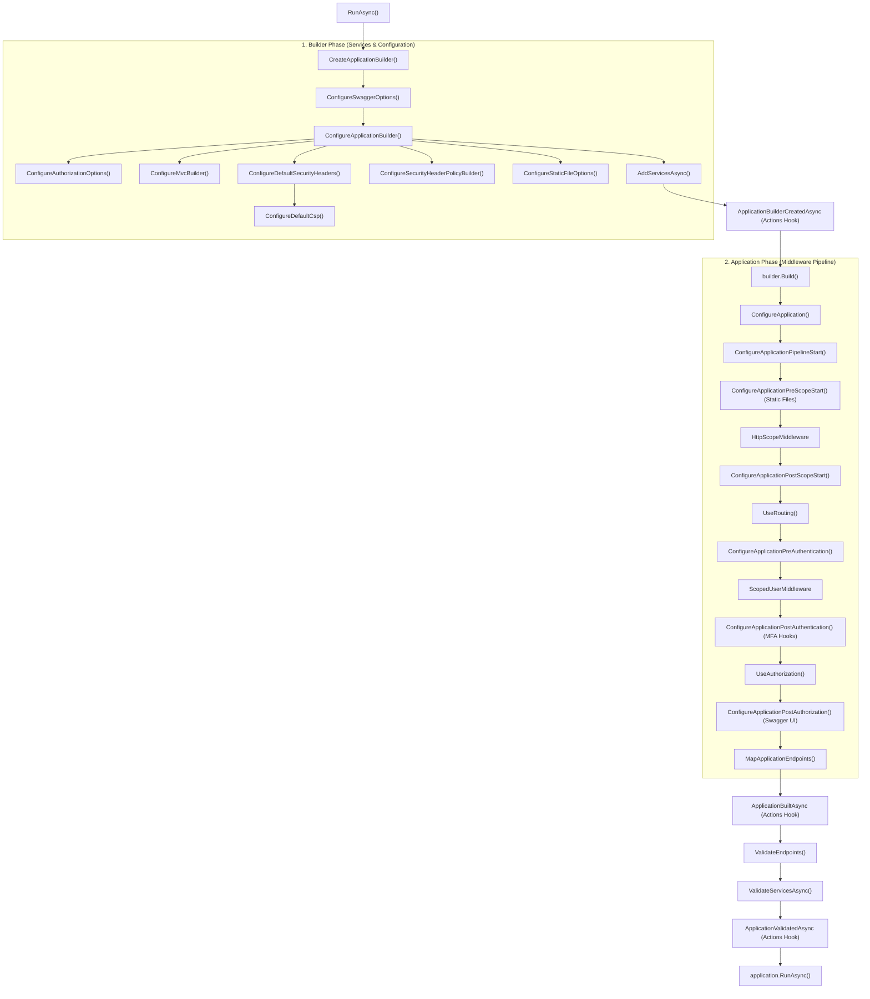

# DRN.Framework.Hosting

> Web application hosting with security-first design, endpoints, and middlewares.

## When to Apply
- Creating new hosted applications
- Configuring security (CSP, Auth, MFA)
- Working with endpoints and Razor Pages
- Adding or customizing middlewares
- Using TagHelpers for frontend rendering

---

## Package Purpose

Hosting provides the **application shell** for DRN web applications with built-in security, logging, and conventions.

---

## Directory Structure

```
DRN.Framework.Hosting/
├── DrnProgram/       # DrnProgramBase, options, conventions
├── Endpoints/        # EndpointCollectionBase, EndpointFor
├── Auth/             # Policies, MFA configuration
├── Consent/          # Cookie consent management
├── Identity/         # Identity integration
├── Middlewares/      # HttpScopeLogger, security middlewares
├── TagHelpers/       # Razor TagHelpers (Script, CSP, etc.)
├── Areas/            # Razor Pages areas
├── Extensions/       # Hosting extensions
├── HealthCheck/      # Health check integration
├── Nexus/            # Nexus service mesh integration
├── Utils/            # Hosting utilities
└── wwwroot/          # Static files
```

---

## DrnProgramBase Pattern

All DRN web apps inherit from `DrnProgramBase<TProgram>`:

```csharp
public class SampleProgram : DrnProgramBase<SampleProgram>, IDrnProgram
{
    public static async Task Main(string[] args) => await RunAsync(args);

    protected override Task AddServicesAsync(
        WebApplicationBuilder builder, 
        IAppSettings appSettings, 
        IScopedLog scopedLog)
    {
        builder.Services.AddSampleHostedServices(appSettings);
        return Task.CompletedTask;
    }
    
    protected override MfaRedirectionConfig ConfigureMFARedirection()
        => new(Get.Page.User.Management.EnableAuthenticator, 
               Get.Page.User.LoginWith2Fa,
               Get.Page.User.Login, 
               Get.Page.User.Logout, 
               Get.Page.All);
}
```

### Pipeline Hooks

| Method | Purpose |
|--------|---------|
| `AddServicesAsync()` | [Required] Add services to DI container |
| `ConfigureSwaggerOptions()` | Customize Swagger/OpenAPI title and availability |
| `ConfigureApplicationBuilder()` | Root application builder customization |
| `ConfigureMvcOptions()` | MVC options configuration |
| `ConfigureMvcBuilder()` | IMvcBuilder customization (JSON, Runtime compilation) |
| `ConfigureDefaultSecurityHeaders()` | Main CSP and security header policy definitions |
| `ConfigureDefaultCsp()` | Customize CSP directives |
| `ConfigureSecurityHeaderPolicyBuilder()`| Advanced conditional security policies |
| `ConfigureCookiePolicy()` | GDRP and consent cookie settings |
| `ConfigureApplicationPipelineStart()` | Earliest middleware (HSTS, Cookies, Security Headers) |
| `ConfigureApplicationPreScopeStart()` | Pre-logger/scope (Static files) |
| `ConfigureApplicationPreAuthentication()` | Before Auth (Localization) |
| `ConfigureApplicationPostAuthentication()` | Post-Auth, Pre-AuthZ (MFA Redirection/Exemption) |
| `ConfigureApplicationPostAuthorization()` | Post-AuthZ (Swagger UI) |
| `MapApplicationEndpoints()` | Route mapping (Controllers, Razor Pages) |
| `ValidateEndpoints()` | Post-mapping endpoint validation |
| `ValidateServicesAsync()` | DI validation (Attributes/Conventions) |
| `ConfigureMFARedirection()` | MFA page configuration |
| `ConfigureMFAExemption()` | Exempt schemes from MFA |

### Life-cycle & Execution Flow

The following diagram illustrates the relationship and execution order of overrideable hooks during application startup.



#### Hierarchy Summary
1.  **Bootstrapping**: The program instance is created, and `ConfigureSwaggerOptions` is invoked immediately to set early metadata (Title, Version) *before* the `WebApplicationBuilder` is initialized.
2.  **Configuration (Builder Phase)**: `ConfigureApplicationBuilder` and its specialized sub-hooks (`ConfigureMvcBuilder`, `ConfigureDefaultSecurityHeaders`, etc.) prepare the DI container and system defaults, ending with the user's `AddServicesAsync`.
3.  **Pipeline (Application Phase)**: `ConfigureApplication` defines the middleware sequence. It uses `Pre` and `Post` hooks to allow insertion of logic around critical stages (Static Files, Authentication, Authorization).
4.  **Verification**: Final mapping of endpoints and end-to-end service validation occur *before* the application starts listening for requests.

### Advanced Startup Customization (`DrnProgramActions`)

Intercept application startup without modifying the main program class. Useful for assembly scanning patterns or environment-specific logic.

```csharp
public class SampleProgramActions : DrnProgramActions
{
    public override async Task ApplicationBuilderCreatedAsync<TProgram>(
        TProgram program, WebApplicationBuilder builder,
        IAppSettings appSettings, IScopedLog scopedLog)
    {
        // Hook into builder creation (e.g., launch containers)
    }

    public override async Task ApplicationBuiltAsync<TProgram>(...)
    {
        // Hook after application is built (e.g., final validations)
    }

    public override async Task ApplicationValidatedAsync<TProgram>(...)
    {
        // Hook after DRN validations (e.g., seed data)
    }
}
```

### Local Development Infrastructure

Use `LaunchExternalDependenciesAsync` in `DEBUG` mode to automatically spin up infrastructure (Postgres, RabbitMQ) using Testcontainers.

> [!IMPORTANT]
> This extension method resides in `DRN.Framework.Testing`. To use it in a `Hosted` project, you must add a conditional reference to `DRN.Framework.Testing` for the `Debug` configuration.

Add the following to your `.csproj` file:

```xml
<!-- CONDITIONAL TESTING REFERENCE (Development ONLY) -->
<ItemGroup Condition="'$(Configuration)' == 'Debug'">
    <ProjectReference Include="..\DRN.Framework.Testing\DRN.Framework.Testing.csproj"/>
</ItemGroup>
```

```csharp
#if DEBUG
public override async Task ApplicationBuilderCreatedAsync<TProgram>(...)
{
    var launchOptions = new ExternalDependencyLaunchOptions
    {
        PostgresContainerSettings = new PostgresContainerSettings
        {
            Reuse = true, // Faster restarts
            HostPort = 6432 // Avoid default port conflict
        }
    };
    
    // Auto-starts containers if not running
    await builder.LaunchExternalDependenciesAsync(scopedLog, appSettings, launchOptions);
}
#endif
```

---

## Security Features

### Built-in Security
- **CSP (Content Security Policy)** - Nonce-based script protection
- **Security Headers** - HSTS, X-Frame-Options, X-Content-Type-Options
- **Cookie Policy** - SameSite=Strict, Secure, HttpOnly
- **Host Filtering** - AllowedHosts validation
- **Forwarded Headers** - Proxy support

### Startup Augmentations

`DrnProgramBase` augments the application startup with automatic configurations:

| Feature | Description |
|---------|-------------|
| **Service Validation** | Automatically calls `ValidateServicesAddedByAttributesAsync` to ensure all dependencies are resolvable and valid. |
| **Security Defaults** | Enforces "MFA by default" policy unless `[AllowAnonymous]` is used. Configures strict security headers (HSTS, CSP, etc.). |
| **Logging Setup** | Bootstraps NLog with JSON structure and `HttpScopeLogger` for request tracing. |
| **Infrastructure** | (Debug only) Can launch external dependencies (Postgres, RabbitMQ) via `LaunchExternalDependenciesAsync`. |

### MFA by Default

MFA is enforced globally via `FallbackPolicy`. Any route not explicitly opted-out requires MFA. Custom policies are automatically combined with MFA requirements via the `MfaEnforcingAuthorizationPolicyProvider`.

#### Opting-Out / Exemptions

To bypass MFA for specific routes, use `AllowAnonymous` or the `MfaExempt` policy:

```csharp
// 1. Fully anonymous (Public landing page)
[AllowAnonymous]
public class PublicController : Controller { }

// 2. Single-Factor only (MFA Setup or Login pages)
[Authorize(Policy = AuthPolicy.MfaExempt)]
public class MfaSetupController : Controller { }
```

### Configuration Properties

`DrnProgramBase` provides several properties for high-level configuration:

| Property | Description |
|----------|-------------|
| `AppBuilderType` | Controls `WebApplicationBuilder` creation (Empty, Slim, Default, or DrnDefaults) |
| `DrnProgramSwaggerOptions`| OpenAPI and Swagger UI configuration |
| `NLogOptions` | Static NLog bootstrap options |

```csharp
protected override void ConfigureSwaggerOptions(DrnProgramSwaggerOptions options, IAppSettings appSettings)
{
    options.AddSwagger = appSettings.IsDevEnvironment;
}
```

### Security Invariants (Priority 1)

DRN Hosting enforces several security invariants by default:

- **MFA by Default**: The `ConfigureAuthorizationOptions` sets both `DefaultPolicy` and `FallbackPolicy` to the `MFA` policy. Unauthenticated or single-factor users are denied access unless explicitly opted-out via `[AllowAnonymous]` or `[Authorize(Policy = AuthPolicy.MfaExempt)]`.
- **Identity Context**: `ScopedUserMiddleware` automatically populates `IScopedLog` with user identity for auditability and provides a secure `HttpScope` for transaction tracking.
- **Strict Headers**: `ConfigureDefaultSecurityHeaders` enforces `FrameOptionsDeny`, `ContentTypeOptionsNoSniff`, and strict `CSP` with nonces.
- **GDPR Compliance**: `ConfigureCookiePolicy` enforces `SameSiteMode.Strict`, `HttpOnly`, and integrates with `ConsentCookie` logic.

### Performance & Caching (Priority 5)

Default optimizations included in the host:

- **Static Asset Caching**: `ConfigureStaticFileOptions` sets `Cache-Control` to 1 year and enables `HttpsCompression`.
- **Response Caching**: `AddResponseCaching()` is registered by default, configurable via `ConfigureResponseCachingOptions`.
- **Service Validation**: End-to-end service validation happens *before* the host starts listening (`ValidateServicesAsync`), preventing late-stage dependency errors.

---

## Endpoint Management

### EndpointCollectionBase

Type-safe endpoint references:

```csharp
public class SampleEndpointFor : EndpointCollectionBase<SampleProgram>
{
    public QaApiFor Qa { get; } = new();
    public UserApiFor User { get; } = new();
}

public class QaApiFor
{
    public EndpointFor<QaController> GetQuestions { get; } = new(c => c.GetQuestions);
}
```

### Usage

```csharp
// In code
var url = Get.Endpoint.Qa.GetQuestions;

// In Razor
<a href="@Get.Endpoint.User.Profile">Profile</a>
```

---

## Middlewares

| Middleware | Purpose |
|------------|---------|
| `HttpScopeLogger` | Request/response logging with IScopedLog |
| `HttpRequestLogger` | Detailed request logging |
| `MfaEnforcementMiddleware` | Enforce MFA for protected routes |

### HttpScopeLogger

Automatically logs:
- Request path, method, host
- Response status, content length
- Exceptions with inner details
- Scope duration and TraceId

---

## TagHelpers

DRN.Framework.Hosting provides 8 tag helpers in `TagHelpers/`:

### ViteScriptTagHelper / ViteLinkTagHelper

Auto-resolve Vite manifest entries when `src`/`href` starts with `buildwww/` or `node_modules/`:

```razor
<!-- Source in Razor (use buildwww/ path) -->
<script src="buildwww/app/js/appPostload.js" crossorigin="anonymous"></script>
<link href="buildwww/lib/bootstrap/bootstrap.scss" rel="stylesheet" />

<!-- Rendered output (hash + integrity added) -->
<script src="/app/app_postload.abc123.js" integrity="sha256-xyz" crossorigin="anonymous"></script>
<link href="/lib/bootstrap/bootstrap.def456.css" integrity="sha256-xyz" rel="stylesheet" />
```

> The tag helper detects Vite entries by checking if path starts with `buildwww/` or `node_modules/`.

### NonceTagHelper

Auto-adds CSP nonce to `<script>`, `<style>`, `<link>`, `<iframe>` tags:

```razor
<!-- Nonce added automatically -->
<script src="~/app/script.js"></script>

<!-- Opt-out with disable-nonce -->
<script src="external-cdn.js" disable-nonce="true"></script>
```

### CsrfTokenTagHelper

Auto-adds CSRF token to htmx requests (`hx-post`, `hx-put`, `hx-delete`, `hx-patch`):

```razor
<!-- CSRF token auto-added to hx-headers -->
<button hx-post="/api/action" hx-target="#result">Submit</button>

<!-- Opt-out with disable-csrf-token -->
<button hx-post="/api/action" disable-csrf-token="true">Send</button>
```

### AuthorizedOnlyTagHelper

Show element only when user is authenticated with MFA:

```razor
<nav authorized-only>
    <a asp-page="/User/Profile">Profile</a>
</nav>
```

### AnonymousOnlyTagHelper

Show element only when user is NOT authenticated:

```razor
<a asp-page="/User/Login" anonymous-only>Sign In</a>
```

### PageAnchorAspPageTagHelper / PageAnchorHrefTagHelper

Auto-add `active` class and `aria-current="page"` to links matching current page:

```razor
<a asp-page="/Dashboard">Dashboard</a>
<!-- If on /Dashboard, renders: -->
<a asp-page="/Dashboard" class="active fw-bold" aria-current="page">Dashboard</a>

<!-- Customize active class -->
<a asp-page="/Settings" ActiveClass="current">Settings</a>

<!-- Disable active marking -->
<a asp-page="/Help" MarkWhenActive="false">Help</a>
```

### Tag Helper Summary

| TagHelper | Target | Purpose |
|-----------|--------|---------|
| `ViteScriptTagHelper` | `<script>` | Resolve Vite manifest entry |
| `ViteLinkTagHelper` | `<link>` | Resolve Vite manifest entry |
| `NonceTagHelper` | `<script>`, `<style>`, `<link>`, `<iframe>` | Add CSP nonce |
| `CsrfTokenTagHelper` | `hx-post`, `hx-put`, `hx-delete`, `hx-patch` | Add CSRF token |
| `AuthorizedOnlyTagHelper` | `*[authorized-only]` | Render only if MFA complete |
| `AnonymousOnlyTagHelper` | `*[anonymous-only]` | Render only if anonymous |
| `PageAnchorAspPageTagHelper` | `<a asp-page>` | Mark active page |
| `PageAnchorHrefTagHelper` | `<a href>` | Mark active page |

---

## Configuration (appsettings.json)

### Kestrel

```json
{
  "Kestrel": {
    "EndpointDefaults": { "Protocols": "Http1" },
    "Endpoints": {
      "All": { "Url": "http://*:5988" }
    }
  }
}
```

### NLog

```json
{
  "NLog": {
    "throwConfigExceptions": true,
    "targets": {
      "async": true,
      "console": {
        "type": "ColoredConsole",
        "layout": "${longdate}|${level:uppercase=true}|${logger}|${message}"
      }
    },
    "rules": [
      {
        "logger": "*",
        "minLevel": "Info",
        "writeTo": "console"
      }
    ]
  }
}
```

---

## wwwroot Structure

```
DRN.Framework.Hosting/wwwroot/
├── css/           # Framework CSS
├── js/            # Framework JS
└── lib/           # Third-party libs
```

---

## Related Skills

- [overview-drn-framework.md](../overview-drn-framework/SKILL.md) - Framework overview
- [drn-utils.md](../drn-utils/SKILL.md) - Utils and DI
- [overview-ddd-architecture.md](../overview-ddd-architecture/SKILL.md) - Sample architecture
- [frontend-razor-pages-shared.md](../frontend-razor-pages-shared/SKILL.md) - Layout system
- [frontend-razor-accessors.md](../frontend-razor-accessors/SKILL.md) - Accessor patterns

---
