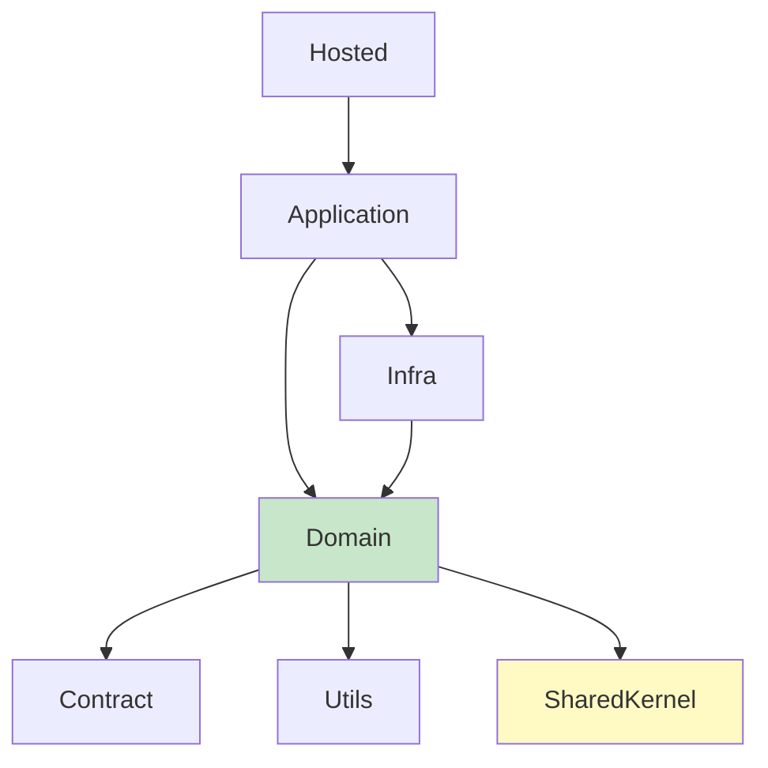

# DDD Architecture

> Domain-Driven Design layer architecture for DRN applications.

## When to Apply

- Starting a new application or bounded context
- Understanding layer responsibilities and dependencies
- Deciding where to place new code
- Reviewing architecture compliance

---

## Layer Structure

```text
Presentation  →  Application  →  Domain  ←  Infrastructure
    (UI/API)      (Orchestration)  (Core)     (Data/External)
```

**Dependency rule**: Dependencies flow **inward**. Domain has zero outward dependencies. Infrastructure depends on Domain (implements its contracts).



**Key**: Application → Infra project dependency is allowed (pragmatic DDD — Application orchestrates Infra interfaces directly).

---

## Layer Responsibilities

### Application vs Domain Logic

| Concern | Application Layer | Domain Layer |
|---------|------------------|-------------|
| **Example** | "Load Order → Tell Order to Pay → Save" | "Check if Order is valid to pay (invariants)" |
| **Owns** | Orchestration, transaction management, DTO mapping | Business rules, invariants, domain events |
| **Never does** | Domain invariant checks, business rule decisions | I/O, HTTP concerns, framework dependencies |

---

## Layers

### Domain Layer (`*.Domain`)

The core — entities, value objects, domain events, repository contracts, domain services.

| Place Here | Never Place Here |
|-----------|-----------------|
| `SourceKnownEntity` / `AggregateRoot` subclasses | EF Core references |
| Domain events | HTTP/API concerns |
| Repository **interfaces** (`IXxxRepository`) | Framework dependencies |
| Value objects, domain-internal enums, domain exceptions | Implementation details |
| Domain services (pure business logic) | Database queries |
| `ToDto()` instance methods (entity → DTO mapping) | DTO definitions |

### Contract Layer (`*.Contract`)

Shared boundary — DTOs, shared enums, value models consumed across all layers.

| Place Here | Never Place Here |
|-----------|-----------------|
| DTOs (`Dto` subclasses) | Entities |
| Shared enums (source of truth for DTOs & entities) | Repository interfaces |
| Value models (e.g., `TagValueModel`) | Domain services |
| Shared constants / display types | Business logic |

**Dependency rule**: Contract depends **only** on `DRN.Framework.SharedKernel`. Any project (including `*.Domain`) may reference `*.Contract`.

### Application Layer (`*.Application`)

Orchestration — coordinates domain objects and infrastructure services.

| Place Here | Never Place Here |
|-----------|-----------------|
| Use case handlers / application services | Entity definitions |
| Input validation | Direct DB access |
| Cross-cutting concerns (logging, auth checks) | Domain logic |
| `ISourceKnownRepository<T>` consumption | UI concerns / Framework config |

### Infrastructure Layer (`*.Infra`)

Implementation — database, external services, file system.

| Place Here | Never Place Here |
|-----------|-----------------|
| `DrnContext<T>` subclasses | Business logic |
| `IEntityTypeConfiguration<T>` | Domain events |
| Repository **implementations** | DTOs |
| External service clients | UI rendering |
| EF Core migrations | Application orchestration |

### Presentation Layer (`*.Hosted` / `*.Web`)

UI and API — Razor Pages, Controllers, minimal APIs.

| Place Here | Never Place Here |
|-----------|-----------------|
| `DrnProgramBase<T>` | Business logic |
| Razor Pages / Controllers | Entity definitions |
| View models, page models | Direct DB access |
| Endpoint configuration | Domain services |
| Static assets, layouts | Repository implementations |

---

## DRN Project Naming Convention

```text
Sample.Contract/       # Contract layer (DTOs, shared enums, value models)
Sample.Domain/         # Domain layer
Sample.Application/    # Application layer  
Sample.Infra/          # Infrastructure layer
Sample.Hosted/         # Presentation layer
```

---

## Module Registration

Each layer uses a `Module` class for self-contained service registration:

```csharp
public static class InfraModule
{
    public static IServiceCollection AddSampleInfraServices(this IServiceCollection sc)
    {
        sc.AddServicesWithAttributes(); // Auto-register [Scoped<T>], [Singleton<T>], etc.
        return sc;
    }
}
```

Keeps `Program.cs` clean — each module owns its registrations.

---

## DDD Patterns in DRN

| Pattern | DRN Implementation |
|---------|-------------------|
| Entity | `SourceKnownEntity` with `[EntityType]` |
| Aggregate Root | `AggregateRoot` / `AggregateRoot<TModel>` |
| Repository | `ISourceKnownRepository<T>` → `SourceKnownRepository<TCtx, T>` |
| Domain Event | `DomainEvent` subclasses, auto-collected by `DrnContext` |
| Value Object | `record` or `readonly record struct` |
| Factory | Static factory methods on entities |
| Module | `AddXxxServices()` extension methods |

See [drn-domain-design](../drn-domain-design/SKILL.md) for implementation details.

---

## Related Skills

- [drn-domain-design.md](../drn-domain-design/SKILL.md) - Entity & Repository patterns
- [drn-sharedkernel.md](../drn-sharedkernel/SKILL.md) - Domain primitives
- [overview-repository-structure.md](../overview-repository-structure/SKILL.md) - Folder conventions
