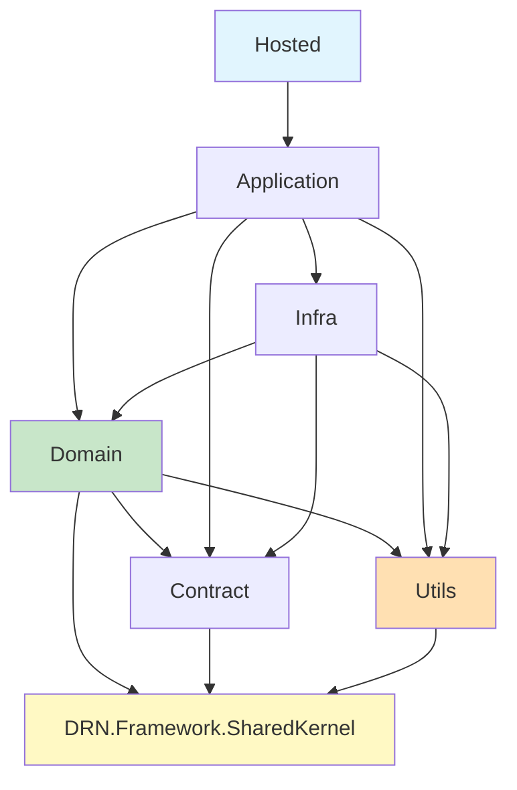

# DRN DDD Architecture

> DRN recommended tiered architecture for building maintainable, DDD-compatible applications.

## When to Apply
- Creating new applications following DRN patterns
- Understanding project layer responsibilities
- Deciding where to place new code
- Maintaining separation of concerns

---

## Architecture Overview

Standard DRN applications follow a clean, tiered architecture:

```
┌─────────────────────────────────────────────────────────────────┐
│                      [Project].Hosted                           │
│    (Presentation: Razor Pages, Controllers, API, Frontend)      │
├─────────────────────────────────────────────────────────────────┤
│                    [Project].Application                        │
│                  (Use Cases, Orchestration)                     │
├─────────────────────────────────────────────────────────────────┤
│                      [Project].Infra                            │
│              (Implementation, DB, External)                     │
├─────────────────────────────────────────────────────────────────┤
│                       [Project].Domain                          │
│          (Entities, Aggregates, Domain Events, Rules)           │
├─────────────────────────────────────────────────────────────────┤
│      [Project].Contract      │          [Project].Utils         │
│   (DTOs, Events, API Specs)  │      (Cross-cutting utilities)   │
└─────────────────────────────────────────────────────────────────┘
```

---

## Layer Responsibilities

### Presentation Layer (`.Hosted`)

The entry point of the application. It handles HTTP requests, renders views, and serves the frontend.

**Key Components**:
- **Controllers**: API endpoints.
- **Pages**: Razor Pages for server-side rendering.
- **Program.cs**: Application startup and configuration.
- **wwwroot/buildwww**: Static assets (Vite/TypeScript).

**Example (`Sample.Hosted`)**:
```
Sample.Hosted/
├── Controllers/
├── Pages/
├── SampleProgram.cs
└── SampleModule.cs
```

### Application Layer (`.Application`)

Responsible for **orchestration** only. It defines *what* the system can do (Use Cases) but delegates *how* rules are enforced to the Domain.

- **Orchestration (App Layer)**: "Load Order #123 -> Tell Order to Pay -> Save."
- **Domain Logic (Domain Layer)**: "Check if Order #123 is valid to pay (Invariants)."

**Responsibilities**:
- **Orchestration**: Coordinating the flow of data between the UI, Domain, and Infra.
- **Transaction Management**: Ensuring a use case accumulates changes and saves them atomically (Unit of Work).
- **Mapping**: converting raw Domain Entities into Application DTOs.

**What it explicitly avoids**:
- **Domain Invariants**: It does NOT check if `Order.Total > 0`. The `Order` entity must reject an invalid state itself.
- **Business Rules**: It does NOT decide "If user is VIP, give discount." It tells the Domain "Apply execution context", and the Domain decides.

**Example (`Sample.Application`)**:
```
Sample.Application/
├── Services/
│   ├── UserProfileService.cs
│   └── ProfilePictureService.cs
└── ApplicationModule.cs
```

### Domain Layer (`.Domain`)

The heart of the software. Contains all business logic, rules, and invariants. It has **no dependencies** on outer layers (Infra, Hosted).

**Responsibilities**:
- **Aggregate Roots**: Consistency boundaries.
- **Entities & Value Objects**: Domain models.
- **Domain Events**: Internal side-effects.

**Example (`Sample.Domain`)**:
```
Sample.Domain/
├── Identity/
├── QA/ (Bounded Context)
│   ├── Questions/
│   └── Answers/
```

### Infrastructure Layer (`.Infra`)

Implements interfaces defined in the Domain or Application layers. Handles all I/O and external concerns.

**Responsibilities**:
- Database access (DbContext, Repositories).
- External API clients.
- File system access.

**Example (`Sample.Infra`)**:
```
Sample.Infra/
├── QA/
│   ├── Configurations/ (EF Core Config)
│   └── Repositories/
└── InfraModule.cs
```

### Contract Layer (`.Contract`)

Contains shared DTOs and event definitions used for communication between layers or services.

**Responsibilities**:
- Requests/Responses for APIs.
- Integration Events.

### Utils Layer (`.Utils`)

Cross-cutting concerns that don't belong to a specific business domain (e.g., extensions, generic helpers).

---

## Dependency Flow

The standard dependency graph enforces clean architecture rules:



**Key Rules**:
1. **Application → Infra**: Project dependency allowed for interface usage in this Pragmatic DDD pattern. Application orchestrates Infra interfaces such as IEmailSender(logical dependency) directly.
2. **Domain Hierarchy**: Domain is the core but sits above Contract/Utils.
3. **Dependency Direction**: Dependencies point downwards/inwards. `Hosted` binds everything.

---

## Entity Definition Pattern

Entities should inherit from `AggregateRoot` or `Entity` and use private setters to enforce invariants.

```csharp
// Example: Question Aggregate Root
[EntityType((int)SampleEntityTypes.Question)]
public class Question : AggregateRoot
{
    private Question() { }  // EF Core requirement

    public Question(string title, string body, User user)
    {
        Title = title;
        Body = body;
        User = user;
        UserId = user.Id;
    }

    public string Title { get; private set; }
    // ...
}
```

---

## Module Pattern & Feature Organization

The architecture favors **Packaging by Feature** (or Domain Module) over Packaging by Layer within the projects. Organize code by **relevance** (Bounded Contexts) rather than technical type.

### Directory Organization
Group related files together. If you are working on the `QA` module, everything related to it should be close:

```
Sample.Domain/
├── Identity/       # Identity Module
└── QA/             # QA Module
    ├── Questions/  # Question Aggregate
    └── Answers/    # Answer Aggregate
```

### Module Registration
Each layer/module uses a `Module` class to register its own services. This keeps `Program.cs` clean and allows modules to be self-contained.

```csharp
// .Infra/InfraModule.cs (or specialized per feature)
public static class InfraModule
{
    public static IServiceCollection AddSampleInfraServices(this IServiceCollection sc)
    {
        sc.AddServicesWithAttributes(); // Auto-register services
        return sc;
    }
}
```

---

## Related Skills

- [drn-domain-design.md](../drn-domain-design/SKILL.md) - Domain & Repository patterns
- [overview-repository-structure.md](../overview-repository-structure/SKILL.md) - Repository overview
- [drn-sharedkernel.md](../drn-sharedkernel/SKILL.md) - Domain primitives
- [drn-entityframework.md](../drn-entityframework/SKILL.md) - Database access
