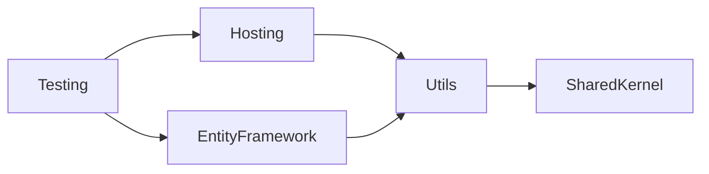

# DRN.Framework Overview

> Architecture overview of DRN.Framework—a convention-based .NET framework for distributed reliable applications.

## When to Apply
- Understanding framework architecture and design principles
- Deciding which package to use for a specific need
- Learning core conventions shared across all packages
- Extending or contributing to framework packages

---

## Framework Stack

```
┌─────────────────────────────────────────────────────────────────┐
│                     DRN.Framework Stack                         │
├─────────────────────────────────────────────────────────────────┤
│  DRN.Framework.Hosting      │  Web hosting, security, endpoints │
│  DRN.Framework.Testing      │  Test contexts, containers        │
│  DRN.Framework.EntityFramework │ DbContext, migrations, IDs     │
│  DRN.Framework.Jobs         │  Background job scheduling        │
│  DRN.Framework.MassTransit  │  Message bus integration          │
├─────────────────────────────────────────────────────────────────┤
│  DRN.Framework.Utils        │  DI, settings, logging, IDs       │
├─────────────────────────────────────────────────────────────────┤
│  DRN.Framework.SharedKernel │  Domain, exceptions, JSON         │
└─────────────────────────────────────────────────────────────────┘
```

---

## Package Purposes

| Package | Purpose | Key Features |
|---------|---------|--------------|
| **SharedKernel** | Lightweight domain primitives | SourceKnownEntity, AggregateRoot, DomainEvent, Exceptions, JsonConventions |
| **Utils** | Core utilities | Attribute DI, IAppSettings, HybridCache, Logging, Extensions |
| **Hosting** | Web application hosting | DrnProgramBase, Security, Endpoints, Middlewares |
| **EntityFramework** | Database access | DrnContext, Conventions, Auto-migrations |
| **Testing** | Test infrastructure | DrnTestContext, Containers, DataAttributes, FlurlHttpTest |
| **Jobs** | Background jobs | Job scheduling (Hangfire-like) |
| **MassTransit** | Messaging | Message bus integration |

---

## Core Conventions

### 1. Attribute-Based Dependency Injection

All DRN projects use attribute-based service registration:

```csharp
[Scoped<IMyService>]
public class MyService : IMyService { }

// Registration in module:
services.AddServicesWithAttributes();
```

| Attribute | Lifetime |
|-----------|----------|
| `[Singleton<T>]` | Singleton |
| `[Scoped<T>]` | Scoped |
| `[Transient<T>]` | Transient |
| `[Config("Section")]` | Configuration binding |
| `[HostedService]` | Background service |

> See: [drn-utils.md](../drn-utils/SKILL.md)

### 2. Configuration Layering

Configuration applied in order:
1. `appsettings.json`
2. `appsettings.{Environment}.json`
3. User secrets (development)
4. Environment variables
5. Mounted settings (`/appconfig/`)
6. Command line arguments

### 3. JSON Conventions

System.Text.Json defaults overridden globally:
- `JsonSerializerDefaults.Web`
- `JsonStringEnumConverter`
- `AllowTrailingCommas = true`
- `PropertyNameCaseInsensitive = true`
- `CamelCase` naming

### 4. Exception Handling

DRN exceptions map to HTTP status codes:

| Exception | Status |
|-----------|--------|
| `ValidationException` | 400 |
| `UnauthorizedException` | 401 |
| `ForbiddenException` | 403 |
| `NotFoundException` | 404 |
| `ConflictException` | 409 |
| `ConfigurationException` | 500 |

```csharp
throw ExceptionFor.NotFound("User not found");
```

---

## Package Dependency Graph



**Key Points**:
- SharedKernel has NO dependencies (can be used in Contract layers)
- Utils provides core infrastructure
- Hosting/EntityFramework are peer packages
- Testing depends on everything for integration tests

---

## Module Pattern

Each assembly exposes a module for service registration:

```csharp
public static class InfraModule
{
    public static IServiceCollection AddSampleInfraServices(this IServiceCollection sc)
    {
        sc.AddServicesWithAttributes();
        return sc;
    }
}
```

---

## Reliability Characteristics

DRN Framework ensures:
- **Secure** - Security headers, CSP, host filtering
- **Observable** - Structured logging, scoped logs
- **Maintainable** - Convention over configuration
- **Performant** - Optimized defaults
- **Scalable** - Distributed ID generation
- **Self-documenting** - Endpoint metadata

---

## Related Skills

| Skill | Package |
|-------|---------|
| [drn-domain-design.md](../drn-domain-design/SKILL.md) | Identity, Entities, Repositories |
| [drn-sharedkernel.md](../drn-sharedkernel/SKILL.md) | Domain primitives, exceptions |
| [drn-utils.md](../drn-utils/SKILL.md) | DI, settings, logging |
| [drn-hosting.md](../drn-hosting/SKILL.md) | Web hosting, security |
| [drn-entityframework.md](../drn-entityframework/SKILL.md) | Database access |
| [drn-testing.md](../drn-testing/SKILL.md) | Test infrastructure |

---
