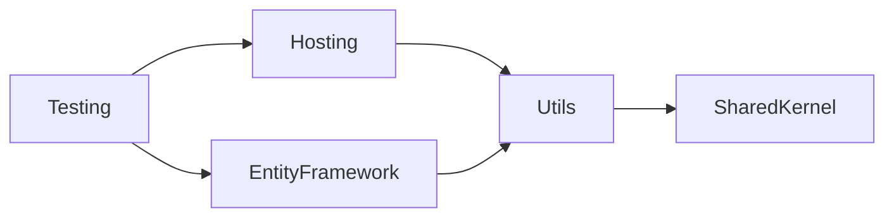

# DRN.Framework Overview

> Architecture overview of DRN.Framework—a convention-based .NET framework for distributed reliable applications.

## When to Apply
- Understanding framework architecture and design principles
- Deciding which package to use for a specific need
- Learning core conventions shared across all packages
- Extending or contributing to framework packages

---

## DiSCOS Alignment

| DiSCOS Principle | Framework Expression |
|------------------|---------------------|
| Security by Design | Security headers, CSP, host filtering baked into `DrnProgramBase` |
| Excellence by Simplicity | Convention over configuration — attribute DI, auto-discovery |
| Systems Thinking | Layered package hierarchy; optimize whole, not parts |
| Margin of Safety | Distributed collision-free ID generation; startup validation |

---

## Framework Stack

```
┌─────────────────────────────────────────────────────────────────┐
│                     DRN.Framework Stack                         │
├─────────────────────────────────────────────────────────────────┤
│  DRN.Framework.Hosting      │  Web hosting, security, endpoints │
│  DRN.Framework.Testing      │  Test contexts, containers        │
│  DRN.Framework.EntityFramework │ DbContext, migrations, IDs     │
│  DRN.Framework.Jobs         │  Background job scheduling        │
│  DRN.Framework.MassTransit  │  Message bus integration          │
├─────────────────────────────────────────────────────────────────┤
│  DRN.Framework.Utils        │  DI, settings, logging, IDs       │
├─────────────────────────────────────────────────────────────────┤
│  DRN.Framework.SharedKernel │  Domain, exceptions, JSON         │
└─────────────────────────────────────────────────────────────────┘
```

---

## Package Purposes

| Package | Purpose | Key Features |
|---------|---------|--------------|
| **SharedKernel** | Lightweight domain primitives | SourceKnownEntity, AggregateRoot, DomainEvent, Exceptions, JsonConventions |
| **Utils** | Core utilities | Attribute DI, IAppSettings, HybridCache, Logging, Extensions |
| **Hosting** | Web application hosting | DrnProgramBase, Security, Endpoints, Middlewares |
| **EntityFramework** | Database access | DrnContext, Conventions, Auto-migrations |
| **Testing** | Test infrastructure | DrnTestContext, Containers, DataAttributes, FlurlHttpTest |
| **Jobs** | Background jobs | Job scheduling (Hangfire-like) |
| **MassTransit** | Messaging | Message bus integration |

---

## Core Conventions

### 1. Attribute-Based Dependency Injection

All DRN projects use attribute-based service registration:

```csharp
[Scoped<IMyService>]
public class MyService : IMyService { }

// Registration in module:
services.AddServicesWithAttributes();
```

| Attribute | Lifetime |
|-----------|----------|
| `[Singleton<T>]` | Singleton |
| `[Scoped<T>]` | Scoped |
| `[Transient<T>]` | Transient |
| `[Config("Section")]` | Configuration binding |
| `[HostedService]` | Background service |

> See: [drn-utils.md](../drn-utils/SKILL.md)

### 2. Configuration Layering

Configuration applied in order. Canonical copy: [Maintenance Reference: Configuration Sources](#maintenance-reference-configuration-sources).

1. `appsettings.json`
2. `appsettings.{Environment}.json`
3. User secrets when the application assembly is available
4. Environment variables
5. Mounted settings (`/appconfig/`)
6. Command line arguments

### 3. JSON Conventions

System.Text.Json defaults overridden globally:
- `JsonSerializerDefaults.Web`
- `JsonStringEnumConverter`
- `AllowTrailingCommas = true`
- `PropertyNameCaseInsensitive = true`
- `CamelCase` naming

### 4. Exception Handling

DRN exceptions map to HTTP status codes:

| Exception | Status |
|-----------|--------|
| `ValidationException` | 400 |
| `UnauthorizedException` | 401 |
| `ForbiddenException` | 403 |
| `NotFoundException` | 404 |
| `ConflictException` | 409 |
| `ConfigurationException` | 500 |

```csharp
throw ExceptionFor.NotFound("User not found");
```

---

## Package Dependency Graph


```mermaid
graph LR
    H[Hosting] --> U[Utils]
    EF[EntityFramework] --> U
    U --> SK[SharedKernel]
    T[Testing] --> H
    T --> EF
```

**Key Points**:
- SharedKernel has NO dependencies (can be used in Contract layers)
- Utils provides core infrastructure
- Hosting/EntityFramework are peer packages
- Testing depends on everything for integration tests

---

## Module Pattern

Each assembly exposes a module for service registration:

```csharp
public static class InfraModule
{
    public static IServiceCollection AddSampleInfraServices(this IServiceCollection sc)
    {
        sc.AddServicesWithAttributes();
        return sc;
    }
}
```

---

## Reliability Characteristics

DRN Framework ensures:
- **Secure** - Security headers, CSP, host filtering
- **Observable** - Structured logging, scoped logs
- **Maintainable** - Convention over configuration
- **Performant** - Optimized defaults
- **Scalable** - Distributed ID generation
- **Self-documenting** - Endpoint metadata

---

## DRN Framework Maintenance Reference

These are framework-level facts for reusable DRN skills. In a DRN Framework source repository, verify changes against source-owned package code and package READMEs before updating this section. In a consuming repository, treat the installed DRN Framework version and its package docs as the source of truth.

Package READMEs must remain self-contained for important operational information. Skills may summarize framework behavior, but package readers should not need an agent profile to understand required defaults.

### Maintenance Reference: Configuration Sources

`AddDrnSettings` loads configuration in this order. Later sources override earlier sources.

1. `appsettings.json`
2. `appsettings.{Environment}.json`
3. User secrets when the application assembly can be loaded
4. Environment variables in this order: `ASPNETCORE_`, `DOTNET_`, then unprefixed
5. Mounted settings:
   - `/appconfig/key-per-file-settings/*`
   - `/appconfig/json-settings/*.json`
6. Command-line arguments

The mounted root defaults to `/appconfig` and can be overridden by registering `IMountedSettingsConventionsOverride`.

### Maintenance Reference: Development Settings

| Setting | Default | Maintenance note |
|---------|---------|------------------|
| `SkipValidation` | `false` | Mostly for test contexts. |
| `TemporaryApplication` | `false` | Auto-set by tests to avoid local-development collisions. |
| `LaunchExternalDependencies` | `false` | Development-only local PostgreSQL Testcontainers provisioning. |
| `AutoMigrateDevelopment` | `true` | Applies pending migrations in Development after startup validation. |
| `AutoMigrateStaging` | `false` | Applies pending migrations in Staging only; never enables prototype recreation. |
| `Prototype` | `false` | Development-only prototype database recreation gate. |
| `BreakForUserUnhandledException` | `false` | Developer diagnostics flag. |

### Maintenance Reference: Migration And Prototype Invariants

Production:
- Uses explicit `ConnectionStrings:{ContextName}` values.
- Never auto-migrates.
- Never recreates a database through prototype mode.

Staging:
- Uses explicit `ConnectionStrings:{ContextName}` values.
- Applies migrations only when `DrnDevelopmentSettings:AutoMigrateStaging = true`.
- Never recreates a database through prototype mode.

Development:
- Uses `AutoMigrateDevelopment = true` by default.
- Prototype recreation is allowed only when every condition is true:
  - Application environment is Development.
  - `DrnDevelopmentSettings:AutoMigrateDevelopment = true`.
  - `DrnDevelopmentSettings:Prototype = true`.
  - The context attribute has `UsePrototypeMode = true`.
  - Pending model changes exist.
  - No migrations have been applied, or applied migrations exist and `UsePrototypeModeWhenMigrationExists = true`.

### Maintenance Reference: Connection Modes

| Scenario | Connection source | Notes |
|----------|-------------------|-------|
| Production/Staging | `ConnectionStrings:{ContextName}` | Explicit configuration only. |
| Local Debug with Testcontainers | `LaunchExternalDependenciesAsync()` | Uses `PostgresContainerSettings`; ignores `postgres-password` and `DrnContext_Dev*`. |
| Docker/Kubernetes Development | `DrnContextDevelopmentConnection` | Uses `postgres-password` plus `DrnContext_Dev*` keys to generate a connection string. |
| Integration tests | `ContainerContext.Postgres` | Starts/binds PostgreSQL on demand and injects connection strings. |
| RabbitMQ tests | `RabbitMQContext.StartAsync()` | Explicit opt-in helper; not started by `CreateClientAsync` or PostgreSQL binding. |

### Maintenance Reference: Container Defaults

PostgreSQL:

| Property | Default |
|----------|---------|
| `DefaultImage` | `"postgres"` |
| `DefaultVersion` | `"18.4-alpine3.23"` |
| `DefaultPassword` | `"drn"` |
| `Database` | `"drn"` |
| `Username` | `"drn"` |

RabbitMQ:

| Property | Default |
|----------|---------|
| `DefaultImage` | `"rabbitmq"` |
| `DefaultVersion` | `"4.2.3-management-alpine"` |
| `Username` | unset |
| `Password` | unset |

### Maintenance Reference: Testing Settings

`SettingsProvider` uses `settings.json` by convention. It resolves settings from the test-local folder or a `Settings/` folder and passes the selected base name to `AddDrnSettings`.

Use the consuming repository's profile-declared MTP commands in docs. In framework-scoped skills and reusable workflows, keep project paths generic and discover actual test projects from the profile, filesystem, or CI jobs:

```bash
dotnet run --project <unit-test-csproj>
dotnet run --project <integration-test-csproj>
```

Unit tests should be listed before integration tests. Do not use `.slnx` in test-run commands.

### Maintenance Reference: Release Notes Triggers

Every `DRN.Framework.*` package packs `RELEASE-NOTES.md` into NuGet metadata through `PackageReleaseNotes`. Update only the package(s) whose consumer-facing behavior or published package metadata other than version-only alignment changed.

| Package | Release-note trigger examples |
|---------|-------------------------------|
| `DRN.Framework.SharedKernel` | Domain primitives, public repository/domain contracts, exceptions, JSON conventions, public entity ID operations. |
| `DRN.Framework.Utils` | Settings/configuration, DI attributes, logging/scope behavior, validators, hashing, ID utilities, public extension methods. |
| `DRN.Framework.EntityFramework` | DbContext/repository behavior, migrations, provider defaults, query semantics, database safety gates. |
| `DRN.Framework.Hosting` | Web hosting pipeline, security headers, CSRF/CSP/host filtering, endpoint behavior, Vite/static asset publishing, rate limiting. |
| `DRN.Framework.Testing` | Test contexts, data attributes, providers, Testcontainers defaults, integration-test orchestration. |
| `DRN.Framework.Jobs` | Published jobs package APIs, scheduling behavior, package metadata shipped to consumers. |
| `DRN.Framework.MassTransit` | Published messaging package APIs, bus/consumer behavior, package metadata shipped to consumers. |

Triggers include public API/contract changes, behavior/default changes, security or operational posture changes, observable bug fixes, data/migration behavior, package metadata changes other than version-only alignment, and dependency/runtime/container changes that are breaking, security-relevant, consumer-visible, or alter published artifacts.

Non-triggers include internal-only refactors, tests, comments, agent-only docs, routine dependency-only updates with no consumer-visible effect, and shared-version release alignment for packages with no package-specific changes. During release preparation, if no package-specific change exists before release, one concise version-alignment disclaimer may be added so package metadata is not empty for the release. Outside release preparation, when no trigger applies, explicitly report release notes as not required and leave that package's `RELEASE-NOTES.md` unchanged; the invariant prefix already explains that versions may advance for consistency even when a package has no changes.

### Maintenance Reference: Release Notes Format

DRN Framework package release notes use this repository-owned template:

```markdown
Not every version includes changes, features or bug fixes. This project can increment version to keep consistency with other DRN.Framework projects.

## Version X.Y.Z

[Optional dedication or milestone message]

### Breaking Changes

*   **Area**: Detail description.

### New Features

*   **Feature Group**
    *   **Feature Description**: Details.

### Changed

*   **Area**: Detail description.

### Bug Fixes

*   **Area**: Detail description.

---

Documented with the assistance of [DiSC OS](https://github.com/duranserkan/DRN-Project/blob/develop/.agent/rules/DiSCOS.md)

---
**Semper Progressivus: Always Progressive**
```

Use `## Version X.Y.Z` headings, not `## vX.Y.Z`. Omit empty sections in actual package files. Preserve historical wording unless editing the current version block or repairing a malformed invariant prefix/footer.

### Maintenance Reference: Documentation Sync Checklist

When source code changes one of the shared facts above:

1. Verify the framework source-owned file or package docs.
2. Update package READMEs with self-contained important facts wherever package readers need the new behavior.
3. Update the owning package release notes when a release-note trigger above applies; leave unchanged packages untouched during version-only alignment releases.
4. Update framework-scoped DRN skills that agents use for that package.
5. Search changed terms, renamed keys, changed defaults, and removed examples across package docs, framework skills, `AGENTS.md`, and the repository profile.
6. Run `git diff --check`.

---

## Related Skills

| Skill | Package |
|-------|---------|
| [drn-domain-design.md](../drn-domain-design/SKILL.md) | Identity, Entities, Repositories |
| [drn-sharedkernel.md](../drn-sharedkernel/SKILL.md) | Domain primitives, exceptions |
| [drn-utils.md](../drn-utils/SKILL.md) | DI, settings, logging |
| [drn-hosting.md](../drn-hosting/SKILL.md) | Web hosting, security |
| [drn-entityframework.md](../drn-entityframework/SKILL.md) | Database access |
| [drn-testing.md](../drn-testing/SKILL.md) | Test infrastructure |

---
