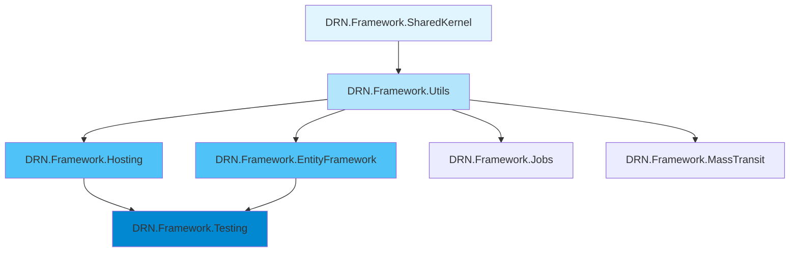

# DRN-Project Repository Structure

> Complete reference for repository organization, solution structure, and project dependencies.

## When to Apply
- Navigating the codebase for the first time
- Understanding project relationships and dependencies
- Locating specific functionality across the repository
- Setting up development environment

---

## Repository Layout (Physical)

The physical directory structure separates source code, documentation, and agent resources.

```
DRN-Project/
├── .agent/                    # Agent skills and workflows
│   ├── rules/                 # DiSCOS rules
│   └── skills/                # Expert skills (this directory)
├── .github/workflows/         # CI/CD workflows
├── DiSCOS/                    # Distinguished Secure Cognitive OS documentation
├── Docker/                    # Container definitions (Postgre, Graylog, RabbitMQ)
│
├── DRN.Framework.*/           # Framework packages (Physical folders in root)
├── DRN.Nexus.*/               # Nexus microservice hub (Physical folders in root)
├── Sample.*/                  # Sample DDD application (Physical folders in root)
├── DRN.Test.*/                # Test projects (Physical folders in root)
│
├── DRN.slnx                   # Solution file (defines logical structure)
├── docker-compose.yml         # Global compose for all services
└── README.md                  # Project documentation
```

---

## Solution Structure (Logical)

The `.slnx` solution file organizes the flat physical project list into logical Solution Folders for better navigation in IDEs.

| Solution Folder | Purpose | Contains Projects |
|-----------------|---------|-------------------|
| `/Src/Framework/` | Reusable packages | `DRN.Framework.*` (SharedKernel, Utils, Hosting, etc.) |
| `/Src/Nexus/` | Service mesh hub | `DRN.Nexus.*` (Application, Domain, Hosted, etc.) |
| `/Src/Sample/` | Reference implementation | `Sample.*` (Application, Domain, Hosted, etc.) |
| `/Test/` | All test projects | `DRN.Test.*` (Unit, Integration, Performance) |
| `/Docker/` | Infrastructure | Compose files for Postgre, Graylog, RabbitMQ |
| `/Docs/` | Documentation | LICENSE, README, ROADMAP, SECURITY |
| `/Items/` | Configuration | .gitignore, .agent rules, GitHub workflows |

---

## Framework Package Hierarchy



**Dependency Order** (bottom to top):
1. `SharedKernel` - No external DRN dependencies (lightweight)
2. `Utils` - Depends on SharedKernel
3. `Hosting` / `EntityFramework` - Depend on Utils
4. `Testing` - Depends on Hosting + EntityFramework

---

## Sample Application Tiers

| Layer | Project | Responsibility |
|-------|---------|----------------|
| **Presentation** | `Sample.Hosted` | Razor Pages, Controllers, API, Frontend build |
| **Application** | `Sample.Application` | Use cases, orchestration, DTOs |
| **Domain** | `Sample.Domain` | Entities, Aggregates, Domain Events |
| **Infrastructure** | `Sample.Infra` | DbContexts, Repositories, External services |
| **Contract** | `Sample.Contract` | Shared DTOs, Events, API contracts |
| **Utils** | `Sample.Utils` | Cross-cutting utilities |

> See: [overview-ddd-architecture.md](../overview-ddd-architecture/SKILL.md)

---

## Project Dependencies (Sample)

```
Sample.Hosted
├── Sample.Application
├── Sample.Infra
│   ├── Sample.Domain (entities, aggregates)
│   └── Sample.Contract (DTOs, events)
└── DRN.Framework.Hosting
    └── DRN.Framework.Utils
        └── DRN.Framework.SharedKernel
```

---

## Key Configuration Files

| File | Purpose | Location |
|------|---------|----------|
| `appsettings.json` | Runtime configuration | `*/appsettings.json` |
| `vite.config.js` | Frontend build | `Sample.Hosted/` |
| `tsconfig.json` | TypeScript config | `Sample.Hosted/` |
| `docker-compose.yml` | Local dependencies | Root + `Docker/*/` |
| `DRN.slnx` | Solution definition | Root |

---

## CI/CD Workflows

| Workflow | Trigger | Actions |
|----------|---------|---------|
| `develop.yml` | Push to develop | Build, Test, SonarCloud |
| `master.yml` | Push to master | Build, Test, SonarCloud |
| `release.yml` | Tag push | Build, Test, NuGet publish, Docker push |
| `release-preview.yml` | Preview tag | Preview NuGet publish |

---

## Common Development Commands

```bash
# Build solution
dotnet build DRN.slnx

# Run tests
dotnet test DRN.slnx

# Run Sample.Hosted
dotnet run --project Sample.Hosted

# Start dependencies
docker compose -f Docker/Postgre/docker-compose.yml up -d

# Frontend build (Sample.Hosted)
cd Sample.Hosted && npm run build
```

---

## Related Skills

- [overview-drn-framework.md](../overview-drn-framework/SKILL.md) - Framework architecture
- [overview-drn-testing.md](../overview-drn-testing/SKILL.md) - Testing philosophy
- [overview-ddd-architecture.md](../overview-ddd-architecture/SKILL.md) - Sample application architecture

---
