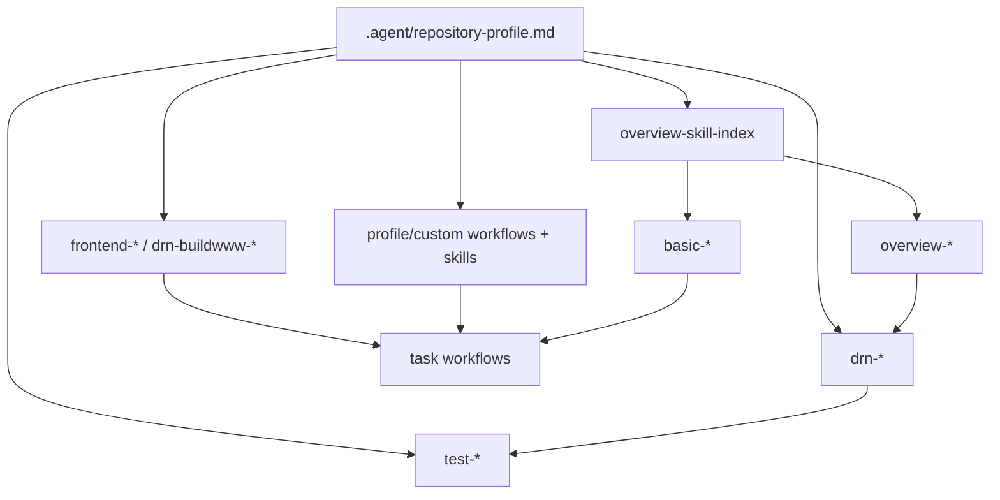

# Skill Cross-Reference Index

> Portable skill router. Read `.agent/repository-profile.md` first so profile-declared framework or repository overlays can refine generic routing.

## Selection Rules

1. Use existing source-owned guidance through the smallest set of skills that covers the task; do not create separate thin guidance forks.
2. Prefer generic `basic-*`, `overview-*`, and `test-*` skills for portable process guidance.
3. Load framework-specific skills only when the repository profile, source code, or user request names that framework.
4. Load generic `frontend-*` skills only when the repository profile or filesystem declares the matching frontend convention.
5. Load DRN-scoped buildwww skills only when the repository profile or filesystem declares DRN `buildwww`.
6. Load profile-declared custom workflows and skills before generic fallback when they match the task, route, layer, or slash-command flag.
7. If a referenced skill is missing after copying to another repository, skip it and rely on conventions/profile discovery.

## By Task

| Task | Skills to Load |
|------|----------------|
| Review a PR or diff | `basic-code-review` -> `basic-security-checklist` |
| Write documentation | `basic-documentation` -> `basic-documentation-diagrams` |
| Navigate repository | `overview-repository-structure` |
| Review architecture | `overview-ddd-architecture` when DDD applies |
| Modify CI/CD | `overview-github-actions` -> `basic-security-checklist` |
| Add unit tests | repository testing profile -> `test-unit` |
| Add integration tests | repository testing profile -> `test-integration` plus `test-integration-api` or `test-integration-db` |
| Run benchmarks | `test-performance` |
| Add DRN buildwww package | repository frontend profile -> `drn-buildwww-packages` when DRN `buildwww` applies |
| Modify DRN Vite/buildwww | `drn-buildwww-vite` when DRN `buildwww` applies |
| Add Razor UI | `frontend-razor-pages-shared` -> `frontend-razor-pages-navigation` -> `frontend-razor-accessors` |
| Add DRN React mounted island | `drn-buildwww-libraries` -> `drn-buildwww-react` when DRN `buildwww` applies |
| Work as an AI agent | `basic-agentic-development` |
| Pursue a goal through workflow routing | `/goal` workflow -> profile/custom route or skill overlays -> `basic-agentic-development` |
| Use repository-specific custom behavior | `.agent/repository-profile.md` -> matching `.agent/workflows/<custom>.md` or `.agent/skills/<custom>-*/SKILL.md` |
| Sync skills/workflows | `/update` workflow |
| Port `.agent` into a new repository | `/update all` -> full new-repository self-sync -> `/update` verification |

## Framework And Convention-Specific Families

The following families are framework- or convention-scoped and should be used only when present and relevant:

| Family | Trigger |
|--------|---------|
| `drn-*` | Repository uses DRN Framework or the user asks for DRN behavior |
| `overview-drn-*` | Repository profile declares DRN overview/testing conventions |
| `drn-buildwww-*` | Repository profile or filesystem declares DRN `buildwww` frontend convention |
| `<custom>-*` | Repository profile, workflow, or task declares a custom local convention |

## By Layer

| Concern | Portable Skills | Framework/Profile Overlay |
|---------|-----------------|----------------|
| Domain / architecture | `overview-ddd-architecture` | Framework/domain skill from profile |
| Hosting / API | `basic-security-checklist`, `test-integration-api` | Hosting skill from profile |
| Persistence | `test-integration-db` | ORM/framework skill from profile |
| Testing | `test-unit`, `test-integration`, `test-performance` | Framework/profile testing skill |
| Frontend | Detected generic `frontend-*` convention skill | `drn-buildwww-*` or other framework/web skill from profile |
| CI/CD | `overview-github-actions`, `basic-git-conventions` | Release/deployment profile |
| Custom workflow route | Selected generic route | Profile-declared custom workflow or skill overlay |

## Dependency Graph

## Keyword Index

Portable keywords should stay broad. Repository- or framework-specific terms belong in the profile-scoped index below and apply only when `.agent/repository-profile.md` declares the matching convention.

| Keyword | Skills |
|---------|--------|
| agentic / ai-agent | `basic-agentic-development` |
| architecture / ddd | `overview-ddd-architecture` |
| ci / github-actions / deployment | `overview-github-actions` |
| documentation / readme / release-notes | `basic-documentation`, `/documentation` |
| frontend / razor-ui | `frontend-razor-pages-shared`, `frontend-razor-pages-navigation`, `frontend-razor-accessors` |
| goal / goal-mode / workflow-routing | `/goal`, profile/custom route overlays, `basic-agentic-development` |
| repository / navigation | `overview-repository-structure` |
| new repository / port .agent / self-sync | `/update all`, `.agent/repository-profile.md`, `overview-skill-index` |
| repository-specific / custom workflow / custom skill | `.agent/repository-profile.md`, matching `.agent/workflows/<custom>.md`, matching `.agent/skills/<custom>-*/SKILL.md` |
| security | `basic-security-checklist`, `basic-code-review` |
| testing / unit / integration | `test-unit`, `test-integration`, `test-integration-api`, `test-integration-db` |

### Profile-Scoped Keywords

Use these terms only when the repository profile declares the matching framework, package, or frontend convention.

| Keyword | Skills / Next Hop |
|---------|-------------------|
| aggregate / entity / source-known / source-known-id / entity-type | `drn-domain-design`, `drn-sharedkernel` |
| repository / pagination / dto | `drn-domain-design`, `drn-sharedkernel`, `drn-entityframework` |
| ef-core / migration / prototype-mode | `drn-entityframework`, `drn-testing`, `test-integration-db` |
| testcontainers / postgres / rabbitmq | `drn-testing`, `test-integration-db` |
| frontend / vite / buildwww | `drn-buildwww-vite`, `drn-buildwww-packages` |
| authentication / authorization / csp / csrf / nonce | `drn-hosting`, `basic-security-checklist`, `drn-buildwww-libraries` |
| htmx / bootstrap / rsjs / onmount | `drn-buildwww-libraries`, `drn-buildwww-vite` |
| react / islands | `drn-buildwww-react` |
| shadow-dom / mount-api / tailwind / react-islands | `drn-buildwww-react`, `drn-buildwww-packages` |
| background-job / hosted-service | `drn-hosting`, profile-declared framework package docs |
| mass-transit / messaging / rabbitmq | `drn-testing`, profile-declared framework package docs |

## Related Skills

- [overview-repository-structure.md](../overview-repository-structure/SKILL.md)
- [basic-code-review.md](../basic-code-review/SKILL.md)
