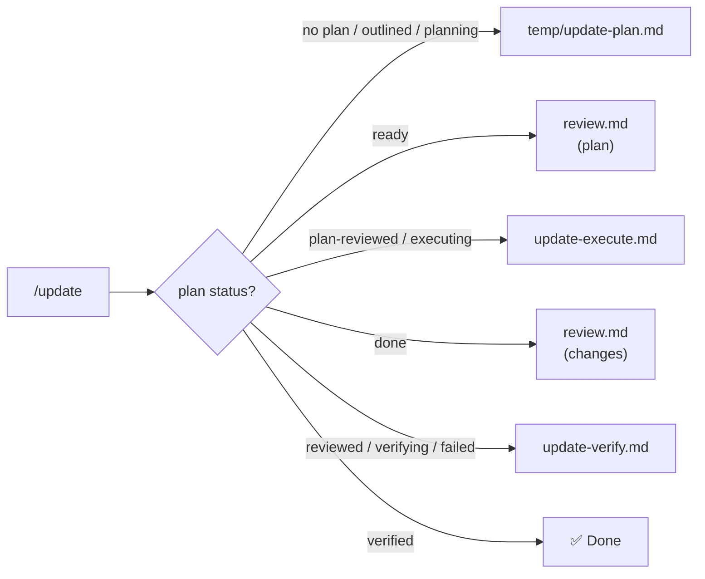

> **Trigger**: After adding/removing/renaming skills, or when porting `.agent` to a new repository.
> **Scope**: `/update <scope>` (limits sync to affected stages). Default: `all`.
> See also: [Status Lifecycle](./_shared/status-lifecycle.md) · [Operating Model](./_shared/workflow-operating-model.md)
> [!IMPORTANT]
> **Executive Presence governs every stage**: structured reporting, evidence-based checks, honest findings, scope-adaptive execution.
> **Estimated context: ~1.5K tokens**

---

## 1. Architecture
`/update` is a stateful orchestrator. It reads `.agent/temp/update-plan.md`, detects progress, and delegates or resumes via the state machine. Run repeatedly until status is `verified`.

Apply the shared Startup Gate before work: read `AGENTS.md`, `.agent/rules/DiSCOS.md` when present, `.agent/repository-profile.md` when present, this workflow, the shared operating model, the shared status lifecycle, and only needed skills/workflows.



### Standard Load Order (Stage 1, 2, 5)
`Basic` → `Overview` → `DRN Framework` → `Testing` → `Frontend` → `Custom`
*Single source of truth for group ordering.*

---

## 2. Situation Report
Emit a Situation Report before and after delegation:
```markdown
## 🔍 Situation <Before | After>
| Aspect | Value |
|--------|-------|
| **Plan file** | exists / missing |
| **Plan status** | outlined / planning / ready / plan-reviewed / executing / done / reviewed / verifying / verified / failed / N/A |
| **Scope** | `<scope>` or `all` |
| **Stages** | N total — X pending, Y skipped, Z done |
| **Last generated** | <timestamp> or N/A |
| **What happened** | *(After only)* <summary of work performed> |
| **Next step** | Run `/update` again / Done — suggest cleanup and commit commands |
```

Upon `verified` status, suggest cleanup and commit commands only. Do not delete files or run VCS mutations unless the user explicitly requested that action:
```markdown
## ✅ Update Complete
Suggested cleanup: delete `.agent/temp/update-plan.md` and `.agent/temp/update-verify-progress.md` before staging.
Suggested commit: `git add .agent/ && git commit -m "chore(skills): sync agent configuration"`
```

---

## 3. Detect State & Delegate
Read file: `.agent/temp/update-plan.md`. If missing, state is `no-plan`. Else, parse `Status:` and `Scope:`.

| State | Action | Delegate To | Post-Condition |
|-------|--------|-------------|----------------|
| No plan / `outlined` / `planning` | Plan discovery/detailing | `update-plan.md` | — |
| `ready` | Plan review | `review.md` (scope: `.agent/temp/update-plan.md`) | No 🔴 Critical → `plan-reviewed`; otherwise keep `ready` |
| `plan-reviewed` | Fresh execution start | `update-execute.md` (Stage 1) | — |
| `executing` | Resume execution | `update-execute.md` (resume) | — |
| `done` | Changes review | `review.md` (scope table below) | No 🔴 Critical → `reviewed`; otherwise keep `done` |
| `reviewed` / `verifying` | Verify content | `update-verify.md` | `verified` \| `failed` |
| `failed` | Re-verify after fixes | `update-verify.md` | `verified` \| `failed` |
| `verified` | Stop | None | — |

`/review` is read-only. When it returns `transition_allowed: plan-reviewed` or `transition_allowed: reviewed`, `/update` performs the plan-header status mutation. Other sub-workflows own only the state files named in the shared status lifecycle.

### Review Scope for `done` State
- **Include**: Stage 1–5 action item files, `_shared` fragments when in scope, `AGENTS.md` (if Stage 3 run), `overview-skill-index/SKILL.md` (if Stage 5 run).
- **Exclude**: Stage 6 files (flags only, no edits).

---

## 4. Plan File Contract
**Location**: `.agent/temp/update-plan.md`
**Lifecycle**: shared `UPDATE` lifecycle in `_shared/status-lifecycle.md`.

### Structure
- **Header**: Metadata.
- **Discovery Summary**: Skills Manifest, Projects Manifest, Non-Project Assets, Drift Report, Documentation Drift.
- **Stage 1**: Sync Group Workflows (group loaders & task workflows).
- **Stage 2**: Sync `load-skills-all.md`.
- **Stage 3**: Sync `AGENTS.md` & profile.
- **Stage 4**: Sync Non-Project References.
- **Stage 5**: Sync Skill Index.
- **Stage 6**: Sync Project Docs (drift flag only, no edits).

### Scope Resolution
| Scope | Meaning | Stages | Discovery |
|-------|---------|--------|-----------|
| `all` / *(omitted)* | Full repo sync | 1–6 | Full |
| `<group>` (e.g. `basic`) | Group skills changed | 1 (group), 2, 5 | Skills only |
| `<skill-dir>` | Single skill changed | 1 (parent), 2, 5 | That skill only |
| `skills` | All skill groups | 1, 2, 5 | Skills only |
| `agents` | AGENTS.md sync | 3 | Projects + assets |
| `projects` | Projects changed | 3, 4, 6 | Projects + assets |
| `infra` | Infrastructure changed | 4 | Assets only |
| `files: <paths>` | Explicit changed file list, usually from `/update-last` | Derived from listed paths | File-scoped |
| `stage-<N>` | Explicit stage | Stage N | Stage-scoped |
| *(freeform)* | Handled by planner | Determined in planning | Resolved in planning |

- **Scope-widening rule**: If cross-group dependencies are found, report and ask before widening (never auto-widen).
- **File-scope rule**: `files:` is a known scope. The planner maps each path to affected stages, preserves the original path list in the plan, and asks only when a listed path cannot be mapped deterministically.
- **Stage Resumption Protocol**: Read plan, find first non-terminal stage, execute, pause at `Requires Approval`, update status.

### Plan File Template
```markdown
# Update Plan
> Generated: <timestamp> | Status: <status> | Scope: <scope> | Resolved Stages: <stages>
> Repo: <path> | Baseline HEAD: <sha> | Baseline Inputs Hash: <sha256 or N/A>
> Custom Groups: <prefix> → <workflow>

## Discovery Summary

### Skills Manifest
| Name | Group | Path | Tokens |
|------|-------|------|--------|
| <name> | <group> | .agent/skills/<dir>/SKILL.md | <bytes/4> |

### Projects Manifest
| Project | Layer | Runnable | Test |
|---------|-------|----------|------|
| <name> | <layer> | ✅/❌ | ✅/❌ |

### Non-Project Assets
| File | Category | Exists |
|------|----------|--------|
| `Directory.Build.props` | Build config | ✅/❌ |

### Drift Report
- ➕ Added: <list>
- ➖ Removed: <list>
- ⚠️ Stale references: <list>
- 🔀 Prefix mapping: <old> → <new>

### Documentation Drift
| Module | State | STALE | MISSING | RENAMED | Action |
|--------|-------|-------|---------|---------|--------|
| <Module> | rich/stub | N | N | N | flag / skip |

## Stage <N>: <Title>
> Status: pending | skipped | executing | done | Maps to: §<refs>
### Actions
- [ ] <description>
### Requires Approval
- [ ] <approval item>

<!-- Repeat for each stage; skipped stages replace Actions with _(skipped — out of scope)_ -->
```

Baseline semantics: `Baseline HEAD` is audit metadata and may differ after unrelated commits. `Baseline Inputs Hash` is the staleness gate; compute it from sorted normalized in-scope paths, file contents, and deletion markers. Use `N/A` only when the resolved scope has no material input files to hash.

---

## 5. Operational Guarantees
- **Stateful**: Ephemeral `.agent/temp/update-plan.md` stores state across sessions.
- **Idempotent & Reversible**: Git-tracked changes, no backups, no destructive cleanup without explicit request.
- **Scope-aware**: SKIPPED states for out-of-scope stages.
- **Safe**: Manual deletion for skills, prefix mappings require approval, and VCS mutations are suggested only unless explicitly requested.
