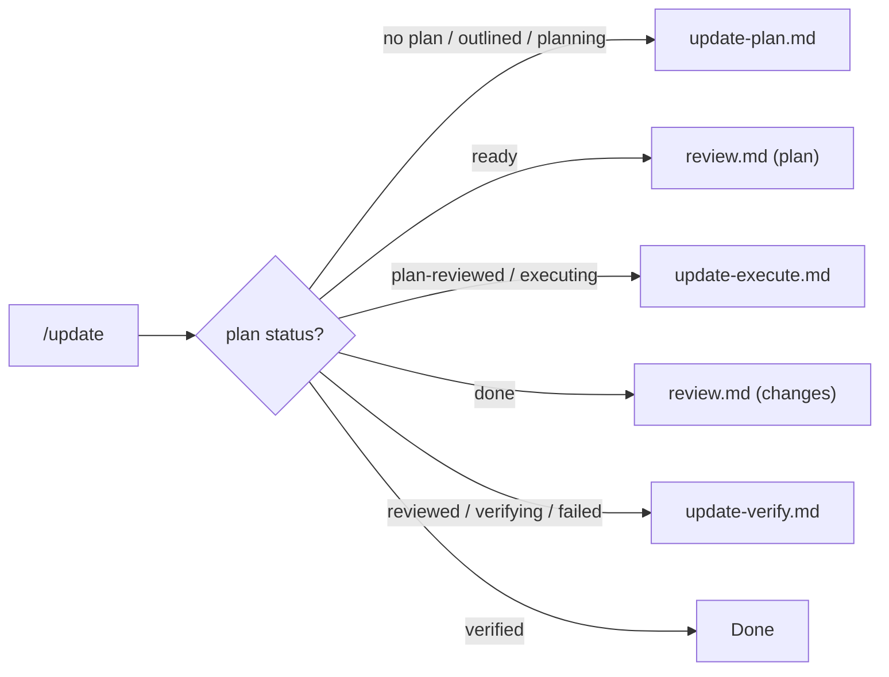

> **Trigger**: After adding/removing/renaming skills, or when porting `.agent` to a new repository.
> **Scope**: `/update <scope>`; default `all`.
> See also: [Status Lifecycle](./_shared/status-lifecycle.md) · [Operating Model](./_shared/workflow-operating-model.md)
> [!IMPORTANT]
> Govern each stage with Executive Presence: structure, evidence, honesty, and scope-adaptive execution.
> **Estimated context: ~2.0K tokens**

## 1. Mission

`/update` is the stateful orchestrator for agent configuration sync. It reads `.agent/temp/update-plan.md`, detects status, delegates the next owner, and repeats until status is `verified`.

Run the shared Startup Gate once. Read `AGENTS.md`; read `.agent/rules/DiSCOS.md` and `.agent/repository-profile.md` when present; read this workflow, the operating model, the status lifecycle, and only task-needed skills or workflows.

### State Machine



### Standard Load Order

Use this order for Stages 1, 2, and 5:

`Basic` -> `Overview` -> `DRN Framework` -> `Testing` -> `Frontend` -> `Custom`

### New Repository Self-Sync

When `.agent/` is copied into a new repository and scope is omitted or `all`:

1. Treat the current filesystem as source of truth; use cached manifests and old facts only as evidence.
2. Rediscover `AGENTS.md`, profile, skills, workflows, manifests, CI, docs roots, and repository assets.
3. Detect custom skills and workflows, including `<custom>-*`, uncategorized skill directories, and task routes absent from portable `AGENTS.md`.
4. Sync derived agent files together: group loaders, `load-skills-all.md`, `AGENTS.md` workflow table, profile route/load-set sections, and `overview-skill-index`.
5. Flag project docs and release-note drift only; delegate rewrites to `/documentation`.
6. Verify structural consistency before reporting `verified`.

---

## 2. Situation Report

Emit before and after delegation:

```markdown
## Situation <Before | After>
| Aspect | Value |
|---|---|
| Plan file | exists / missing |
| Plan status | outlined / planning / ready / plan-reviewed / executing / done / reviewed / verifying / verified / failed / N/A |
| Scope | `<scope>` or `all` |
| Stages | N total; X pending, Y skipped, Z done |
| Last generated | <timestamp> or N/A |
| What happened | <After only: summary> |
| Next step | Run `/update` again / Done; suggest cleanup and commit commands |
```

When status is `verified`, suggest cleanup and commit commands only. Do not delete files or mutate Git unless the user explicitly asks.

```markdown
## Update Complete
Suggested cleanup: delete `.agent/temp/update-plan.md` and `.agent/temp/update-verify-progress.md` before staging.
Suggested commit: `git add AGENTS.md .agent/ && git commit -m "chore(skills): sync agent configuration"`
```

---

## 3. Detect State And Delegate

Read `.agent/temp/update-plan.md`. If missing, state is `no-plan`. Otherwise parse `Status:` and `Scope:`.

| State | Action | Delegate | Post-condition |
|---|---|---|---|
| No plan / `outlined` / `planning` | Plan discovery/detailing | `update-plan.md` | - |
| `ready` | Review plan | `review.md` on `.agent/temp/update-plan.md` | No Critical -> `plan-reviewed`; else keep `ready` |
| `plan-reviewed` | Start execution | `update-execute.md` Stage 1 | - |
| `executing` | Resume execution | `update-execute.md` | - |
| `done` | Review changes | `review.md` on scope below | No Critical -> `reviewed`; else keep `done` |
| `reviewed` / `verifying` | Verify content | `update-verify.md` | `verified` or `failed` |
| `failed` | Re-verify after fixes | `update-verify.md` | `verified` or `failed` |
| `verified` | Stop | None | - |

`/review` is read-only. When it returns `transition_allowed: plan-reviewed` or `transition_allowed: reviewed`, `/update` mutates only the plan-header status. Other sub-workflows own only their lifecycle state files.

### Review Scope For `done`

- Include Stage 1-5 action files, in-scope `_shared` fragments, `AGENTS.md` if Stage 3 ran, and `overview-skill-index/SKILL.md` if Stage 5 ran.
- Exclude Stage 6 files; Stage 6 flags drift only.

---

## 4. Plan File Contract

**Location**: `.agent/temp/update-plan.md`
**Lifecycle**: `UPDATE` lifecycle in `_shared/status-lifecycle.md`.

### Required Structure

- Header metadata.
- Discovery Summary: Skills Manifest, Projects Manifest, Non-Project Assets, Drift Report, Documentation Drift.
- Stages 1-6:
  1. Sync Group Workflows.
  2. Sync `load-skills-all.md`.
  3. Sync `AGENTS.md` and profile.
  4. Sync Non-Project References.
  5. Sync Skill Index.
  6. Sync Project Docs as drift flags only.

### Scope Resolution

| Scope | Meaning | Stages | Discovery |
|---|---|---|---|
| `all` / omitted | Full repo sync plus bootstrap mode | 1-6 | Full filesystem |
| `<group>` | Group skills changed | 1 group, 2, 5 | Skills |
| `<skill-dir>` | Single skill changed | 1 parent, 2, 5 | That skill |
| `skills` | All skill groups | 1, 2, 5 | Skills |
| `agents` | `AGENTS.md` sync | 3 | Projects + assets |
| `projects` | Projects changed | 3, 4, 6 | Projects + assets |
| `infra` | Infrastructure changed | 4 | Assets |
| `files: <paths>` | Explicit changed files, usually from `/update-last` | Derived | File-scoped |
| `stage-<N>` | Explicit stage | Stage N | Stage-scoped |
| freeform | Planner resolves | Determined | Resolved in planning |

Rules:

- Ask before widening scope for cross-group dependencies.
- Treat `files:` as known scope. Map each path to stages, preserve the original list, and ask only when a path cannot be mapped deterministically.
- Resume from the first non-terminal stage; pause at `Requires Approval`; update status after each stage.

### Plan Template

```markdown
# Update Plan
> Generated: <timestamp> | Status: <status> | Scope: <scope> | Resolved Stages: <stages>
> Repo: <path> | Baseline HEAD: <sha> | Baseline Inputs Hash: <sha256 or N/A>
> Baseline Inputs Hash Justification: no-material-input-files
> Custom Groups: <prefix> -> <workflow>
> Custom Workflows: <route> -> <workflow>

## Discovery Summary

### Skills Manifest
| Name | Group | Path | Tokens |
|---|---|---|---|

### Projects Manifest
| Project | Layer | Runnable | Test |
|---|---|---|---|

### Non-Project Assets
| File | Category | Exists |
|---|---|---|

### Drift Report
- Added:
- Removed:
- Stale references:
- Prefix mapping:

### Documentation Drift
| Module | State | STALE | MISSING | RENAMED | Action |
|---|---|---|---|---|---|

## Stage <N>: <Title>
> Status: pending | skipped | executing | done | Maps to: §<refs>
### Actions
- [ ] <description>
### Requires Approval
- [ ] <approval item>
```

Baseline semantics: `Baseline HEAD` is audit metadata. `Baseline Inputs Hash` is the staleness gate; compute it for every material in-scope input using [`baseline-inputs-hash-spec.md`](./_shared/baseline-inputs-hash-spec.md). Use `N/A` only when no material input files exist, and then include the exact header `Baseline Inputs Hash Justification: no-material-input-files`. Omit that header when the hash is a SHA-256 value.

---

## 5. Guarantees

- Stateful: `.agent/temp/update-plan.md` stores progress.
- Idempotent and reversible: use Git-tracked changes; do not create backups.
- Scope-aware: mark out-of-scope stages `skipped`.
- Safe: require approval for manual deletion and prefix mappings; suggest VCS mutations only unless explicitly requested.
