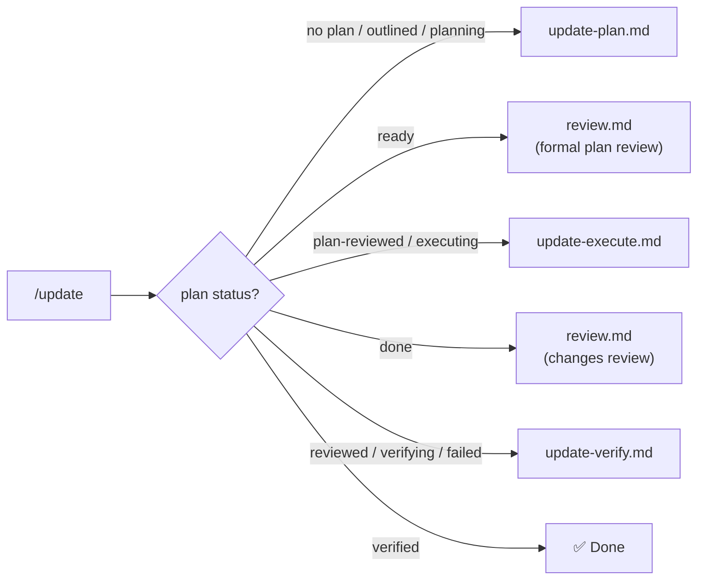

> **Trigger**: After adding, removing, or renaming skills, or after copying `.agent` to a new repository.
>
> **Scope** *(optional)*: `/update <scope>` — limits sync to affected stages. Default: `all`. See §Scope Resolution.
> [!IMPORTANT]
> **Executive Presence governs every stage**: Decorum (structured, professional reporting) × Competency (rigorous, evidence-based checks) × Integrity (honest findings — never suppress failures) × Situational Awareness (scope-adaptive, context-budget-aware, fail-fast on structural issues).

---

## Architecture

`/update` is a **stateful orchestrator**. It reads `.agent/update-plan.md`, detects progress, and resumes at the correct phase. Run repeatedly until done — no flags required.



> **Note**: In the diagram above, `plan-reviewed` and `executing` both route to `update-execute.md`. See §2.2 state table for the authoritative entry-point distinction.

### Standard Load Order

Automated sync operations follow a consistent group order to ensure dependency-aware loading. This order governs Stage 1 (group loader skill lists), Stage 2 (`all.md` section ordering), and Stage 5 (Skill Index By Layer tables). §0 (Pre-Execution Validation) is a gate, not a sync stage.

`Basic` → `Overview` → `DRN Framework` → `Testing` → `Frontend` → `Custom`

> [!NOTE]
> This order is the single source of truth for `AGENTS.md`, `all.md`, and structural verification.

---

## 1. Situation Report

Read state **before** acting; report state **after** delegation completes. Use the same template both times:

```markdown
## 🔍 Situation <Before | After>

| Aspect | Value |
|--------|-------|
| **Plan file** | exists / missing |
| **Plan status** | outlined / planning / ready / plan-reviewed / executing / done / reviewed / verifying / verified / N/A |
| **Scope** | `<scope>` or `all` (default) |
| **Stages** | N total — X pending, Y skipped, Z done |
| **Last generated** | <timestamp> or N/A |
| **What happened** | *(After only)* <summary of work performed> |
| **Next step** | Run `/update` again / Done — delete plan file and commit |
```

When status reaches `verified`:

```markdown
## ✅ Update Complete

All stages finished, self-reviewed, changes reviewed, content verified.

**Next steps:**
1. Commit: `git add .agent/ && git commit -m "chore(skills): sync agent configuration"`
2. Clean up: delete `.agent/update-plan.md` and `.agent/update-verify-progress.md`
```

---

## 2. Detect State & Delegate

### 2.1 Read State

// turbo
Run: `view_file .agent/update-plan.md` — if the file exists, extract `Status:` and `Scope:` from the header; if not found, set state to `no-plan`.

### 2.2 State Machine & Delegation

Load the target sub-workflow via `view_file` and execute its instructions.

| State | Action | Delegate To | Post-Condition | Notes |
|-------|--------|-------------|----------------|-------|
| No plan file | Start fresh planning | `update-plan.md` | — | — |
| `outlined` | Detail remaining stages | `update-plan.md` | — | — |
| `planning` | Continue detailing | `update-plan.md` | — | — |
| `ready` | Review plan before execution | `review.md` → scope: `.agent/update-plan.md` | Status → `plan-reviewed` | — |
| `plan-reviewed` | Begin execution | `update-execute.md` | — | **Fresh start** — begin from Stage 1 |
| `executing` | Resume from last incomplete stage | `update-execute.md` | — | **Resume** — find first non-terminal stage |
| `done` | Review all file changes | `review.md` → scope: see §Review Scope for `done` State below | Status → `reviewed` | — |
| `reviewed` | Begin content verification | `update-verify.md` | Status → `verified` | — |
| `verifying` | Resume verification | `update-verify.md` | Status → `verified` | — |
| `failed` | Re-verify after fixes | `update-verify.md` | Status → `verified` \| `failed` | — |
| `verified` | Report completion, stop | *(none)* | — | — |

### Review Scope for `done` State

When status is `done`, pass the following file set to `review.md`:

- All files listed in plan Stage 1–5 action items
- **Always include** `AGENTS.md` if Stage 3 executed — it is always touched by Stage 3 regardless of action item wording
- **Always include** `.agent/skills/overview-skill-index/SKILL.md` if Stage 5 executed — it is always touched by Stage 5 regardless of action item wording
- **Exclude** Stage 6 — it is flag-only and produces no file modifications

---

## Plan File Contract

**Location**: `.agent/update-plan.md`

**Status lifecycle**: `outlined` → `planning` → `ready` → `plan-reviewed` → `executing` → `done` → `reviewed` → `verifying` → `verified` (or `failed` → re-verify)

### Structure

| Section | Purpose |
|---------|---------|
| **Header** | Timestamp, Status, Scope, Repo path |
| **Discovery Summary** | Skills Manifest, Projects Manifest, Non-Project Assets, Drift Report |
| **Stage 1** | Sync Group Workflows — update group loaders and task workflow skill sections |
| **Stage 2** | Sync `all.md` — regenerate all sections from group workflows |
| **Stage 3** | Sync `AGENTS.md` — update project table, commands, skill paths, workflow listing |
| **Stage 4** | Sync Non-Project References — validate build config, CI/CD, Docker references |
| **Stage 5** | Sync Skill Index — update task table, layer tables, dependency graph, keyword index |
| **Stage 6** | Sync Project Docs — flag stale `README.md`, `RELEASE-NOTES.md`, `ROADMAP.md`, `CHANGELOG.md`, `docs/` sections after project rename or structural change (flag only — never auto-modify) |

> [!NOTE]
> **Out of scope**: `/update` does not rewrite project documentation content. Stage 6 flags sections that reference renamed projects or removed paths — the author makes the actual edits. If no project rename or structural change occurred, Stage 6 is skipped.

### Scope Resolution

The orchestrator resolves scopes into affected stage sets. Sub-workflows interpret scope within their stages — the orchestrator provides boundaries, sub-workflows own responsibility.

| Scope | Meaning | Stages | Discovery | Widening |
|-------|---------|--------|-----------|----------|
| *(omitted)* / `all` | Full repo sync | 1–6 | Full | N/A |
| `<group>` (e.g. `basic`) | Single skill group changed | 1 (that group), 2, 5 | Skills only | Possible |
| `<skill-dir>` (e.g. `drn-hosting`) | Single skill changed | 1 (parent group), 2, 5 | That skill only | Possible |
| `skills` | All skill groups | 1, 2, 5 | Skills only | N/A |
| `agents` | AGENTS.md sync | 3 | Projects + assets | N/A |
| `projects` | Project references changed | 3, 4, 6 | Projects + assets | N/A |
| `infra` | Non-project infrastructure | 4 | Assets only | N/A |
| `stage-<N>` | Explicit stage | That stage only | Stage-scoped | N/A |
| *(freeform)* | Natural-language — resolved during planning | Determined by planner | Determined by planner | Possible |

> [!NOTE]
> This is a resolution guide, not a closed enum. Known scopes resolve deterministically; freeform scopes are interpreted by the planner and confirmed by the user.

#### Scope-Widening Rule

If a scoped update discovers cross-group dependencies (e.g., a skill in `basic` cross-referenced in `drn.md`): **report** the wider impact, **ask** whether to widen or defer, **never auto-widen** (DiSCOS Autonomy Limits). Downstream references may be temporarily out of sync until a wider-scoped run.

#### Freeform Scope Resolution

When the scope string matches no known value, the planner interprets it during `update-plan.md` §0:

1. **Interpret** — scan skill names, descriptions, keywords, project names, file paths, and workflow areas for relevance
2. **Resolve** — map to the closest known scope combination and determine affected stages
3. **Confirm** — present resolution to user and wait for approval (DiSCOS Confidence Signaling: Low):
   ```
   Scope Resolution: "<freeform>" → <interpretation>. Skills: <list>. Projects: <list>. Stages: <N, N>. Proceed?
   ```
4. On **rejection** — ask for clarification or accept a corrected scope

> [!NOTE]
> Freeform resolution runs once during planning. The confirmed result persists in the plan header (`Resolved Stages:`), so execution and verification never re-interpret freeform strings.

### Plan File Template

````markdown
# Update Plan

> Generated: <ISO-8601 timestamp>
> Status: outlined | planning | ready | plan-reviewed | executing | done | reviewed | verifying | verified
> Scope: all | skills | agents | projects | infra | <group> | <skill-dir> | stage-<N> | <freeform>
> Resolved Stages: 1, 2, 3, 4, 5, 6 *(always populated — full set for known scopes, subset for freeform/scoped runs)*
> Repo: <repository root path>

---

## Discovery Summary

### Skills Manifest
| Name | Group | Path | Tokens |
|------|-------|------|--------|
| <name> | <group> | .agent/skills/<dir>/SKILL.md | <bytes/4> |

### Projects Manifest
| Project | Layer | Runnable | Test |
|---------|-------|----------|------|
| <name> | <layer> | ✅/❌ | ✅/❌ |

### Non-Project Assets
| File | Category | Exists |
|------|----------|--------|
| `Directory.Build.props` | Build config | ✅/❌ |

### Drift Report
- ➕ Added: <list>
- ➖ Removed: <list>
- ⚠️ Stale references: <list>
- 🔀 Prefix mapping: <old> → <new>

---

## Stage <N>: <Title>
> Status: pending | skipped | executing | done
> Maps to: §<refs>

### Actions
- [ ] <action description>

### Requires Approval *(if applicable)*
- [ ] <approval item>

<!-- Repeat for each stage; skipped stages replace Actions with _(skipped — out of scope)_ -->
````

### Design Rules

1. Discovery Summary is written once during planning — execution never re-discovers
2. `Requires Approval` subsections — execution pauses and asks user before proceeding

### Stage Resumption Protocol

Used by `update-execute.md` and `update-verify.md`:

1. Read the coordination file (plan or progress file)
2. Find first stage with non-terminal status (not `done` / `pass` / `fail` / `skipped`)
3. Mark it `executing`, check off each action on completion
4. If `Requires Approval` exists, pause and ask user (execution only; verification has no approval gates)
5. Mark stage terminal, continue to next until all complete

---

## Operational Guarantees

| Property | Guarantee |
|----------|-----------|
| **Stateful** | Progress persists in `.agent/update-plan.md` — survives context boundaries, resumes automatically |
| **Idempotent** | No file content changes on an already-synced repo; re-verification re-checks (reset only on explicit request). Plan file and progress file are ephemeral and may be re-read or updated on each run. |
| **Warning persistence** | `⚠️ Verified with warnings` sets plan status to `verified` — warnings are **ephemeral** (recorded in `.agent/update-verify-progress.md` only). Review and act on all warnings before committing; they are not re-surfaced on subsequent runs. |
| **Scope-aware** | Optional scope limits discovery and execution; unaffected stages `skipped`; defaults to `all` |
| **Safe by default** | Skill body modified only via project name substitution (requires approval); stale refs flagged, never auto-removed; scope never auto-widened |
| **Portable** | Adapts to any project via prefix detection; `update-verify.md` validates content post-execution |
| **Dynamic stages** | Verification stages generated from Projects Manifest, not hardcoded |
| **Workflow-type aware** | Distinguishes group loaders from task workflows — syncs each appropriately (see `update-execute.md` §1.2) |
| **Observable** | Every invocation emits the Situation Report — Before and After (§1) |
