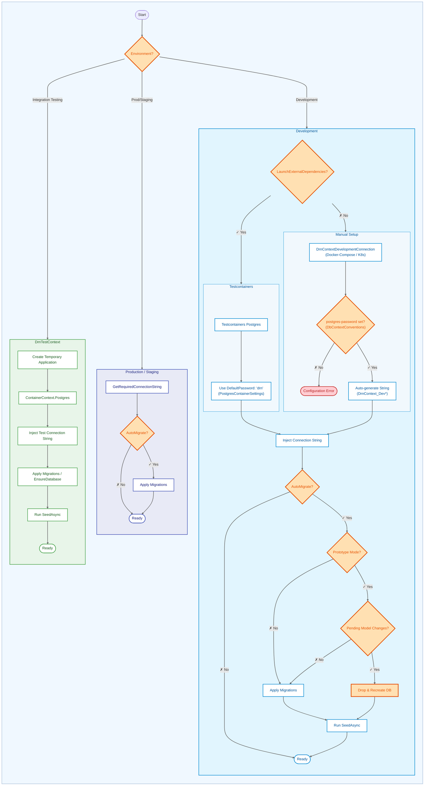

[](https://github.com/duranserkan/DRN-Project/actions/workflows/master.yml)
[](https://github.com/duranserkan/DRN-Project/actions/workflows/develop.yml)
[](https://sonarcloud.io/summary/new_code?id=duranserkan_DRN-Project)

[](https://sonarcloud.io/summary/new_code?id=duranserkan_DRN-Project)
[](https://sonarcloud.io/summary/new_code?id=duranserkan_DRN-Project)
[](https://sonarcloud.io/summary/new_code?id=duranserkan_DRN-Project)
[](https://sonarcloud.io/summary/new_code?id=duranserkan_DRN-Project)
[](https://sonarcloud.io/summary/new_code?id=duranserkan_DRN-Project)
[](https://sonarcloud.io/summary/new_code?id=duranserkan_DRN-Project)
[](https://sonarcloud.io/summary/new_code?id=duranserkan_DRN-Project)

# DRN.Framework.EntityFramework

> Convention-based Entity Framework Core integration with automatic configuration, migrations, and domain event support.

## TL;DR

- **Zero-Config DbContext** - `DrnContext<T>` auto-registers, discovers configurations, and manages migrations
- **Source Known IDs** - Internal `long` for DB performance, external `Guid` for API security
- **Auto-Tracking** - Automatic `CreatedAt`/`ModifiedAt` timestamps and domain events
- **Prototype Mode** - Auto-recreate database on model changes during development
- **Repository Base** - `SourceKnownRepository<TContext, TEntity>` with pagination and validation

> [!WARNING]
> **Upcoming Features (v1.0.0)**: The following features will be available after DRN.Nexus integration is completed:
> - Auto-Migration in Production
> - Domain Event Publishing

## Table of Contents

- [QuickStart: Beginner](#quickstart-beginner)
- [QuickStart: Advanced](#quickstart-advanced)
- [Identity System](#identity-system)
- [DrnContext](#drncontext)
- [Context-Specific Migrations](#context-specific-migrations)
- [Identity Naming Conventions](#identity-naming-conventions)
- [SourceKnownRepository](#sourceknownrepository)
- [Entity Configuration](#entity-configuration)
- [Attributes & Configuration](#attributes--configuration)
- [Prototype Mode](#prototype-mode)
- [Connection String Resolution by Environment](#connection-string-resolution-by-environment)
- [Configuration Settings Reference](#configuration-settings-reference)
- [Global Usings](#global-usings)
- [Related Packages](#related-packages)

---

## QuickStart: Beginner

Define a DbContext and entity with automatic ID generation:

```csharp
// 1. Define your entity with EntityType attribute
[EntityType(1)] // Unique byte per entity type
public class User : SourceKnownEntity
{
    public string Username { get; set; } = "";
}

// 2. Create your context inheriting from DrnContext
public class AppContext : DrnContext<AppContext>
{
    public AppContext(DbContextOptions<AppContext> options) : base(options) { }
    public AppContext() : base(null) { } // Required for migrations

    public DbSet<User> Users { get; set; }
}

// 3. Use in your service - IDs are generated before save
public class UserService(AppContext context)
{
    public async Task CreateUserAsync(string username)
    {
        context.Users.Add(new User { Username = username }); 
        await context.SaveChangesAsync(); // ID generated here by IDrnSaveChangesInterceptor
    }
}
```

## QuickStart: Advanced

Complete repository pattern with pagination and filtering:

```csharp
// Repository with custom query methods
public interface IUserRepository : ISourceKnownRepository<User> 
{
    Task<User[]> GetActiveUsersAsync();
}

[Scoped<IUserRepository>]
public class UserRepository(AppContext context, IEntityUtils utils) 
    : SourceKnownRepository<AppContext, User>(context, utils), IUserRepository
{
    public async Task<User[]> GetActiveUsersAsync()
    {
        // EntitiesWithAppliedSettings() applies AsNoTracking, Filters, etc.
        return await EntitiesWithAppliedSettings()
            .Where(u => u.IsActive)
            .ToArrayAsync();
    }
}

// Controller with pagination
[ApiController, Route("api/users")]
public class UserController(IUserRepository repository) : ControllerBase
{
    [HttpGet]
    public async Task<PaginationResultModel<UserDto>> GetAsync([FromQuery] PaginationRequest request)
    {
        var result = await repository.PaginateAsync(request);
        return result.ToModel(u => new UserDto { Id = u.EntityId, Username = u.Username });
    }
    
    [HttpGet("{id:guid}")]
    public async Task<UserDto> GetByIdAsync(Guid id)
    {
        var user = await repository.GetAsync(id); // Validates ID automatically
        return new UserDto { Id = user.EntityId, Username = user.Username };
    }
}
```

---

## Identity System

The framework uses a Source Known identifier system that balances database performance (long IDs) with external security (GUIDs) and type safety.

### SourceKnownId

The internal structure representing identity components:

```csharp
public readonly record struct SourceKnownId(
    long Id,                  // Internal DB ID (primary key)
    DateTimeOffset CreatedAt, // Timestamp of generation
    uint InstanceId,          // Generator instance ID
    byte AppId,               // Application ID
    byte AppInstanceId        // Application Instance ID
);
```

### SourceKnownEntityId

The public-facing identifier wrapper used in contracts and domain logic:

```csharp
public readonly record struct SourceKnownEntityId(
    SourceKnownId Source,   // Decoded internal components
    Guid EntityId,          // Opaque external GUID
    byte EntityType,        // Entity type discriminator
    bool Valid              // Structural validity flag
);
```

### External vs Internal IDs

> [!IMPORTANT]
> **External Identity Rule**: Always use `Guid EntityId` (mapped as `Id` in DTOs) for all public-facing contracts, API route parameters, and external lookups. The internal `long Id` must **never** be exposed outside the infrastructure/domain boundaries.

**Why Two IDs?**
- **Performance**: `long Id` provides fast database indexing and joins
- **Security**: `Guid EntityId` prevents enumeration attacks and ID guessing
- **Type Safety**: `EntityType` byte ensures IDs are validated against the correct entity type

## DrnContext

`DrnContext` is the foundational `DbContext` implementation that integrates with the DRN Framework ecosystem.

### Standard Attributes (Inherited)

Every `DrnContext` automatically inherits three critical attributes from the base class. You can override them with your custom attributes that inherits from these attributes.

```csharp
// The base class defines these defaults:
[DrnContextServiceRegistration, DrnContextDefaults, DrnContextPerformanceDefaults]
public abstract class DrnContext<TContext> : DbContext, IDrnContext<TContext> 
    where TContext : DrnContext<TContext>, new()
{
    // ...
}
```

| Attribute | Description |
| --- | --- |
| `DrnContextServiceRegistration` | Auto-registration, startup validation, migration management |
| `DrnContextDefaults` | Npgsql defaults, JSON configuration, logging setup |
| `DrnContextPerformanceDefaults` | Connection pooling, multiplexing, command timeouts |

### Features

*   **Zero-Config Registration**: Uses `[DrnContextServiceRegistration]` for automatic DI registration, including `IDesignTimeDbContextFactory` support for migrations.
*   **Convention-Based Configuration**:
    *   Context name defines the connection string key (e.g., `QAContext` → `ConnectionStrings:QAContext`).
    *   Automatically applies `IEntityTypeConfiguration` from the context's assembly and namespace.
    *   Schema naming derived from context name in `snake_case`.
*   **Audit Support**: Automatically manages `IDomainEvent` dispatching and `Tracking` properties (`CreatedAt`, `ModifiedAt`) for `SourceKnownEntity`.
*   **Integration Testing**: Native support for `DRN.Framework.Testing`'s `ContainerContext` for isolated Postgres container tests.

## Context-Specific Migrations

DRN Framework simplifies multi-context projects by automatically managing migration locations via `DrnMigrationsScaffolder`.

- **Clean Project Structure**: Keeps migrations separated logically by context, preventing clutter in the project root.

> [!TIP]
> **Migration Startup Project**: When adding or applying migrations, the project containing the `DrnContext` should be used as the startup project (e.g., `dotnet ef migrations add Name --project Sample.Infra --startup-project Sample.Infra`). This is because the context already implements `IDesignTimeDbContextFactory`, ensuring all configuration and connection defaults are correctly applied.

## Identity Naming Conventions

When using `DrnContextIdentity`, the framework automatically applies clean `snake_case` naming to standard ASP.NET Core Identity tables.

| Original Table | DRN Table Name |
| :--- | :--- |
| `AspNetUsers` | `users` |
| `AspNetUserLogins` | `user_logins` |
| `AspNetUserClaims` | `user_claims` |
| `AspNetRoles` | `roles` |
| `AspNetUserRoles` | `user_roles` |
| `AspNetRoleClaims` | `role_claims` |
| `AspNetUserTokens` | `user_tokens` |

This ensures that your identity schema feels at home with the rest of your `snake_case` domain tables.

### Entity ID Generation

Entities inheriting from `SourceKnownEntity` have their IDs automatically generated before being persisted to the database:

*   **Generation**: Handled by `IDrnSaveChangesInterceptor` which assigns a unique Source-Known ID when `Id = 0` during `SaveChangesAsync`.
*   **Initialization**: `IDrnMaterializationInterceptor` ensures external identity properties are initialized when entities are loaded from the database.
*   **Mechanism**: Uses `ISourceKnownIdUtils.Next<TEntity>()` to generate collision-free `long` IDs.
*   **Requirement**: Every entity must have a unique `[EntityType(n)]` attribute.
*   **Note**: `EntityId` (Guid) and `EntityIdSource` are computed properties, initialized by interceptors and ignored by EF Core mapping.

```csharp
[EntityType(1)]
public class User : SourceKnownEntity
{
    // Id is generated by IDrnSaveChangesInterceptor before SaveChanges
    public string Username { get; set; }
}
```

### Startup Validation

`[DrnContextServiceRegistration]` performs critical validations at startup:

*   **Scope Check**: Validates that 50+ service scopes can be created rapidly (catches singleton/scoped mismatches early).
*   **Entity Type Check**: Scans all `SourceKnownEntity` types in the model to ensure they have unique `[EntityType]` attributes.
*   **Auto-Migration & Seeding**:
    *   Detects pending migrations and applies them if configured (`DrnDevelopmentSettings:AutoMigrate`).
    *   Runs `SeedAsync` implementations from registered `NpgsqlDbContextOptionsAttribute`s after migration.

### Example

```csharp
public class QAContext : DrnContext<QAContext>
{
    public QAContext(DbContextOptions<QAContext> options) : base(options) { }
    public QAContext() : base(null) { }  // Required for migrations

    public DbSet<User> Users { get; set; }
    public DbSet<Question> Questions { get; set; }
    public DbSet<Answer> Answers { get; set; }
}
```

## SourceKnownRepository

`SourceKnownRepository<TContext, TEntity>` is the EF Core implementation of `SharedKernel.ISourceKnownRepository`. It provides a production-ready data access layer with built-in performance and consistency checks.

### IEntityUtils

Repositories require [`IEntityUtils`](../DRN.Framework.Utils/Entity/EntityUtils.cs) (defined in `DRN.Framework.Utils`) for core domain operations:

```csharp
public class UserRepository(QAContext context, IEntityUtils utils) 
    : SourceKnownRepository<QAContext, User>(context, utils), IUserRepository
{
    // Custom query methods...
}
```

**IEntityUtils provides:**
- **Id**: Identity generation and validation utilities
- **EntityId**: GUID ↔ SourceKnownEntityId conversion
- **Cancellation**: Token management and merging
- **Pagination**: Pagination logic helpers
- **DateTime**: Time-aware operations
- **ScopedLog**: Integrated performance logging

### RepositorySettings

Configure repository behavior via the `Settings` property:

```csharp
public class RepositorySettings<TEntity>
{
    public bool AsNoTracking { get; set; }           // Disable change tracking
    public bool IgnoreAutoIncludes { get; set; }     // Prevent auto-loading navigations
    public IReadOnlyDictionary<string, Expression<Func<TEntity, bool>>> Filters { get; }
}
```

**Configuration Examples:**

```csharp
// Read-only queries (performance optimization)
repository.Settings.AsNoTracking = true;
repository.Settings.IgnoreAutoIncludes = true;

// Tenant filtering (applied to all queries)
repository.Settings.AddFilter("TenantId", 
    entity => entity.TenantId == currentTenantId);

// Soft delete filter
repository.Settings.AddFilter("NotDeleted", 
    entity => entity.DeletedAt == null);

// Remove a filter
repository.Settings.RemoveFilter("TenantId");

// Clear all filters
repository.Settings.ClearFilters();
```

### Pagination

Efficient cursor-based pagination using `PaginateAsync`:

```csharp
// Basic pagination
var request = PaginationRequest.DefaultWith(pageSize: 20);
var result = await repository.PaginateAsync(request);

// Access results
foreach (var user in result.Items)
{
    Console.WriteLine(user.Username);
}

// Navigate to next page
if (result.Info.HasNext)
{
    var nextRequest = result.Info.RequestNextPage();
    var nextPage = await repository.PaginateAsync(nextRequest);
}

// Navigate to previous page
if (result.Info.HasPrevious)
{
    var prevRequest = result.Info.RequestPreviousPage();
    var prevPage = await repository.PaginateAsync(prevRequest);
}

// Filter by creation date
var filter = EntityCreatedFilter.After(DateTime.UtcNow.AddDays(-7));
var recentUsers = await repository.PaginateAsync(request, filter);

// Map to DTOs while preserving pagination
var dtoResult = result.ToModel(user => new UserDto 
{ 
    Id = user.EntityId, 
    Username = user.Username 
});
```

### Query Composition

For custom queries, use protected methods that respect repository settings:

```csharp
public class UserRepository(QAContext context, IEntityUtils utils) 
    : SourceKnownRepository<QAContext, User>(context, utils)
{
    public async Task<User[]> GetActiveUsersAsync()
    {
        // EntitiesWithAppliedSettings() applies AsNoTracking, IgnoreAutoIncludes, and Filters
        var query = EntitiesWithAppliedSettings()
            .Where(u => u.IsActive);
            
        return await query.ToArrayAsync();
    }
    
    public async Task<PaginationResultModel<User>> GetUsersByRoleAsync(
        string role, 
        PaginationRequest request)
    {
        var query = EntitiesWithAppliedSettings()
            .Where(u => u.Role == role);
            
        return await PaginateAsync(query, request);
    }
}
```

### Overriding Standard Behavior

You can change the standard behavior of all repository methods (e.g., `GetAsync`, `PaginateAsync`, `GetAllAsync`) by overriding `EntitiesWithAppliedSettings`. This is particularly useful for including navigation properties or applying complex filters that should be present globally for the repository.

> [!TIP]
> **Nested Includes**: Use this technique to apply nested `Include` and `ThenInclude` chains, which are not supported by EF Core's `AutoInclude` configuration.

```csharp
public class UserRepository(QAContext context, IEntityUtils utils) 
    : SourceKnownRepository<AppContext, User>(context, utils), IUserRepository
{
    protected override IQueryable<User> EntitiesWithAppliedSettings(string? caller = null)
    {
        // Start with base settings (AsNoTracking, Filters, etc.)
        return base.EntitiesWithAppliedSettings(caller)
            .Include(u => u.Posts)
                .ThenInclude(p => p.Comments)
            .Include(u => u.Profile);
    }
}
```

By overriding this method, every retrieval operation in the repository will automatically include the specified navigation properties while still respecting the `AsNoTracking` and global `Filters` set in `Settings`.

### Validation

The repository validates `SourceKnownEntityId` entity types before query execution:

```csharp
// This will throw ValidationException if the ID's EntityType doesn't match User
var userId = repository.GetEntityId(someGuid, validate: true);
var user = await repository.GetAsync(userId);

// Validate multiple IDs
var userIds = repository.GetEntityIds(guidList, validate: true);
var users = await repository.GetAsync(userIds);
```


---

## Entity Configuration

The framework supports both attribute-based and Fluent API configuration.

### Attribute-Based Configuration (Preferred)

Use attributes for simple, standard configurations:

```csharp
[EntityType(1)]
[Table("users")]
[Index(nameof(Username), IsUnique = true)]
public class User : SourceKnownEntity
{
    [MaxLength(100)]
    [Required]
    public string Username { get; set; }
    
    [MaxLength(255)]
    [EmailAddress]
    public string Email { get; set; }
    
    public bool IsActive { get; set; } = true;
}
```

### Fluent API Configuration (Complex Cases)

Use `IEntityTypeConfiguration` for complex relationships and conditional mapping:

```csharp
public class UserConfiguration : IEntityTypeConfiguration<User>
{
    public void Configure(EntityTypeBuilder<User> builder)
    {
        // Complex relationships
        builder.HasMany(u => u.Posts)
               .WithOne(p => p.Author)
               .HasForeignKey(p => p.AuthorId)
               .OnDelete(DeleteBehavior.Cascade);
        
        // Composite indexes
        builder.HasIndex(u => new { u.TenantId, u.Username })
               .IsUnique();
        
        // Owned entities
        builder.OwnsOne(u => u.Address, address =>
        {
            address.Property(a => a.Street).HasMaxLength(200);
            address.Property(a => a.City).HasMaxLength(100);
        });
    }
}
```

> [!TIP]
> **Design Preference**: Prefer attribute-based design over Fluent API when available. Use Fluent API only for complex definitions that cannot be elegantly expressed with attributes (e.g., composite keys, complex many-to-many relationships, or conditional mapping).

### Auto-Discovery

Configurations are automatically discovered and applied if they:
- Reside in the same assembly as the context
- Share the context's namespace (or a sub-namespace)

```
Sample.Infra/
├── QAContext.cs                    # Namespace: Sample.Infra
├── Configurations/
│   ├── UserConfiguration.cs        # Namespace: Sample.Infra.Configurations ✓
│   └── QuestionConfiguration.cs    # Namespace: Sample.Infra.Configurations ✓
```

### JSON Models

Entities implementing `IEntityWithModel<TModel>` have their `Model` property automatically mapped to a `jsonb` column:

```csharp
public class Question : AggregateRoot<QuestionModel>
{
    // Model property is automatically configured as jsonb
}

public class QuestionModel
{
    public string Title { get; set; }
    public string Body { get; set; }
    public List<string> Tags { get; set; }
}
```
## Attributes & Configuration

### DrnContextServiceRegistrationAttribute

Enables automatic registration and lifecycle management for your `DbContext`.

**Features:**
- Auto-registers context with DI container
- Validates entity type uniqueness at startup
- Applies pending migrations if configured
- Runs seed data after migrations

### DrnContextDefaultsAttribute

Provides framework defaults for Npgsql and EF Core:

**Npgsql Defaults:**
- Query splitting behavior: `SplitQuery`
- Migrations assembly: Context's assembly
- Migrations history table: `{context_name}_history` in `__entity_migrations` schema
- PostgreSQL version: 18.1
- **Database History**: Automically placed in the `__entity_migrations` schema (e.g., `__entity_migrations.mycontext_history`) to keep the public schema focused on domain data.

**Data Source Defaults:**
- Parameter logging: Disabled
- JSON options: Framework's `JsonConventions.DefaultOptions`
- Application name: `{AppName}_{ContextName}`

**DbContext Defaults:**
- Snake case naming convention
- Warning-level logging to `IScopedLog`
- Test environment warning suppression

### DrnContextPerformanceDefaultsAttribute

Provides production-ready performance settings for Npgsql:

```csharp
[DrnContextPerformanceDefaults(
    multiplexing: true,
    maxAutoPrepare: 200,
    autoPrepareMinUsages: 5,
    minPoolSize: 1,
    maxPoolSize: 15,
    readBufferSize: 8192,
    writeBufferSize: 8192,
    commandTimeout: 30
)]
public class MyContext : DrnContext<MyContext> { }
```

### NpgsqlDbContextOptionsAttribute

Base attribute for custom database configuration. Override methods to customize behavior:

```csharp
public class MyContextOptions : NpgsqlDbContextOptionsAttribute
{
    public override void ConfigureNpgsqlOptions<TContext>(
        NpgsqlDbContextOptionsBuilder builder, 
        IServiceProvider? serviceProvider)
    {
        // Configure Npgsql-specific options
        builder.CommandTimeout(60);
        builder.UseQuerySplittingBehavior(QuerySplittingBehavior.SingleQuery);
    }

    public override void ConfigureNpgsqlDataSource<TContext>(
        NpgsqlDataSourceBuilder builder, 
        IServiceProvider serviceProvider)
    {
        // Configure NpgsqlDataSource
        builder.EnableDynamicJson();
        builder.EnableParameterLogging();
    }

    public override void ConfigureDbContextOptions<TContext>(
        DbContextOptionsBuilder builder, 
        IServiceProvider? serviceProvider)
    {
        base.ConfigureDbContextOptions<TContext>(builder, serviceProvider);
        
        // Configure general DbContext options
        builder.EnableSensitiveDataLogging();
        builder.EnableDetailedErrors();
    }

    public override async Task SeedAsync(
        IServiceProvider serviceProvider, 
        IAppSettings appSettings)
    {
        // Seed data after migrations
        var context = serviceProvider.GetRequiredService<TContext>();
        if (!await context.Users.AnyAsync())
        {
            context.Users.Add(new User { Username = "admin" });
            await context.SaveChangesAsync();
        }
    }
}
```

**Usage:**

```csharp
[MyContextOptions(UsePrototypeMode = true)]
public class MyDbContext : DrnContext<MyDbContext> { }
```

### NpgsqlPerformanceSettingsAttribute

Abstract base for declarative performance tuning. Create custom attributes by inheriting:

```csharp
public class HighThroughputSettings : NpgsqlPerformanceSettingsAttribute
{
    public HighThroughputSettings() : base(
        multiplexing: true,
        maxAutoPrepare: 500,
        autoPrepareMinUsages: 3,
        minPoolSize: 10,
        maxPoolSize: 100,
        readBufferSize: 16384,
        writeBufferSize: 16384,
        commandTimeout: 60)
    {
    }
}
```

## Prototype Mode

**Prototype Mode** enables rapid development by automatically recreating the database when model changes are detected.

### What It Does

When prototype mode is active and the framework detects pending model changes (e.g., you added a property to an entity) but no corresponding migration exists yet, it will **automatically drop and recreate the local development database**.

**Benefit**: Eliminates the need to create "junk" migrations during the initial prototyping phase.

### How to Enable

Prototype mode requires **all three** of the following conditions:

1. **Attribute Configuration**: Set `UsePrototypeMode = true` on your `NpgsqlDbContextOptionsAttribute`

```csharp
[MyProjectPrototypeSettings(UsePrototypeMode = true)]
public class MyDbContext : DrnContext<MyDbContext> { }
```

2. **Development Settings**: Configure in `appsettings.Development.json`

```json
{
  "DrnDevelopmentSettings": {
    "LaunchExternalDependencies": true,  // Uses testcontainer instead of connection string
    "AutoMigrate": true,                 // Required for schema initialization
    "Prototype": true                    // Enables database recreation on model changes
  }
}
```

3. **Development Environment**: Must be running in Development environment

### When Database Recreates

The database is recreated **only** when:
- Pending model changes exist (no migration created yet)
- `UsePrototypeMode = true` on the attribute
- `DrnDevelopmentSettings.Prototype = true` in configuration
- `DrnDevelopmentSettings.LaunchExternalDependencies = true` (uses testcontainer)

> [!TIP]
> If `DrnDevelopmentSettings.Prototype` is `false`, the database is **never** recreated, even if `UsePrototypeMode` is enabled and model changes are detected. This gives you control over when prototype behavior is active.

### Prototype Mode with Existing Migrations

By default, prototype mode is disabled once migrations exist. To override this behavior:

```csharp
[MyProjectPrototypeSettings(
    UsePrototypeMode = true,
    UsePrototypeModeWhenMigrationExists = true
)]
public class MyDbContext : DrnContext<MyDbContext> { }
```

---

## Connection String Resolution by Environment

The framework uses different connection string resolution strategies depending on the environment and configuration mode. The following diagram illustrates all scenarios:



### Non-Development (Production/Staging)

**Explicit connection strings are required.** The framework calls `appSettings.GetRequiredConnectionString(contextName)`.

**Configuration Convention**: `ConnectionStrings:{ContextName}`

```json
{
  "ConnectionStrings": {
    "QAContext": "Host=prod-db.example.com;Port=5432;Database=qa_prod;User ID=qa_user;Password=***;..."
  }
}
```

> [!CAUTION]
> `postgres-password` and all `DrnContext_Dev*` settings are **ignored** in non-Development environments. Missing connection strings will throw `ConfigurationException`.

---

### Local Debug with LaunchExternalDependencies

When `DrnDevelopmentSettings:LaunchExternalDependencies = true`, the framework uses Testcontainers to automatically start PostgreSQL.

**Setup** (requires `DRN.Framework.Testing` reference in Debug mode):

```xml
<!-- In your .csproj -->
<ItemGroup Condition="'$(Configuration)' == 'Debug'">
    <ProjectReference Include="..\DRN.Framework.Testing\DRN.Framework.Testing.csproj" />
</ItemGroup>
```

**Implementation** (see [SampleProgramActions.cs](../Sample.Hosted/SampleProgramActions.cs)):

```csharp
#if DEBUG
public class SampleProgramActions : DrnProgramActions
{
    public override async Task ApplicationBuilderCreatedAsync<TProgram>(
        TProgram program, WebApplicationBuilder builder,
        IAppSettings appSettings, IScopedLog scopedLog)
    {
        var launchOptions = new ExternalDependencyLaunchOptions
        {
            PostgresContainerSettings = new PostgresContainerSettings
            {
                Reuse = true,      // Keep container across restarts
                HostPort = 6432    // Avoid port conflicts
            }
        };
        await builder.LaunchExternalDependenciesAsync(scopedLog, appSettings, launchOptions);
    }
}
#endif
```

**appsettings.Development.json**:

```json
{
  "Environment": "Development",
  "DrnDevelopmentSettings": {
    "LaunchExternalDependencies": true,
    "AutoMigrate": true,
    "Prototype": true
  }
}
```

**Key Points**:
- `postgres-password` is **not used** - containers use `PostgresContainerSettings.DefaultPassword` (`"drn"`)
- Connection strings are automatically injected into configuration
- `Reuse = true` keeps the container running across application restarts

---

### Containerized Development (Docker Compose / Kubernetes)

For development with external database containers (Docker Compose, Kubernetes, Podman), use `postgres-password` to trigger auto-connection string generation.

**Docker Compose Example**:

```yaml
services:
  app:
    build: .
    environment:
      - Environment=Development
      - postgres-password=dev-password # Source: DbContextConventions
      - DrnContext_DevHost=postgres    # Source: DbContextConventions
      - DrnDevelopmentSettings:AutoMigrate=true
    depends_on:
      - postgres
      
  postgres:
    image: postgres:18
    environment:
      POSTGRES_USER: drn
      POSTGRES_PASSWORD: dev-password
      POSTGRES_DB: drn
    ports:
      - "5432:5432"
    volumes:
      - postgres-data:/var/lib/postgresql/data

volumes:
  postgres-data:
```

**Kubernetes ConfigMap/Secret**:

```yaml
apiVersion: v1
kind: ConfigMap
metadata:
  name: app-config
data:
  Environment: "Development"
  DrnContext_DevHost: "postgres-service" # Source: DbContextConventions
  DrnDevelopmentSettings:AutoMigrate: "true"
---
apiVersion: v1
kind: Secret
metadata:
  name: app-secrets
stringData:
  postgres-password: "dev-password" # Source: DbContextConventions
```

**Connection String Generation** (see [DrnContextDevelopmentConnection.cs](Context/DrnContextDevelopmentConnection.cs)):

When `postgres-password` is set, the framework auto-generates:
```
Host={DrnContext_DevHost};Port={DrnContext_DevPort};Database={DrnContext_DevDatabase};
User ID={DrnContext_DevUsername};password={postgres-password};Multiplexing=true;...
```

---

### DrnTestContext (Integration Tests)

For integration tests, `ContainerContext` manages Postgres containers automatically.

```csharp
[Theory]
[DataInline]
public async Task Integration_Test(DrnTestContext context)
{
    context.ServiceCollection.AddSampleInfraServices();
    await context.ContainerContext.Postgres.ApplyMigrationsAsync();
    
    var dbContext = context.GetRequiredService<QAContext>();
    // ... test code
}
```

**Key Points**:
- `TestEnvironment.DrnTestContextEnabled` and `TemporaryApplication` are **automatically set** to prevent collision with local dev containers
- `DrnContext_Dev*` settings are **NOT used** - containers use [PostgresContainerSettings](../DRN.Framework.Testing/Contexts/Postgres/PostgresContainerSettings.cs) defaults
- Connection strings from containers are automatically injected

---

## Configuration Settings Reference

### Connection String Settings (Containerized Development Only)

These settings are used **only** by [DrnContextDevelopmentConnection](Context/DrnContextDevelopmentConnection.cs) for Docker/Kubernetes scenarios. They are **NOT used** by Testcontainers.

| Setting | Default | Source | Purpose |
|---------|---------|--------|---------|
| `DrnContext_DevHost` | `drn` | DbContextConventions.DevHostKey | Database host |
| `DrnContext_DevPort` | `5432` | DbContextConventions.DevPortKey | Database port |
| `DrnContext_DevUsername` | `drn` | DbContextConventions.DevUsernameKey | Database username |
| `DrnContext_DevDatabase` | `drn` | DbContextConventions.DefaultDatabaseKey | Database name |
| `postgres-password` | *(required)* | DbContextConventions.DevPasswordKey | Triggers auto-connection string |

### Migration and Prototype Settings

| Setting | Default | Source | Purpose |
|---------|---------|--------|---------|
| `AutoMigrate` | `false` | DrnDevelopmentSettings.AutoMigrate | Enables migration flow |
| `Prototype` | `false` | DrnDevelopmentSettings.Prototype | Enables DB recreation on model changes |
| `LaunchExternalDependencies` | `false` | DrnDevelopmentSettings.LaunchExternalDependencies | Launches Testcontainers |
| `TemporaryApplication` | `false` | DrnDevelopmentSettings.TemporaryApplication | **Auto-set by tests** to prevent collision |

### Testcontainers Defaults

When using `LaunchExternalDependencies` or `ContainerContext`, these values from [PostgresContainerSettings](../DRN.Framework.Testing/Contexts/Postgres/PostgresContainerSettings.cs) are used:

| Property | Default | Notes |
|----------|---------|-------|
| `DefaultPassword` | `"drn"` | Container password |
| `DefaultImage` | `"postgres"` | Docker image |
| `DefaultVersion` | `"18.1-alpine3.23"` | Image tag |
| `Database` | `"drn"` | From `DbContextConventions.DefaultDatabase` |
| `Username` | `"drn"` | From `DbContextConventions.DefaultUsername` |

> [!WARNING]
> **Prototype Mode Requirements**:
> 1. `NpgsqlDbContextOptionsAttribute.UsePrototypeMode = true` on context
> 2. `DrnDevelopmentSettings:Prototype = true`
> 3. `DrnDevelopmentSettings:LaunchExternalDependencies = true`
>
> If any condition is false, the database is **never** recreated.

---

### DrnDevelopmentSettings Class

```csharp
public class DrnDevelopmentSettings
{
    public bool SkipValidation { get; init; }
    public bool TemporaryApplication { get; init; }
    public bool LaunchExternalDependencies { get; init; }
    public bool AutoMigrate { get; init; }
    public bool Prototype { get; init; }
}
```


## Global Usings

```csharp
global using DRN.Framework.EntityFramework.Context;
global using Microsoft.EntityFrameworkCore;
global using DRN.Framework.Utils.DependencyInjection;
```

---

## Related Packages

- [DRN.Framework.SharedKernel](https://www.nuget.org/packages/DRN.Framework.SharedKernel/) - Domain primitives and exceptions
- [DRN.Framework.Utils](https://www.nuget.org/packages/DRN.Framework.Utils/) - Configuration and DI utilities
- [DRN.Framework.Hosting](https://www.nuget.org/packages/DRN.Framework.Hosting/) - Web application hosting
- [DRN.Framework.Testing](https://www.nuget.org/packages/DRN.Framework.Testing/) - Testing utilities

For complete examples, see [Sample.Hosted](https://github.com/duranserkan/DRN-Project/tree/master/Sample.Hosted).

---

Documented with the assistance of [DiSC OS](https://github.com/duranserkan/DRN-Project/blob/develop/DiSCOS/DiSCOS.md)

---
**Semper Progressivus: Always Progressive**
