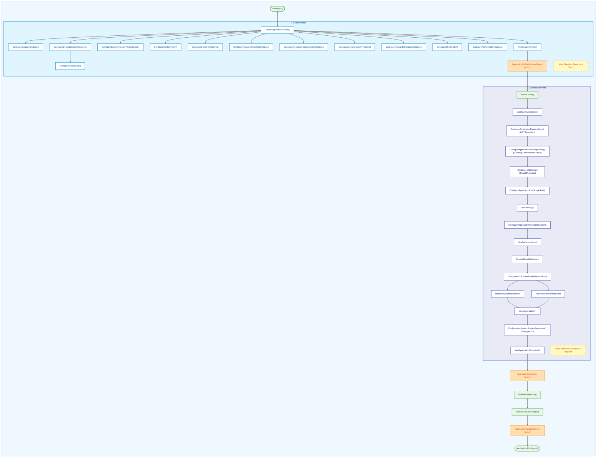

[](https://github.com/duranserkan/DRN-Project/actions/workflows/master.yml)
[](https://github.com/duranserkan/DRN-Project/actions/workflows/develop.yml)
[](https://sonarcloud.io/summary/new_code?id=duranserkan_DRN-Project)

[](https://sonarcloud.io/summary/new_code?id=duranserkan_DRN-Project)
[](https://sonarcloud.io/summary/new_code?id=duranserkan_DRN-Project)
[](https://sonarcloud.io/summary/new_code?id=duranserkan_DRN-Project)
[](https://sonarcloud.io/summary/new_code?id=duranserkan_DRN-Project)
[](https://sonarcloud.io/summary/new_code?id=duranserkan_DRN-Project)
[](https://sonarcloud.io/summary/new_code?id=duranserkan_DRN-Project)

# DRN.Framework.Hosting

> Application shell for DRN web applications with security-first design, structured lifecycle, and type-safe routing.

## TL;DR

- **Secure by Default** - MFA enforced (Fail-Closed), strict CSP with Nonces, HSTS automatic
- **Opinionated Startup** - `DrnProgramBase` with 20+ overrideable lifecycle hooks
- **Type-Safe Routing** - Typed `Endpoint` and `Page` accessors replace magic strings
- **Zero-Config Infrastructure** - Auto-provision Postgres/RabbitMQ in Debug mode
- **Frontend Integration** - TagHelpers for Vite manifest, CSRF for HTMX, secure assets

## Table of Contents

- [QuickStart: Beginner](#quickstart-beginner)
- [QuickStart: Advanced](#quickstart-advanced)
- [Directory Structure](#directory-structure)
- [Lifecycle & Execution Flow](#lifecycle--execution-flow)
- [DrnProgramBase Deep Dive](#drnprogrambase-deep-dive)
- [Configuration](#configuration)
- [Security Features](#security-features)
- [Endpoint Management](#endpoint-management)
- [Razor TagHelpers](#razor-taghelpers)
- [Developer Diagnostics](#developer-diagnostics)
- [Modern HTTP Standards](#modern-http-standards)
- [GDPR & Consent Integration](#gdpr--consent-integration)
- [Local Development](#local-development-infrastructure)
- [Global Usings](#global-usings)
- [Related Packages](#related-packages)

---

## QuickStart: Beginner

DRN web applications inherit from `DrnProgramBase<TProgram>` to implement standard lifecycle hooks and behaviors.

```csharp
using DRN.Framework.Hosting.DrnProgram;
using DRN.Framework.Hosting.HealthCheck;

namespace Sample.Hosted;

public class Program : DrnProgramBase<Program>, IDrnProgram
{
    // Entry Point (Runs the opinionated bootstrapping)
    public static async Task Main(string[] args) => await RunAsync(args);

    // [Required] Service Registration Hook
    protected override Task AddServicesAsync(WebApplicationBuilder builder, IAppSettings appSettings, IScopedLog scopedLog)
    {
        builder.Services.AddSampleInfraServices(appSettings);
        builder.Services.AddSampleApplicationServices();
        return Task.CompletedTask;
    }
}

// Immediate API endpoint for testing and health checks (Inherits [AllowAnonymous] and Get())
[Route("[controller]")]
public class WeatherForecastController : WeatherForecastControllerBase;
```

## QuickStart: Advanced

Test your application using `DRN.Framework.Testing` to spin up the full pipeline including databases.

```csharp
[Theory, DataInline]
public async Task WeatherForecast_Should_Return_Data(DrnTestContext context, ITestOutputHelper outputHelper)
{
    // Arrange
    var client = await context.ApplicationContext.CreateClientAsync<Program>(outputHelper);
    
    // Act
    var response = await client.GetAsync("WeatherForecast");
    
    // Assert
    response.StatusCode.Should().Be(HttpStatusCode.OK);
    var data = await response.Content.ReadFromJsonAsync<IEnumerable<WeatherForecast>>();
    data.Should().NotBeEmpty();
}
```

## Directory Structure
```
DRN.Framework.Hosting/
├── DrnProgram/       # DrnProgramBase, options, actions, conventions
├── Endpoints/        # EndpointCollectionBase, PageForBase, type-safe accessors
├── Auth/             # Policies, MFA configuration, requirements
├── Consent/          # GDPR cookie consent management
├── Identity/         # Identity integration and scoped user middleware
├── Middlewares/      # HttpScopeLogger, exception handling, security middlewares
├── TagHelpers/       # Razor TagHelpers (Vite, Nonce, CSRF, Auth-Only)
├── Areas/            # Framework-provided Razor Pages (e.g., Error pages)
├── wwwroot/          # Framework style and script assets
```

## Lifecycle & Execution Flow

`DrnProgramBase` manages application startup sequence to ensure security headers, logging scopes, and validation logic execute in order. Use `DrnProgramActions` to intercept these phases without modifying the primary Program class.



## DrnProgramBase Deep Dive

This section details the hooks for customizing the application lifecycle. `DrnProgramBase` implements a Hook Method pattern where the base defines the workflow and specific logic is injected via overrides.

### 1. Configuration Hooks (Builder Phase)

These hooks run while the `WebApplicationBuilder` is active, allowing you to configure the DI container and system options.

| Category | Method | Purpose |
| :--- | :--- | :--- |
| **OpenAPI** | `ConfigureSwaggerOptions` | Customize Swagger UI title, version, and visibility settings. |
| **MVC** | `ConfigureMvcBuilder` | Add `ApplicationParts`, custom formatters, or enable Razor Runtime Compilation. |
| **MVC** | `ConfigureMvcOptions` | Add global filters, conventions, or customize model binding. |
| **Auth** | `ConfigureAuthorizationOptions` | Define security policies. **Note**: Sets MFA as the default/fallback by default. |
| **Security** | `ConfigureDefaultSecurityHeaders` | Define global headers (HSTS, CSP, FrameOptions). |
| **Security** | `ConfigureDefaultCsp` | Customize CSP directives (Script, Image, Style sources). |
| **Security** | `ConfigureSecurityHeaderPolicyBuilder` | Advanced conditional security policies (e.g., per-route CSP). |
| **Cookies** | `ConfigureCookiePolicy` | Set GDPR consent logic and security attributes for all cookies. |
| **Cookies** | `ConfigureCookieTempDataProvider` | Configure TempData cookie settings (HttpOnly, IsEssential). |
| **Identity** | `ConfigureSecurityStampValidatorOptions` | Customize security stamp validation and claim preservation. |
| **Infras.** | `ConfigureStaticFileOptions` | Customize caching (default: 1 year) and HTTPS compression. |
| **Infras.** | `ConfigureForwardedHeadersOptions` | Configure proxy/load-balancer header forwarding. |
| **Infras.** | `ConfigureRequestLocalizationOptions` | Configure culture providers and supported cultures. |
| **Infras.** | `ConfigureHostFilteringOptions` | Configure allowed hosts for host header validation. |
| **Infras.** | `ConfigureResponseCachingOptions` | Configure server-side response caching with sensible defaults (16MB max body size, case-insensitive paths). |
| **Infras.** | `ConfigureResponseCompressionOptions` | Configure response compression (Brotli/Gzip) for static assets. HTTPS compression disabled by default for BREACH prevention. |
| **Infras.** | `ConfigureCompressionProviders` | Configure Brotli and Gzip compression provider options including compression levels. |
| **Infras.** | `ConfigureBrotliCompressionLevel` | Customize Brotli compression level (default: SmallestSize for static assets). |
| **Infras.** | `ConfigureGzipCompressionLevel` | Customize Gzip compression level (default: SmallestSize for static assets). |
| **Global** | `AddServicesAsync` | **[Required]** The primary place to register your application services. |

### 2. Pipeline Hooks (Application Phase)

These hooks define the request processing middleware sequence.

| Order | Hook | Typical Usage |
| :--- | :--- | :--- |
| **1** | `ConfigureApplicationPipelineStart` | `UseForwardedHeaders`, `UseHostFiltering`, `UseCookiePolicy`. |
| **2** | `ConfigureApplicationPreScopeStart` | `UseResponseCaching`, `UseResponseCompression`, `UseStaticFiles`. Caching placed before compression for efficiency. |
| **3** | `ConfigureApplicationPostScopeStart` | Add middleware that needs access to `IScopedLog` but runs before routing. |
| **4** | `ConfigureApplicationPreAuthentication` | `UseRequestLocalization`. Runs before the user identity is resolved. |
| **5** | `ConfigureApplicationPostAuthentication` | `MfaRedirectionMiddleware`, `MfaExemptionMiddleware`. Logic that runs after the user is known but before access checks. |
| **6** | `ConfigureApplicationPostAuthorization` | `UseSwaggerUI`. Runs after access is granted but before the final endpoint. |
| **7** | `MapApplicationEndpoints` | `MapControllers`, `MapRazorPages`, `MapHubs`. |

### 3. Verification Hooks

| Hook | Purpose |
| :--- | :--- |
| `ValidateEndpoints` | Ensures all type-safe endpoint accessors match actual mapped routes. |
| `ValidateServicesAsync` | Scans the container for `[Attribute]` based registrations and ensures they are resolvable at startup via `ValidateServicesAddedByAttributesAsync`. |

### 4. MFA Configuration Hooks

| Hook | Purpose |
| :--- | :--- |
| `ConfigureMFARedirection` | Configure MFA setup and login redirection URLs. Returns `null` to disable. |
| `ConfigureMFAExemption` | Configure authentication schemes exempt from MFA requirements. Returns `null` to disable. |

### 5. Internal Wiring (Automatic)

* **Service Validation**: Calls `ValidateServicesAsync` to scan `[Attribute]`-registered services and ensure they are resolvable at startup.
* **Secure JSON**: Enforces `HtmlSafeWebJsonDefaults` to prevent XSS via JSON serialization.
* **Endpoint Accessor**: Registers `IEndpointAccessor` for typed access to `EndpointCollectionBase`.

### 6. Properties

| Property | Default | Purpose |
|----------|---------|---------|
| `AppBuilderType` | `DrnDefaults` | Controls builder creation. Use `Slim` for minimal APIs. |
| `DrnProgramSwaggerOptions` | (Object) | Toggles Swagger generation. Defaults to `IsDevEnvironment`. |
| `NLogOptions` | (Object) | Controls NLog bootstrapping (e.g., replace logger factory). |

## Configuration

> [!TIP]
> **Configuration Precedence**: Environment > Secrets > AppSettings.
> Always use `User Secrets` for local connection strings to avoid committing credentials.

### Layering
1.  `appsettings.json`
2.  `appsettings.{Environment}.json`
3.  **User Secrets** (Development only)
4.  **Environment Variables** (`ASPNETCORE_`, `DOTNET_`)
5.  **Mounted Directories** (e.g. `/app/config`)
6.  **Command Line Arguments**

### Reference Configurations

#### NLog (Logging)
Standard configuration for Console and Graylog output.
```json
{
  "NLog": {
    "throwConfigExceptions": true,
    "targets": {
      "async": true,
      "console": {
        "type": "Console",
        "layout": "${longdate}|${level:uppercase=true}|${logger}|${message} ${exception:format=tostring}"
      }
    },
    "rules": [
      { "logger": "*", "minLevel": "Info", "writeTo": "console" }
    ]
  }
}
```

#### Kestrel (Server)
```json
{
  "Kestrel": {
    "EndpointDefaults": { "Protocols": "Http1" },
    "Endpoints": {
      "All": { "Url": "http://*:5988" }
    }
  }
}
```

## Security Features

DRN Hosting enforces a **"Fail-Closed"** security model. If you forget to configure something, it remains locked.

### 1. MFA Enforcement (Fail-Closed)
The framework sets the `FallbackPolicy` for the entire application to require a Multi-Factor Authentication session. 
*   **Result**: Any new controller or page you add is **secure by default**. 
*   **Opt-Out**: Use `[AllowAnonymous]` or `[Authorize(Policy = AuthPolicy.MfaExempt)]` for single-factor pages like Login or MFA Setup.

### 2. MFA Configuration
Configure MFA behavior by overriding these hooks in your `DrnProgramBase` implementation:

```csharp
// Configure MFA redirection URLs
protected override MfaRedirectionConfig ConfigureMFARedirection()
    => new(
        mfaSetupUrl: Get.Page.User.EnableAuthenticator,
        mfaLoginUrl: Get.Page.User.LoginWith2Fa,
        loginUrl: Get.Page.User.Login,
        logoutUrl: Get.Page.User.Logout,
        allowedUrls: Get.Page.All
    );

// Exempt specific authentication schemes from MFA
protected override MfaExemptionConfig ConfigureMFAExemption()
    => new(exemptSchemes: ["ApiKey", "Certificate"]);
```

### Disabling MFA Entirely

To disable MFA enforcement for your entire application (e.g., for internal tools or development):

```csharp
public class Program : DrnProgramBase<Program>, IDrnProgram
{
    // Return null to disable MFA redirection middleware
    protected override MfaRedirectionConfig? ConfigureMFARedirection() => null;

    // Return null to disable MFA exemption middleware  
    protected override MfaExemptionConfig? ConfigureMFAExemption() => null;

    // Override authorization to remove MFA requirement from fallback policy
    protected override void ConfigureAuthorizationOptions(AuthorizationOptions options)
    {
        // Remove MFA enforcement - authenticated users can access without MFA
        options.FallbackPolicy = new AuthorizationPolicyBuilder()
            .RequireAuthenticatedUser()
            .Build();
    }
}
```

> [!WARNING]
> Disabling MFA removes a critical security layer. Only do this for internal applications on secured networks.

### 3. Content Security Policy (Nonce-based)
DRN automatically generates a unique cryptographic nonce for every request.
*   **Automatic Protection**: Scripts and styles without a matching nonce are blocked by the browser, stopping most XSS attacks.
*   **Usage**: Use the `NonceTagHelper` (see below) to automatically inject these nonces.

### 4. Transparent Security Headers
Standard security headers are injected into every response:
*   **HSTS**: Strict-Transport-Security (2 years, includes subdomains).
*   **FrameOptions**: `DENY` (prevents clickjacking).
*   **ContentTypeOptions**: `nosniff`.
*   **ReferrerPolicy**: `strict-origin-when-cross-origin`.

### 5. GDPR & Cookie Security
Cookies are configured with `SameSite=Strict` and `HttpOnly` by default to mitigate CSRF and session hijacking. The `ConsentCookie` system ensures compliance with privacy regulations.

### 6. Per-Route Security Headers

Customize security headers for specific routes by overriding `ConfigureSecurityHeaderPolicyBuilder`:

```csharp
protected override void ConfigureSecurityHeaderPolicyBuilder(
    HeaderPolicyCollection policies, 
    IAppSettings appSettings)
{
    base.ConfigureSecurityHeaderPolicyBuilder(policies, appSettings);
    
    // Add route-specific CSP for embedding external content
    policies.AddContentSecurityPolicy(builder =>
    {
        builder.AddFrameAncestors().Self();
        builder.AddScriptSrc().Self().UnsafeInline(); // Only for specific legacy routes
    }, 
    // Apply only to specific paths
    context => context.Request.Path.StartsWithSegments("/legacy"));
}
```

### 7. Rate Limiting

Configure rate limiting by overriding `AddServicesAsync`:

```csharp
protected override Task AddServicesAsync(
    WebApplicationBuilder builder, 
    IAppSettings appSettings, 
    IScopedLog scopedLog)
{
    builder.Services.AddRateLimiter(options =>
    {
        options.GlobalLimiter = PartitionedRateLimiter.Create<HttpContext, string>(
            context => RateLimitPartition.GetFixedWindowLimiter(
                partitionKey: context.User?.Identity?.Name ?? context.Request.Headers.Host.ToString(),
                factory: _ => new FixedWindowRateLimiterOptions
                {
                    AutoReplenishment = true,
                    PermitLimit = 100,
                    Window = TimeSpan.FromMinutes(1)
                }));
        
        options.RejectionStatusCode = StatusCodes.Status429TooManyRequests;
    });
    
    return Task.CompletedTask;
}

protected override void ConfigureApplicationPostAuthorization(WebApplication application)
{
    base.ConfigureApplicationPostAuthorization(application);
    application.UseRateLimiter();
}
```


## Endpoint Management

Avoid "magic strings" in your code. DRN provides a type-safe way to reference routes that is verified at startup.

### 1. Define Your Accessors
Create a class inheriting from `EndpointCollectionBase<Program>` or `PageCollectionBase<Program>`.

```csharp
public class Get : EndpointCollectionBase<Program>
{
    public static UserEndpoints User { get; } = new();
}

public class UserEndpoints : ControllerForBase<UserController>
{
    // Template: /Api/User/[controller]/[action]
    public UserEndpoints() : base("/Api/User/[controller]") { }

    // Properties matching Controller Action names
    public ApiEndpoint Login { get; private set; } = null!;
    public ApiEndpoint Profile { get; private set; } = null!;
}
```

### 2. Usage in Code
Resolve routes at compile-time with full IDE support (intellisense).

```csharp
// Get the typed endpoint object
ApiEndpoint endpoint = Get.User.Login;

// Generate the path string
string url = endpoint.Path(); // "/Api/User/User/Login"

// Generate path with route parameters
string profileUrl = Get.User.ProfileDetail.Path(new() { ["id"] = userId.ToString() });
```

## Razor TagHelpers

| TagHelper | Target | Purpose |
| :--- | :--- | :--- |
| `ViteScriptTagHelper` | `<script src="buildwww/...">` | Resolves Vite manifest entries, adds subresource integrity (SRI), and automatic nonce. |
| `NonceTagHelper` | `<script>`, `<style>`, `<link>`, `<iframe>` | Automatically injects the request-specific CSP nonce. |
| `CsrfTokenTagHelper` | `hx-post`, `hx-put`, etc. | Automatically adds `RequestVerificationToken` to HTMX headers for non-GET requests. |
| `AuthorizedOnlyTagHelper` | `*[authorized-only]` | Renders the element only if the user has an active MFA session. |
| `PageAnchorTagHelper` | `<a asp-page="...">` | Automatically adds `active` CSS class if the link matches current page. |

## Developer Diagnostics

DRN Hosting provides deep observability into application failures, especially during the critical startup phase.

### Startup Exception Reports
If the application fails to start during `RunAsync`, it generates a `StartupExceptionReport.html` in the execution directory. This report includes:
-   Full stack traces with source code highlighting (if symbols available).
-   Environment details and configuration snapshots.
-   Scoped logs leading up to the crash.

### Custom Error Pages
The framework includes built-in Razor Pages for developer-time exception handling:
-   **RuntimeExceptionPage**: Detailed breakdown of unhandled exceptions with request state and logs.
-   **CompilationExceptionPage**: Visualizes Razor or code compilation errors with line-specific highlighting.

## Modern HTTP Standards

DRN Hosting enforces modern web standards to improve security and predictability:
-   **303 See Other**: The middleware automatically converts `302 Found` redirects to `303 See Other`. This ensures that following a POST request, the browser correctly uses `GET` for the redirected URL, adhering to established web patterns.
-   **Strict Caching**: By default, `Cache-Control: no-store, no-cache, must-revalidate` is applied to all sensitive responses to prevent data leaking into shared or browser caches.

## GDPR & Consent Integration

The framework provides a structured way to handle user privacy choices:
-   **ConsentCookie**: A strongly-typed model to track analytics and marketing preferences.
-   **Middleware Integration**: `ScopedUserMiddleware` automatically extracts consent data and makes it available via `ScopeContext.Data`, allowing services to check consent status without reaching into the raw cookie.

### Example: Secure Script Loading
```html
<!-- Input: Original Vite source path -->
<script src="buildwww/app/main.ts" crossorigin="anonymous"></script>

<!-- Output: Browser receives hashed path + integrity + nonce -->
<script src="/app/main.abc123.js" 
        integrity="sha256-xyz..." 
        nonce="random_nonce_here" 
        crossorigin="anonymous"></script>
```

## Static Asset Pre-Warming

`StaticAssetPreWarmService` is a `[HostedService]` that populates the `ResponseCaching` middleware cache with compressed static assets immediately after application startup.

**How it works**:
1. Waits for the host to fully start via `IAppStartupStatus`
2. Reads all entries from the Vite manifest
3. Requests each asset with `Accept-Encoding: br` and `Accept-Encoding: gzip` against the loopback address (via `IServerSettings`)
4. `ResponseCaching` stores each compressed variant keyed on `Vary: Accept-Encoding`

**Compression defaults** — both use `CompressionLevel.SmallestSize` (maximum compression) since only static files are compressed and the cost is paid once at startup:

| Provider | Default Level | Override Hook |
|----------|--------------|---------------|
| Brotli | `SmallestSize` (Level 11) | `ConfigureBrotliCompressionLevel()` |
| Gzip | `SmallestSize` | `ConfigureGzipCompressionLevel()` |

> First request after startup returns pre-compressed content from cache — zero compression latency for end users.

## Local Development Infrastructure

Use `DRN.Framework.Testing` to provision infrastructure (Postgres, RabbitMQ) during local development without manual Docker management.

### 1. Add Conditional Reference
Add the following to your `.csproj` file to ensure the testing library (and its heavy dependencies like Testcontainers) is only included during development.

```xml
<ItemGroup Condition="'$(Configuration)' == 'Debug'">
    <ProjectReference Include="..\DRN.Framework.Testing\DRN.Framework.Testing.csproj" />
</ItemGroup>
```

### 2. Configure Startup Actions
Implement `DrnProgramActions` to trigger the auto-provisioning.

```csharp
#if DEBUG
public class SampleProgramActions : DrnProgramActions
{
    public override async Task ApplicationBuilderCreatedAsync<TProgram>(
        TProgram program, WebApplicationBuilder builder,
        IAppSettings appSettings, IScopedLog scopedLog)
    {
        var options = new ExternalDependencyLaunchOptions
        {
            PostgresContainerSettings = new() 
            { 
                Reuse = true, // Faster restarts
                HostPort = 6432 // Avoid conflicts with local Postgres
            }
        };

        // Auto-starts containers if not running and updates AppSettings
        await builder.LaunchExternalDependenciesAsync(scopedLog, appSettings, options);
    }
}
#endif
```

## Hosting Utilities

### IAppStartupStatus

Singleton gate for background services that need to wait until the host has fully started before executing.

```csharp
public class MyWorker(IAppStartupStatus startupStatus) : BackgroundService
{
    protected override async Task ExecuteAsync(CancellationToken stoppingToken)
    {
        if (!await startupStatus.WaitForStartAsync(stoppingToken))
            return; // Cancelled before startup completed

        // Application is fully started — safe to proceed
    }
}
```

### IServerSettings

Resolves bound server addresses from Kestrel. Normalizes wildcard hosts (`0.0.0.0`, `[::]`, `+`, `*`) to `localhost` for internal self-requests. Prefers HTTP over HTTPS to avoid TLS overhead.

```csharp
public class MyService(IServerSettings server)
{
    public void LogAddresses()
    {
        var loopback = server.GetLoopbackAddress();   // e.g. "http://localhost:5988"
        var all = server.GetAllAddresses();            // All normalized bound addresses
    }
}
```

## Global Usings

Standard global usings for Hosted applications to reduce boilerplate:
```csharp
global using DRN.Framework.Hosting.DrnProgram;
global using DRN.Framework.Hosting.Endpoints;
global using DRN.Framework.Utils.DependencyInjection;
global using DRN.Framework.Utils.Logging;
global using DRN.Framework.Utils.Settings;
global using Microsoft.AspNetCore.Mvc;
```

---

## Related Packages

- [DRN.Framework.SharedKernel](https://www.nuget.org/packages/DRN.Framework.SharedKernel/) - Domain primitives and exceptions
- [DRN.Framework.Utils](https://www.nuget.org/packages/DRN.Framework.Utils/) - Configuration and DI utilities
- [DRN.Framework.EntityFramework](https://www.nuget.org/packages/DRN.Framework.EntityFramework/) - EF Core integration
- [DRN.Framework.Testing](https://www.nuget.org/packages/DRN.Framework.Testing/) - Testing utilities

For complete examples, see [Sample.Hosted](https://github.com/duranserkan/DRN-Project/tree/master/Sample.Hosted).

---

Documented with the assistance of [DiSC OS](https://github.com/duranserkan/DRN-Project/blob/develop/DiSCOS/DiSCOS.md)

---
**Semper Progressivus: Always Progressive**