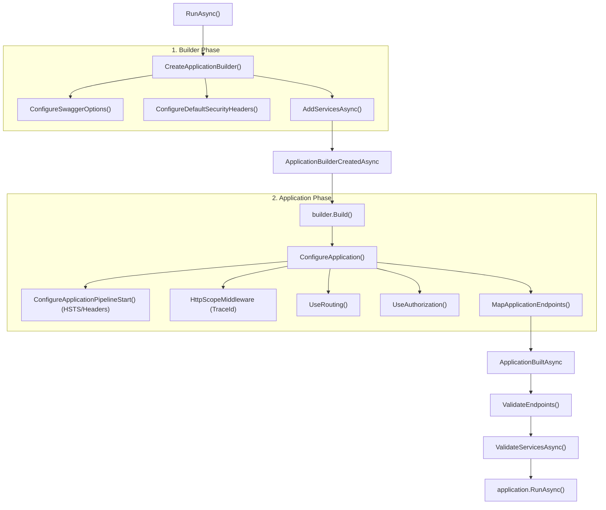

# DRN.Framework.Hosting

[](https://github.com/duranserkan/DRN-Project/actions/workflows/master.yml)
[](https://github.com/duranserkan/DRN-Project/actions/workflows/develop.yml)
[](https://sonarcloud.io/summary/new_code?id=duranserkan_DRN-Project)

[](https://sonarcloud.io/summary/new_code?id=duranserkan_DRN-Project)
[](https://sonarcloud.io/summary/new_code?id=duranserkan_DRN-Project)
[](https://sonarcloud.io/summary/new_code?id=duranserkan_DRN-Project)
[](https://sonarcloud.io/summary/new_code?id=duranserkan_DRN-Project)
[](https://sonarcloud.io/summary/new_code?id=duranserkan_DRN-Project)
[](https://sonarcloud.io/summary/new_code?id=duranserkan_DRN-Project)

**DRN.Framework.Hosting** provides the **application shell** for DRN web applications. It abstracts away the boilerplate of configuring reliable, secure, and observable ASP.NET Core applications.

## Table of Contents

- [TL;DR](#tldr)
- [Directory Structure](#directory-structure)
- [QuickStart](#quickstart)
- [Lifecycle & Execution Flow](#lifecycle--execution-flow)
- [DrnProgramBase Deep Dive](#drnprogrambase-deep-dive)
- [Configuration](#configuration)
- [Security Features](#security-features)
- [Endpoint Management](#endpoint-management)
- [Razor TagHelpers](#razor-taghelpers)
- [Local Development](#local-development-infrastructure)
- [Global Usings](#global-usings)

## TL;DR
* **Secure by Default**: Enforces MFA, strict CSP with Nonces, and HSTS automatically.
* **Opinionated Startup**: `DrnProgramBase` creates a predictable lifecycle for all services.
* **Type-Safe Routing**: Replaces "magic strings" with typed `Endpoint` and `Page` accessors.
* **Frontend Synergy**: Includes TagHelpers for Vite integration and secure asset loading.

## Directory Structure
```
DRN.Framework.Hosting/
├── DrnProgram/       # DrnProgramBase, options, conventions
├── Endpoints/        # EndpointCollectionBase, EndpointForBase
├── Auth/             # Policies, MFA configuration
├── Middlewares/      # HttpScopeLogger, security middlewares
├── TagHelpers/       # Razor TagHelpers (Script, CSP, etc.)
└── wwwroot/          # Static files (JS/CSS)
```

## QuickStart

### 1. Basic Program
All DRN web apps inherit from `DrnProgramBase<TProgram>` to inherit the lifecycle hooks and default behaviors.

```csharp
using DRN.Framework.Hosting.DrnProgram;

namespace Sample.Hosted;

public class Program : DrnProgramBase<Program>, IDrnProgram
{
    // Entry Point
    public static async Task Main(string[] args) => await RunAsync(args);

    // Service Registration
    protected override Task AddServicesAsync(WebApplicationBuilder builder, IAppSettings appSettings, IScopedLog scopedLog)
    {
        builder.Services.AddSampleInfraServices();
        builder.Services.AddSampleApplicationServices();
        return Task.CompletedTask;
    }
}
```

### 2. Testing Integration
You can easily test your application using `DRN.Framework.Testing`.

```csharp
[Theory, DataInline]
public async Task StatusController_Should_Return_Status(DrnTestContext context, ITestOutputHelper outputHelper)
{
  // Arrange: Create authenticated client for the Program
  var client = await context.ApplicationContext.CreateClientAsync<Program>(outputHelper);
  var status = await client.GetFromJsonAsync<ConfigurationDebugViewSummary>("Status");
  status?.ApplicationName.Should().Be("Sample.Hosted");
}
```

## Lifecycle & Execution Flow

`DrnProgramBase` orchestrates the application startup to ensure security headers, logging scopes, and validation logic run in the correct order.



## DrnProgramBase Deep Dive

This section details every overrideable hook and internal behavior of the base class.

### 1. Configuration Hooks (Protected Virtual)

Override these methods to customize specific subsystems without breaking the overall logical flow.

| Method | Argument | Purpose |
|--------|----------|---------|
| `ConfigureSwaggerOptions` | `DrnProgramSwaggerOptions` | Customize OpenAPI metadata text (Title, Desc). |
| `ConfigureMvcBuilder` | `IMvcBuilder` | Add ApplicationParts, JSON options, or Runtime compilation. |
| `ConfigureMvcOptions` | `MvcOptions` | Customize global MVC filters or conventions. |
| `ConfigureAuthorizationOptions` | `AuthorizationOptions` | **Critical**: Defines Policies (`MFA`, `MFAExempt`) and Default/Fallback policies. |
| `ConfigureResponseCachingOptions` | `ResponseCachingOptions` | Customize HTTP response caching behavior. |
| `ConfigureDefaultSecurityHeaders` | `HeaderPolicyCollection` | Define global headers (FrameOptions, ContentTypeOptions). |
| `ConfigureDefaultCsp` | `CspBuilder` | Define the generic Content Security Policy (Nonces are auto-handled). |
| `ConfigureSecurityHeaderPolicyBuilder` | `SecurityHeaderPolicyBuilder` | Define advanced conditional CSP policies (e.g. for Swagger UI vs App). |
| `ConfigureCookiePolicy` | `CookiePolicyOptions` | Customize GDPR consent logic and cookie security attributes. |
| `ConfigureMFARedirection` | Returns `MfaRedirectionConfig` | Define where users go when MFA is required vs setup needed. |

### 2. Pipeline Hooks

These methods insert middleware into key slots of the request pipeline.

| Method | Order | Uses |
|--------|-------|------|
| `ConfigureApplicationPipelineStart` | 1 | `UseForwardedHeaders`, `UseHostFiltering`, `UseCookiePolicy`, `UseSecurityHeaders`. |
| `ConfigureApplicationPreScopeStart` | 2 | `UseStaticFiles`. Runs before Logging/Scope. |
| `ConfigureApplicationPostScopeStart` | 3 | Runs immediately after `HttpScopeMiddleware` (TraceId available). |
| `ConfigureApplicationPreAuthentication` | 5 | `UseRequestLocalization`. Runs before Auth logic. |
| `ConfigureApplicationPostAuthentication` | 8 | `MfaRedirectionMiddleware`. Runs after Identity is established. |
| `ConfigureApplicationPostAuthorization` | 10 | `UseSwaggerUI`. Runs after access is confirmed. |


### 3. Internal Wiring (Automatic)

* **Service Validation**: Calls `ValidateServicesAsync` to scan `[Attribute]`-registered services and ensure they are resolvable at startup.
* **Secure JSON**: Enforces `HtmlSafeWebJsonDefaults` to prevent XSS via JSON serialization.
* **Endpoint Accessor**: Registers `IEndpointAccessor` for typed access to `EndpointCollectionBase`.

### 4. Properties

| Property | Default | Purpose |
|----------|---------|---------|
| `AppBuilderType` | `DrnDefaults` | Controls builder creation. Use `Slim` for minimal APIs. |
| `DrnProgramSwaggerOptions` | (Object) | Toggles Swagger generation. Defaults to `IsDevEnvironment`. |
| `NLogOptions` | (Object) | Controls NLog bootstrapping (e.g., replace logger factory). |

## Configuration

> [!TIP]
> **Configuration Precedence**: Environment > Secrets > AppSettings.
> Always use `User Secrets` for local connection strings to avoid committing credentials.

### Layering
1.  `appsettings.json`
2.  `appsettings.{Environment}.json`
3.  **User Secrets** (Development only)
4.  **Environment Variables** (`ASPNETCORE_`, `DOTNET_`)
5.  **Mounted Directories** (e.g. `/app/config`)
6.  **Command Line Arguments**

### Reference Configurations

#### NLog (Logging)
Standard configuration for Console and Graylog output.
```json
{
  "NLog": {
    "throwConfigExceptions": true,
    "targets": {
      "async": true,
      "console": {
        "type": "Console",
        "layout": "${longdate}|${level:uppercase=true}|${logger}|${message} ${exception:format=tostring}"
      }
    },
    "rules": [
      { "logger": "*", "minLevel": "Info", "writeTo": "console" }
    ]
  }
}
```

#### Kestrel (Server)
```json
{
  "Kestrel": {
    "EndpointDefaults": { "Protocols": "Http1" },
    "Endpoints": {
      "All": { "Url": "http://*:5988" }
    }
  }
}
```

## Security Features

DRN Hosting enforces **"Security by Default"**:

> [!IMPORTANT]
> **MFA Enforcement**: By default, **ALL** routes require MFA unless explicitly opted-out.
> Any new controller without `[AllowAnonymous]` is secure by default (Fail-Closed).

### 1. MFA by Default (Fail-Closed)
The `FallbackPolicy` is set to require MFA. Any controller **not** marked with `[AllowAnonymous]` or `[Authorize(Policy = AuthPolicy.MfaExempt)]` will reject requests without a verified MFA session. Configured in `ConfigureAuthorizationOptions` by setting `FallbackPolicy`.

### 2. Content Security Policy (CSP)
* **Nonce-based**: A cryptographic nonce is generated per request.
* **TagHelpers**: The `NonceTagHelper` automatically injecting `nonce="{current_nonce}"` into scripts and styles.

### 3. Strict Headers
* Strict-Transport-Security (HSTS)
* X-Frame-Options: DENY
* X-Content-Type-Options: nosniff
* Referrer-Policy: strict-origin-when-cross-origin

### 4. GDPR Compliance
* Built-in consent cookie `SameSite=Strict`.

### Opting-Out
```csharp
// Public landing page
[AllowAnonymous]
public class HomeController : Controller { ... }

// Login Page (Single Factor Allowed)
[Authorize(Policy = AuthPolicy.MfaExempt)]
public class LoginController : Controller { ... }
```

## Endpoint Management

Avoid "magic strings" for routes. Use `EndpointCollectionBase` and `PageCollectionBase` for type-safe endpoint references.

```csharp
// Usage in Code
ApiEndpoint endpoint = Get.Endpoint.User.Login;
string url = endpoint.Path();
```

## Razor TagHelpers

| TagHelper | Target | Purpose |
|-----------|--------|---------|
| `ViteScriptTagHelper` | `<script src="buildwww/..." />` | Resolves Vite manifest entries. |
| `NonceTagHelper` | `<script>`, `<style>` | Auto-adds CSP nonce. |
| `CsrfTokenTagHelper` | `hx-post` | Adds CSRF tokens to HTMX requests. |
| `AuthorizedOnlyTagHelper` | `<div authorized-only>` | Renders only for authenticated users. |

## Local Development Infrastructure

Use `DRN.Framework.Testing` to provision infrastructure (Postgres, RabbitMQ) during local development.

### Setup

1.  **Add Conditional Reference**:
    ```xml
    <ItemGroup Condition="'$(Configuration)' == 'Debug'">
        <ProjectReference Include="..\DRN.Framework.Testing\DRN.Framework.Testing.csproj" />
    </ItemGroup>
    ```

2.  **Configure Startup Actions**:
    ```csharp
    #if DEBUG
    public class SampleProgramActions : DrnProgramActions
    {
        public override async Task ApplicationBuilderCreatedAsync<TProgram>(
            TProgram program, WebApplicationBuilder builder,
            IAppSettings appSettings, IScopedLog scopedLog)
        {
            // Auto-starts containers if not running
            await builder.LaunchExternalDependenciesAsync(scopedLog, appSettings);
        }
    }
    #endif
    ```

## Global Usings

Standard global usings for Hosted applications:
```csharp
global using DRN.Framework.Hosting.DrnProgram;
global using DRN.Framework.Hosting.Endpoints;
global using DRN.Framework.Utils.DependencyInjection;
global using Microsoft.AspNetCore.Mvc;
```

---
**Semper Progressivus: Always Progressive**