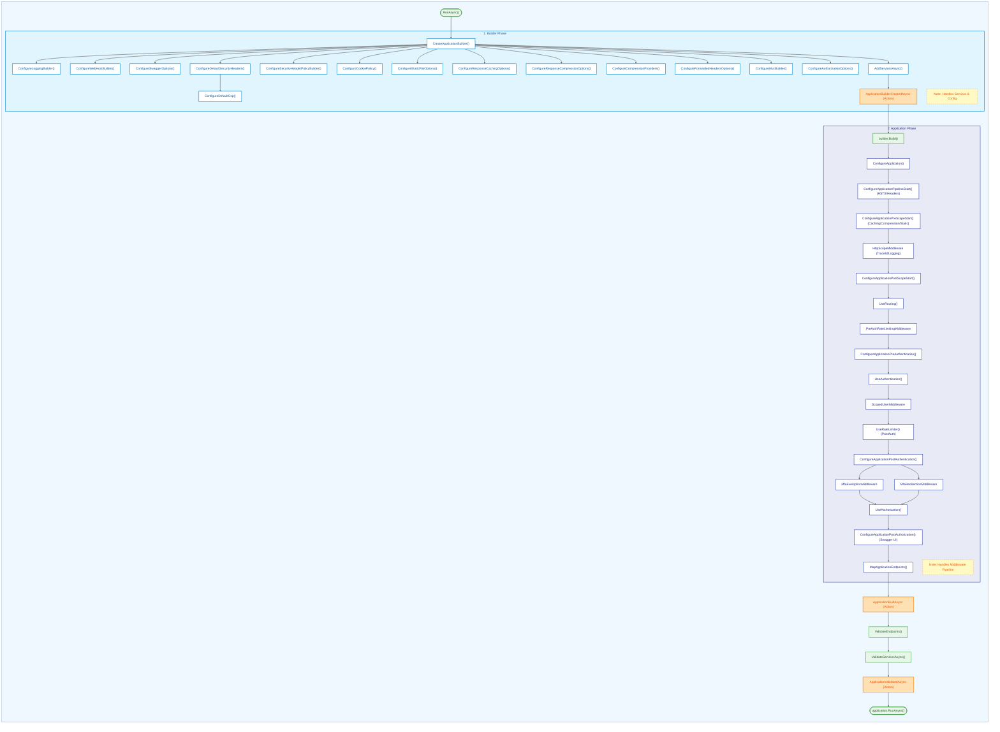

[](https://github.com/duranserkan/DRN-Project/actions/workflows/master.yml)
[](https://github.com/duranserkan/DRN-Project/actions/workflows/develop.yml)
[](https://sonarcloud.io/summary/new_code?id=duranserkan_DRN-Project)

[](https://sonarcloud.io/summary/new_code?id=duranserkan_DRN-Project)
[](https://sonarcloud.io/summary/new_code?id=duranserkan_DRN-Project)
[](https://sonarcloud.io/summary/new_code?id=duranserkan_DRN-Project)
[](https://sonarcloud.io/summary/new_code?id=duranserkan_DRN-Project)
[](https://sonarcloud.io/summary/new_code?id=duranserkan_DRN-Project)
[](https://sonarcloud.io/summary/new_code?id=duranserkan_DRN-Project)

# DRN.Framework.Hosting

> Application shell for DRN web applications with security-first design, structured lifecycle, and type-safe routing.

## TL;DR

- **Secure by Default** - MFA enforced (Fail-Closed), strict CSP with nonces, HSTS outside Development
- **Opinionated Startup** - `DrnProgramBase` with 20+ overrideable lifecycle hooks
- **Type-Safe Routing** - Typed `Endpoint` and `Page` accessors replace magic strings
- **Local Infrastructure** - Optional Debug-time Postgres provisioning via `DRN.Framework.Testing`
- **Frontend Integration** - TagHelpers for Vite manifest, CSRF for HTMX, secure assets

## Table of Contents

- [QuickStart: Beginner](#quickstart-beginner)
- [QuickStart: Advanced](#quickstart-advanced)
- [Directory Structure](#directory-structure)
- [Lifecycle & Execution Flow](#lifecycle--execution-flow)
- [DrnProgramBase Deep Dive](#drnprogrambase-deep-dive)
- [Configuration](#configuration)
- [Security Features](#security-features)
- [Endpoint Management](#endpoint-management)
- [Razor TagHelpers](#razor-taghelpers)
- [Developer Diagnostics](#developer-diagnostics)
- [Modern HTTP Standards](#modern-http-standards)
- [GDPR & Consent Integration](#gdpr--consent-integration)
- [Local Development](#local-development-infrastructure)
- [Global Usings](#global-usings)
- [Related Packages](#related-packages)

---

## QuickStart: Beginner

DRN web applications inherit from `DrnProgramBase<TProgram>` to implement standard lifecycle hooks and behaviors.

```csharp
using DRN.Framework.Hosting.DrnProgram;
using DRN.Framework.Hosting.HealthCheck;

namespace Sample.Hosted;

public class Program : DrnProgramBase<Program>, IDrnProgram
{
    // Entry Point (Runs the opinionated bootstrapping)
    public static async Task Main(string[] args) => await RunAsync(args);

    // [Required] Service Registration Hook
    protected override Task AddServicesAsync(WebApplicationBuilder builder, IAppSettings appSettings, IScopedLog scopedLog)
    {
        builder.Services.AddSampleInfraServices(appSettings);
        builder.Services.AddSampleApplicationServices();
        return Task.CompletedTask;
    }
}

// Immediate API endpoint for testing and health checks (Inherits [AllowAnonymous] and Get())
[Route("[controller]")]
public class WeatherForecastController : WeatherForecastControllerBase;
```

## QuickStart: Advanced

Test your application using `DRN.Framework.Testing` to spin up the full pipeline including databases.

```csharp
[Theory, DataInline]
public async Task WeatherForecast_Should_Return_Data(DrnTestContext context, ITestOutputHelper outputHelper)
{
    // Arrange
    var client = await context.ApplicationContext.CreateClientAsync<Program>(outputHelper);
    
    // Act
    var response = await client.GetAsync("WeatherForecast");
    
    // Assert
    response.StatusCode.Should().Be(HttpStatusCode.OK);
    var data = await response.Content.ReadFromJsonAsync<IEnumerable<WeatherForecast>>();
    data.Should().NotBeEmpty();
}
```

## Directory Structure
```
DRN.Framework.Hosting/
├── DrnProgram/          # DrnProgramBase, options, actions, conventions
├── Endpoints/           # EndpointCollectionBase, PageForBase, type-safe accessors
├── Auth/                # Policies, MFA configuration, requirements
├── BackgroundServices/  # StaticAssetWarmService (pre-warm compressed assets)
├── Consent/             # GDPR cookie consent management
├── Extensions/          # Configuration, controller context, endpoint helpers
├── HealthCheck/         # WeatherForecastControllerBase for quick health checks
├── Identity/            # Identity integration and scoped user middleware
├── Middlewares/         # HttpScopeMiddleware, exception handling, security middlewares
├── Nexus/               # NexusClient for inter-service HTTP communication
├── TagHelpers/          # Razor TagHelpers (Vite, Nonce, CSRF, Auth-Only, Anon-Only)
├── Utils/               # AppStartupStatus, ServerSettings, Vite manifest, ResourceExtractor
├── Areas/               # Framework-provided Razor Pages (e.g., Error pages)
├── wwwroot/             # Framework style and script assets
```

## Lifecycle & Execution Flow

`DrnProgramBase` manages application startup sequence to ensure security headers, logging scopes, and validation logic execute in order. Use `DrnProgramActions` to intercept these phases without modifying the primary Program class.


```mermaid
flowchart TD
    subgraph CONTAINER [" "]
        direction TB
        Start(["RunAsync()"]) --> CAB["CreateApplicationBuilder()"]
        
        subgraph BUILDER ["1. Builder Phase"]
            direction TB
            B_NOTE["Note: Handles Services & Config"]
            CAB --> CLB["ConfigureLoggingBuilder()"]
            CAB --> CWHB["ConfigureWebHostBuilder()"]
            CAB --> CSO["ConfigureSwaggerOptions()"]
            CAB --> CDSH["ConfigureDefaultSecurityHeaders()"]
            CDSH --> CDCSP["ConfigureDefaultCsp()"]
            CAB --> CSHPB["ConfigureSecurityHeaderPolicyBuilder()"]
            CAB --> CCP["ConfigureCookiePolicy()"]
            CAB --> CSFO["ConfigureStaticFileOptions()"]
            CAB --> CRCO["ConfigureResponseCachingOptions()"]
            CAB --> CRCMO["ConfigureResponseCompressionOptions()"]
            CAB --> CCP2["ConfigureCompressionProviders()"]
            CAB --> CFHO["ConfigureForwardedHeadersOptions()"]
            CAB --> CMVCB["ConfigureMvcBuilder()"]
            CAB --> CAO["ConfigureAuthorizationOptions()"]
            CAB --> ASA["AddServicesAsync()"]
            ASA --> ABC["ApplicationBuilderCreatedAsync (Action)"]
        end

        ABC --> Build["builder.Build()"]
        
        subgraph APPLICATION ["2. Application Phase"]
            direction TB
            A_NOTE["Note: Handles Middleware Pipeline"]
            Build --> CA["ConfigureApplication()"]
            CA --> CAPS["ConfigureApplicationPipelineStart() (HSTS/Headers)"]
            CAPS --> CAPR["ConfigureApplicationPreScopeStart() (Caching/Compression/Static)"]
            CAPR --> HSM["HttpScopeMiddleware (TraceId/Logging)"]
            HSM --> CPSS["ConfigureApplicationPostScopeStart()"]
            CPSS --> UR["UseRouting()"]
            UR --> PRL["PreAuthRateLimitingMiddleware"]
            PRL --> CAPREA["ConfigureApplicationPreAuthentication()"]
            CAPREA --> AUTH["UseAuthentication()"]
            AUTH --> SUM["ScopedUserMiddleware"]
            SUM --> PARL["UseRateLimiter() (PostAuth)"]
            PARL --> CAPOSTA["ConfigureApplicationPostAuthentication()"]
            CAPOSTA --> MFAE["MfaExemptionMiddleware"]
            CAPOSTA --> MFAR["MfaRedirectionMiddleware"]
            MFAE --> UA["UseAuthorization()"]
            MFAR --> UA
            UA --> CPSTAZ["ConfigureApplicationPostAuthorization() (Swagger UI)"]
            CPSTAZ --> MAE["MapApplicationEndpoints()"]
        end

        MAE --> ABA["ApplicationBuiltAsync (Action)"]
        ABA --> VE["ValidateEndpoints()"]
        VE --> VSA["ValidateServicesAsync()"]
        VSA --> AVA["ApplicationValidatedAsync (Action)"]
        AVA --> Run(["application.RunAsync()"])
    end

    %% WCAG AA Compliant Styling
    %% Outer Container
    style CONTAINER fill:#F0F8FF,stroke:#B0C4DE,stroke-width:2px,color:#4682B4

    %% Subgraph Backgrounds (Direct styling)
    style BUILDER fill:#E1F5FE,stroke:#0288D1,stroke-width:2px,color:#01579B
    style APPLICATION fill:#E8EAF6,stroke:#3F51B5,stroke-width:2px,color:#1A237E

    %% Node Styles (White for contrast against subgraph)
    classDef builderNode fill:#FFFFFF,stroke:#0288D1,stroke-width:2px,color:#01579B
    classDef appNode fill:#FFFFFF,stroke:#3F51B5,stroke-width:2px,color:#1A237E
    classDef action fill:#FFE0B2,stroke:#F57C00,stroke-width:2px,color:#E65100
    classDef core fill:#E8F5E9,stroke:#43A047,stroke-width:2px,color:#1B5E20
    classDef note fill:#FFF9C4,stroke:#F57C00,stroke-width:1px,color:#E65100,stroke-dasharray: 5 5
    classDef decision fill:#FFE0B2,stroke:#E65100,stroke-width:3px,color:#E65100

    %% Apply Styles
    class CAB,CLB,CWHB,CSO,CDSH,CDCSP,CSHPB,CCP,CSFO,CRCO,CRCMO,CCP2,CFHO,CMVCB,CAO,ASA builderNode
    class CA,CAPS,CAPR,HSM,CPSS,UR,PRL,CAPREA,AUTH,SUM,PARL,CAPOSTA,MFAE,MFAR,UA,CPSTAZ,MAE appNode
    class ABC,ABA,AVA action
    class Start,Build,VE,VSA,Run core
    class B_NOTE,A_NOTE note

    %% Link Styles for Decision Paths (Grey Arrows)
    linkStyle default stroke:#666,stroke-width:2px
```

## DrnProgramBase Deep Dive

This section details the hooks for customizing the application lifecycle. `DrnProgramBase` implements a Hook Method pattern where the base defines the workflow and specific logic is injected via overrides.

### 1. Configuration Hooks (Builder Phase)

These hooks run while the `WebApplicationBuilder` is active, allowing you to configure the DI container and system options.

| Category | Method | Purpose |
| :--- | :--- | :--- |
| **Logging** | `ConfigureLoggingBuilder` | Configure logging providers (clears defaults, applies config section, registers NLog). |
| **WebHost** | `ConfigureWebHostBuilder` | Configure Kestrel options (suppresses Server header, applies optional Kestrel section, registers static web assets). |
| **OpenAPI** | `ConfigureSwaggerOptions` | Customize Swagger UI title, version, and visibility settings. |
| **MVC** | `ConfigureMvcBuilder` | Add `ApplicationParts`, custom formatters, or MVC/Razor options. Razor edit loops use Hot Reload, not runtime compilation. |
| **MVC** | `ConfigureMvcOptions` | Add global filters, conventions, or customize model binding. |
| **Auth** | `ConfigureAuthorizationOptions` | Define security policies. **Note**: Sets MFA as the default/fallback by default. |
| **Security** | `ConfigureDefaultSecurityHeaders` | Define global headers (HSTS, CSP, FrameOptions). |
| **Security** | `ConfigureDefaultCsp` | Customize CSP directives (Script, Image, Style sources). |
| **Security** | `ConfigureSecurityHeaderPolicyBuilder` | Advanced conditional security policies (e.g., per-route CSP). |
| **Cookies** | `ConfigureCookiePolicy` | Set GDPR consent logic and security attributes for all cookies. |
| **Cookies** | `ConfigureCookieTempDataProvider` | Configure TempData cookie settings (HttpOnly, IsEssential). |
| **Identity** | `ConfigureSecurityStampValidatorOptions` | Customize security stamp validation and claim preservation. |
| **Infras.** | `ConfigureStaticFileOptions` | Customize caching (default: 1 year) and HTTPS compression. |
| **Infras.** | `ConfigureForwardedHeadersOptions` | Configure proxy/load-balancer header forwarding. |
| **Infras.** | `ConfigureRequestLocalizationOptions` | Configure culture providers and supported cultures. |
| **Infras.** | `ConfigureHostFilteringOptions` | Configure allowed hosts for host header validation. |
| **Infras.** | `ConfigureResponseCachingOptions` | Configure server-side response caching with sensible defaults (16MB max body size, case-insensitive paths). |
| **Infras.** | `ConfigureResponseCompressionOptions` | Configure response compression (Brotli/Gzip) for static assets. HTTPS compression disabled by default for BREACH prevention. |
| **Infras.** | `ConfigureCompressionProviders` | Configure Brotli and Gzip compression provider options including compression levels. |
| **Infras.** | `ConfigureBrotliCompressionLevel` | Customize Brotli compression level (default: SmallestSize for static assets). |
| **Infras.** | `ConfigureGzipCompressionLevel` | Customize Gzip compression level (default: SmallestSize for static assets). |
| **Global** | `AddServicesAsync` | **[Required]** The primary place to register your application services. |

### Razor Development

DRN uses Razor SDK build-time and publish-time compilation. For local `.cshtml` iteration, use IDE Hot Reload or `dotnet watch` instead of `Microsoft.AspNetCore.Mvc.Razor.RuntimeCompilation`; runtime compilation is obsolete in .NET 10 and disables Hot Reload.

References:

- [Razor runtime compilation is obsolete](https://learn.microsoft.com/en-us/aspnet/core/breaking-changes/10/razor-runtime-compilation-obsolete)
- [.NET Hot Reload support for ASP.NET Core](https://learn.microsoft.com/en-us/aspnet/core/test/hot-reload)

### 2. Pipeline Hooks (Application Phase)

These hooks define the request processing middleware sequence.

| Order | Hook | Typical Usage |
| :--- | :--- | :--- |
| **1** | `ConfigureApplicationPipelineStart` | `UseForwardedHeaders`, `UseHostFiltering`, `UseCookiePolicy`. |
| **2** | `ConfigureApplicationPreScopeStart` | `UseResponseCaching`, `UseResponseCompression`, `UseStaticFiles`. Caching placed before compression for efficiency. |
| **3** | `ConfigureApplicationPostScopeStart` | Add middleware that needs access to `IScopedLog` but runs before routing. |
| **4** | `ConfigureApplicationPreAuthentication` | `UseRequestLocalization`. The built-in pre-auth rate limiter runs after routing and before this hook when enabled. |
| **5** | `ConfigureApplicationPostAuthentication` | `MfaRedirectionMiddleware`, `MfaExemptionMiddleware`. The built-in post-auth `UseRateLimiter()` runs after `ScopedUserMiddleware` and before this hook when enabled. |
| **6** | `ConfigureApplicationPostAuthorization` | `UseSwaggerUI`. Runs after access is granted but before the final endpoint. |
| **7** | `MapApplicationEndpoints` | `MapControllers`, `MapRazorPages`, `MapHubs`. |

### 3. Verification Hooks

| Hook | Purpose |
| :--- | :--- |
| `ValidateEndpoints` | Ensures all type-safe endpoint accessors match actual mapped routes. |
| `ValidateServicesAsync` | Scans the container for `[Attribute]` based registrations and ensures they are resolvable at startup via `ValidateServicesAddedByAttributesAsync`. |

### 4. MFA Configuration Hooks

| Hook | Purpose |
| :--- | :--- |
| `ConfigureMFARedirection` | Configure MFA setup and login redirection URLs. Returns `null` to disable. |
| `ConfigureMFAExemption` | Configure authentication schemes exempt from MFA requirements. Returns `null` to disable. |

### 5. Internal Wiring (Automatic)

* **Service Validation**: Calls `ValidateServicesAsync` to scan `[Attribute]`-registered services and ensure they are resolvable at startup.
* **Secure JSON**: Enforces `HtmlSafeWebJsonDefaults` to prevent XSS via JSON serialization.
* **Endpoint Accessor**: Registers `IEndpointAccessor` for typed access to `EndpointCollectionBase`.

### 6. Properties

| Property | Default | Purpose |
|----------|---------|---------|
| `AppBuilderType` | `DrnDefaults` | Controls builder creation. Use `Slim` for minimal APIs. |
| `DrnProgramSwaggerOptions` | (Object) | Toggles Swagger generation. Defaults to `IsDevelopmentEnvironment`. |
| `NLogOptions` | (Object) | Controls NLog bootstrapping (e.g., replace logger factory). |

## Configuration

> [!TIP]
> **Configuration Precedence**: command line and mounted settings override environment variables, which override User Secrets and appsettings files.
> Always use `User Secrets` for local connection strings to avoid committing credentials.

### Layering
1.  `appsettings.json`
2.  `appsettings.{Environment}.json`
3.  **User Secrets** when the application assembly can be loaded
4.  **Environment Variables** (`ASPNETCORE_`, `DOTNET_`, then unprefixed)
5.  **Mounted Directories** (default: `/appconfig`)
6.  **Command Line Arguments**

### Host Filtering

`AllowedHosts` must be configured outside Development and cannot be `*`. Development may fall back to `*` for local convenience; production and staging should use explicit host names such as `example.com;api.example.com`.

### Reference Configurations

#### NLog (Logging)
Standard configuration for Console and Graylog output.
```json
{
  "NLog": {
    "throwConfigExceptions": true,
    "targets": {
      "async": true,
      "console": {
        "type": "Console",
        "layout": "${longdate}|${level:uppercase=true}|${logger}|${message} ${exception:format=tostring}"
      }
    },
    "rules": [
      { "logger": "*", "minLevel": "Info", "writeTo": "console" }
    ]
  }
}
```

#### Kestrel (Server)
```json
{
  "Kestrel": {
    "EndpointDefaults": { "Protocols": "Http1" },
    "Endpoints": {
      "All": { "Url": "http://*:5988" }
    }
  }
}
```

## Security Features

DRN Hosting enforces a **"Fail-Closed"** security model. If you forget to configure something, it remains locked.

### 1. MFA Enforcement (Fail-Closed)
The framework sets the `FallbackPolicy` for the entire application to require a Multi-Factor Authentication session. 
*   **Result**: Any new controller or page you add is **secure by default**. 
*   **Opt-Out**: Use `[AllowAnonymous]` or `[Authorize(Policy = AuthPolicy.MfaExempt)]` for single-factor pages like Login or MFA Setup.

### 2. MFA Configuration
Configure MFA behavior by overriding these hooks in your `DrnProgramBase` implementation:

```csharp
// Configure MFA redirection URLs
protected override MfaRedirectionConfig ConfigureMFARedirection()
    => new(
        mfaSetupUrl: Get.Page.User.EnableAuthenticator,
        mfaLoginUrl: Get.Page.User.LoginWith2Fa,
        loginUrl: Get.Page.User.Login,
        logoutUrl: Get.Page.User.Logout,
        appPages: Get.Page.All
    );

// Exempt specific authentication schemes from MFA
protected override MfaExemptionConfig ConfigureMFAExemption()
    => new() { ExemptAuthSchemes = ["ApiKey", "Certificate"] };
```

### Disabling MFA Entirely

To disable MFA enforcement for your entire application (e.g., for internal tools or development):

```csharp
public class Program : DrnProgramBase<Program>, IDrnProgram
{
    // Return null to disable MFA redirection middleware
    protected override MfaRedirectionConfig? ConfigureMFARedirection() => null;

    // Return null to disable MFA exemption middleware  
    protected override MfaExemptionConfig? ConfigureMFAExemption() => null;

    // Override authorization to remove MFA requirement from fallback policy
    protected override void ConfigureAuthorizationOptions(AuthorizationOptions options)
    {
        // Remove MFA enforcement - authenticated users can access without MFA
        options.FallbackPolicy = new AuthorizationPolicyBuilder()
            .RequireAuthenticatedUser()
            .Build();
    }
}
```

> [!WARNING]
> Disabling MFA removes a critical security layer. Only do this for internal applications on secured networks.

### 3. Content Security Policy (Nonce-based)

DRN automatically generates a unique cryptographic nonce for every request.
*   **Baseline**: `default-src 'none'` with explicit same-origin allowlists for styles, images, fonts, connections, media, manifests, and workers.
*   **Automatic Protection**: Inline scripts and inline style elements without a matching nonce are blocked by the browser, stopping most XSS attacks.
*   **Usage**: Use the `NonceTagHelper` (see below) to automatically inject these nonces.

### 4. Transparent Security Headers
Standard security headers are injected into responses:
*   **HSTS**: Strict-Transport-Security (2 years, includes subdomains) outside Development.
*   **FrameOptions**: `DENY` (prevents clickjacking).
*   **ContentTypeOptions**: `nosniff`.
*   **ReferrerPolicy**: `strict-origin-when-cross-origin`.
*   **Cross-Origin**: COOP `same-origin`, COEP `credentialless`, and CORP `same-site`.
*   **PermissionsPolicy**: Secure default directives with fullscreen limited to self.

### 5. GDPR & Cookie Security
The global cookie policy uses `SameSite=Strict`; `Secure` is `Always` outside Development and `SameAsRequest` in Development. Global `HttpOnly` is not forced because some consent/client-side cookies must remain script-readable under strict CSP. Antiforgery and TempData cookies are explicitly `HttpOnly`. The `ConsentCookie` system supports privacy preference handling.

### 6. Per-Route Security Headers

Customize security headers for specific routes by overriding `ConfigureSecurityHeaderPolicyBuilder`:

```csharp
protected override void ConfigureSecurityHeaderPolicyBuilder(
    SecurityHeaderPolicyBuilder builder,
    IServiceProvider serviceProvider,
    IAppSettings appSettings)
{
    base.ConfigureSecurityHeaderPolicyBuilder(builder, serviceProvider, appSettings);
    
    // Add route-specific CSP for embedding external content
    var legacyPolicy = new HeaderPolicyCollection();
    ConfigureDefaultSecurityHeaders(legacyPolicy, serviceProvider, appSettings);
    legacyPolicy.Remove("Content-Security-Policy");
    legacyPolicy.AddContentSecurityPolicy(csp =>
    {
        ConfigureDefaultCspBase(csp);
        csp.AddFrameAncestors().Self();
        csp.AddScriptSrc().Self().UnsafeInline(); // Only for selected legacy routes
    });
    builder.AddPolicy("legacy-inline-csp", legacyPolicy);
    builder.SetPolicySelector(selector =>
        selector.HttpContext.Request.Path.StartsWithSegments("/legacy")
            ? selector.ConfiguredPolicies["legacy-inline-csp"]
            : selector.DefaultPolicy);
}
```

### 7. Rate Limiting

DRN Hosting adds two composable limiter phases:

- **Pre-auth** runs after routing and before authentication. It evaluates singleton rules only and uses a coarse IP default to reject obvious abuse before auth and MFA work. Add a custom singleton rule for trusted-header partitioning behind a correctly configured edge proxy.
- **Post-auth** runs after `ScopedUserMiddleware`. It can use singleton and scoped rules, including user, tenant, account, claim, or endpoint partitions.

Defaults are token buckets: 1,000 tokens/minute for pre-auth IP partitions and 100 tokens/minute for post-auth authenticated users or anonymous IP fallback. Rejections return `429 Too Many Requests` with `Retry-After`.

> [!IMPORTANT]
> DRN's built-in limiter state is process-local. In horizontally scaled production deployments, enforce coarse limits at the edge (WAF/CDN/API gateway/load balancer) or add a distributed/custom limiter for quotas that must hold across every application instance.

Endpoint metadata behavior:

- `[DisableRateLimiting]` bypasses DRN pre-auth and post-auth limiting, plus ASP.NET Core post-auth policies.
- `[EnableRateLimiting("policy-name")]` selects ASP.NET Core named post-auth policies. DRN pre-auth remains global; DRN rules with matching `PolicyName` compose with the named policy.
- Static files served before routing are naturally outside the limiter path.

#### Why DRN Rate Limiting

ASP.NET Core `UseRateLimiter()` supports a single global limiter plus endpoint policies. DRN keeps those native policies and adds framework-managed composition for common application needs:

| Capability | ASP.NET Core native | DRN |
|---|---|---|
| Pre-auth abuse rejection | Single post-routing limiter path | Pre-auth limiter before auth/MFA work |
| User, tenant, account, and IP limits together | Manual chained limiter wiring | Independent rules compose automatically |
| Rule addition | Update central `GlobalLimiter` configuration | Add a rule class with DI attributes/base class |
| Scoped/user-aware partitioning | Manual `HttpContext.User` parsing | Post-auth scoped rules can use `IScopedUser` and app helpers |
| Endpoint named policies | Native support | Preserved and enriched with DRN matching rules |
| Rejection diagnostics | Native policy result | Rule, phase, action, and redacted partition tags/logs |

Usage guidance:

- Use the default post-auth rule for ordinary per-user throttling.
- Raise pre-auth limits or add a singleton trusted-header rule when many legitimate users share one edge IP.
- Add scoped post-auth rules for tenant, account, or user-claim partitions that need `IScopedUser` or other scoped collaborators.
- Use `[DisableRateLimiting]` only for trusted health and operational endpoints that must not consume quota.
- Keep tenant plan, feature-flag, account, or endpoint-specific quota decisions in app-owned rules, not in global defaults.
- Pair process-local DRN limits with edge or distributed rate limiting when a quota must hold across replicas.

#### Settings Quick Reference

Configure defaults under `DrnAppFeatures:DrnRateLimit`. Application code reads the same values through `IAppSettings.Features.RateLimit`. Settings are a startup snapshot, so changes require restart.

| Setting group | Default | Used by | Meaning |
|---|---:|---|---|
| `Disabled` | `false` | Both phases | Disables DRN pre-auth and post-auth rate limiting. |
| `PartitionLogMode` | `KeyedHash` | Both phases | Logs deterministic keyed hashes for rejected partitions. Use `PlainText` only in controlled development or dedicated audit sinks. |
| `TokenLimit`, `ReplenishmentSeconds`, `TokensPerPeriod` | `100`, `60`, `100` | Shared fallback | Base token bucket values for both phases. |
| `PreAuthTokenLimit`, `PreAuthReplenishmentSeconds`, `PreAuthTokensPerPeriod` | `1000`, `60`, `1000` | Pre-auth | Coarse IP limits before authentication. `0` inherits the shared value. |
| `PostAuthTokenLimit`, `PostAuthReplenishmentSeconds`, `PostAuthTokensPerPeriod` | `0`, `0`, `0` | Post-auth | Authenticated user or anonymous IP limits after `ScopedUserMiddleware`. `0` inherits the shared value. |

#### Rule Extension Points

Add rules by deriving from `SingletonRateLimitRule` or `ScopedRateLimitRule`; the base classes include attribute-based DI registration. Direct interface implementations must opt into multi-registration with `[Singleton<ISingletonRateLimitRule>(tryAdd: false)]` or `[Scoped<IScopedRateLimitRule>(tryAdd: false)]`.

Rules run by ascending `Order`; framework defaults run last. Matching rules compose through .NET's chained limiter, so tenant + user + IP policies can all apply to one request. `ScopedRateLimitRule` is post-auth only.

| Return value | Effect |
|---|---|
| `null` | Rule does not apply. |
| `RateLimitRuleResult.TokenBucket(key, ...)` | Applies a token bucket to this partition. |
| `RateLimitRuleResult.AllowRequest("reason")` | Allows and skips remaining rules. |
| `RateLimitRuleResult.DenyRequest("reason")` | Rejects immediately with 429. |
| Any result with `stopRemainingRules: true` | Applies this result and skips later rules. |

Partition helpers include `TokenBucket`, `FixedWindow`, `SlidingWindow`, `ConcurrencyLimiter`, and `CustomPartition`. `RateLimitRuleResult.Action` is `Limit`, `Allow`, or `Deny`; `StopRemainingRules` only controls whether later rules compose after this result.

Use `PolicyName` to target endpoints marked with `[EnableRateLimiting("policy-name")]`. Native policies configured through `builder.Services.AddRateLimiter(options => ...)` remain available and run alongside DRN rule policies. DRN invokes rule-specific `OnRejectedAsync` only when that DRN rule's limiter rejects; native named-policy rejections still flow through the configured ASP.NET Core callback.

Use `ShortCircuitOnMatch` and lower `Order` for allow/deny rules that must bypass quota checks. Rules with the same `Order` evaluate short-circuit rules first; if a short-circuit rule returns `null`, later rules still evaluate.

Partition identities are internally namespaced by phase and rule type:

```text
({phase}, {rule type}, {your partition key})
```

The namespacing keeps metrics/logs diagnosable and prevents accidental key collisions between rules. Your rule still returns a simple key like `tenant:acme-corp`; DRN handles the namespace.

> [!WARNING]
> Partition option factories are cached by .NET per partition key. Do not capture `HttpContext` or scoped services inside factory lambdas; pass only immutable values.

Dynamic tenant plans belong in rules, not global settings. Rule evaluation is synchronous, so do not perform database, Redis, or `HybridCache` I/O inside `EvaluatePreAuth` / `EvaluatePostAuth`. Load plan data earlier in the request or maintain an in-memory snapshot refreshed in the background. `HybridCache` and `IDistributedCache` can share policy data, but they are not hard distributed counters by themselves.

```csharp
// Sample.Hosted/Helpers/RateLimitFor.cs
public class RateLimitFor
{
    public string? AccountPartition => Get.Claim.Account.Id == null ? null : $"account:{Get.Claim.Account.Id:N}";
    public string? TenantPartition => Get.Claim.Tenant.Id == null ? null : $"tenant:{Get.Claim.Tenant.Id:N}";
}

public class AccountRateLimitRule(DrnAppFeatures features) : ScopedRateLimitRule
{
    public override RateLimitRuleResult? EvaluatePostAuth(HttpContext context)
    {
        var partitionKey = Get.RateLimit.AccountPartition;
        if (partitionKey == null)
            return null;

        return RateLimitRuleResult.TokenBucket(partitionKey, _ => new TokenBucketRateLimiterOptions
        {
            TokenLimit = features.RateLimit.TokenLimit,
            ReplenishmentPeriod = TimeSpan.FromSeconds(features.RateLimit.ReplenishmentSeconds),
            TokensPerPeriod = features.RateLimit.TokensPerPeriod,
            QueueLimit = 0,
            AutoReplenishment = true
        });
    }
}
```

#### Rule Behavior Quick Reference

| Return Value | Effect |
|---|---|
| `null` | Rule does not apply — skip to next rule |
| `RateLimitRuleResult.TokenBucket(key, ...)` | Apply token bucket limiter on this partition key |
| `RateLimitRuleResult.AllowRequest("health")` | Whitelist — no limiting, stop remaining rules |
| `RateLimitRuleResult.DenyRequest("blocked")` | Reject immediately with 429, stop remaining rules, optionally emit `Retry-After` |
| Any result with `stopRemainingRules: true` | Apply this limiter, then skip remaining rules |

**Partition helpers**: `TokenBucket`, `FixedWindow`, `SlidingWindow`, `ConcurrencyLimiter`, `CustomPartition`.
`RateLimitRuleResult.Action` is `Limit`, `Allow`, or `Deny`; `StopRemainingRules` only controls whether later rules compose after this result.

#### Rule Ordering and Composition

- Rules execute in ascending `Order`. Framework defaults use `int.MaxValue`. Your rules run first.
- Multiple matching rules **compose** via .NET's native chained limiter (e.g., tenant + user + IP all enforce together).
- `ShortCircuitOnMatch = true`: the rule runs before normal same-order rules. If it returns `null`, later rules still evaluate. If it returns a result, that result decides the action and remaining rules are skipped.
- `AllowRequest` succeeds without a limiter. `DenyRequest` fails immediately. Quota results such as `TokenBucket` still acquire their limiter, then skip remaining rules when `ShortCircuitOnMatch` or `stopRemainingRules` applies.
- Use a lower `Order` when an allow/deny rule must bypass earlier quotas entirely.

#### Partition Key Isolation

DRN rate limit rules namespace every partition identity with the phase and the rule type:

```text
({phase}, {rule type}, {your partition key})
```

This namespacing provides:
- **Diagnostics**: Partition keys in metrics and logs identify the rule and phase.
- **Defense in depth**: Protects against future refactoring that might consolidate limiter instances.

**Example**: A request from IP `192.168.1.1` by tenant `acme-corp` hits three rules:

| Rule | Your partition key | DRN internal identity |
|---|---|---|
| `DefaultPreAuthRateLimitRule` | `ip:192.168.1.1` | `(PreAuth, DefaultPreAuthRateLimitRule, ip:192.168.1.1)` |
| `CustomIpRule` | `ip:192.168.1.1` | `(PostAuth, CustomIpRule, ip:192.168.1.1)` |
| `TenantRateLimitRule` | `tenant:acme-corp` | `(PostAuth, TenantRateLimitRule, tenant:acme-corp)` |

The namespacing is internal. Your `EvaluatePreAuth` or `EvaluatePostAuth` method returns a partition key like `"ip:192.168.1.1"`. The framework handles the namespacing.

#### Scoped Rules

- Scoped rules are **post-auth only**. They are not evaluated by the pre-auth limiter.
- DRN detects scoped rule registrations at startup, resolves them from the request scope, and preserves global `Order` across singleton and scoped rules.

#### Claim-Based Partitions

- Use app-specific `RateLimitFor` wrappers (e.g., `Sample.Hosted.Helpers.RateLimitFor`) with claim-access primitives from `Get.Claim.*`.
- This reads claims from the cached scoped user model instead of repeatedly parsing `HttpContext.User`.

> [!WARNING]
> **Factory capture safety**: Partition option factories are cached by .NET per partition key. Do **not** capture `HttpContext` or scoped services inside the factory lambda — use only value-based parameters.

#### Named Policies

- Set `PolicyName` on a rule to scope it to endpoints marked with `[EnableRateLimiting("policy-name")]`.
- `null` policy = global rule. Non-null policy names must be non-empty.
- Native policies configured via `builder.Services.AddRateLimiter(options => ...)` remain available and run alongside DRN rule policies.
- DRN invokes rule-specific `OnRejectedAsync` only when that DRN rule's limiter rejects; native named-policy rejections still flow through the configured ASP.NET Core `OnRejected` callback.

#### Telemetry

DRN emits OpenTelemetry-friendly metrics through the `DRN.Framework.Hosting.RateLimiting` meter:

| Metric | Tags |
|--------|------|
| `drn.rate_limiting.requests` | `drn.rate_limiting.phase`, `aspnetcore.rate_limiting.policy`, `aspnetcore.rate_limiting.result`, `drn.rate_limiting.action`, `drn.rate_limiting.rule` |
| `drn.rate_limiting.rejections` | `drn.rate_limiting.phase`, `aspnetcore.rate_limiting.policy`, `aspnetcore.rate_limiting.result`, `drn.rate_limiting.action`, `drn.rate_limiting.rule` |
| `drn.rate_limiting.active_request_leases` | `drn.rate_limiting.phase`, `aspnetcore.rate_limiting.policy`, `aspnetcore.rate_limiting.result`, `drn.rate_limiting.action`, `drn.rate_limiting.rule` |
| `drn.rate_limiting.request_lease.duration` | `drn.rate_limiting.phase`, `aspnetcore.rate_limiting.policy`, `aspnetcore.rate_limiting.result`, `drn.rate_limiting.action`, `drn.rate_limiting.rule` |

ASP.NET Core's native rate limiting middleware continues to provide its built-in post-auth metrics.
The `action` tag is `limit`, `allow`, `deny`, or `unknown`; this makes whitelist, blocklist, and quota decisions visible without inspecting rule names.
When a native ASP.NET Core named policy rejects after DRN's global limiter succeeds, DRN records the rejection without a DRN rule tag because no DRN rule caused the failed lease.
By default, pre-auth and post-auth rejection logs write IP and partition values as deterministic keyed hashes with a `blake3-keyed:` prefix. This preserves correlation for audits without exposing raw API-key, tenant-hint, service-identifier, user, or IP values. Set `DrnAppFeatures:DrnRateLimit:PartitionLogMode` to `PlainText` only for controlled development or a dedicated encrypted audit sink.

#### Overriding Defaults

Override `CreatePreAuthRateLimiter` or `ConfigurePostAuthRateLimiterOptions` in `DrnProgramBase` to change global algorithms, add named policies, or preserve custom `RateLimiterOptions` callbacks:

```csharp
protected override void ConfigurePostAuthRateLimiterOptions(
    RateLimiterOptions options,
    IServiceProvider serviceProvider,
    IAppSettings appSettings)
{
    base.ConfigurePostAuthRateLimiterOptions(options, serviceProvider, appSettings);
    options.AddTokenBucketLimiter("strict", opt =>
    {
        opt.TokenLimit = 10;
        opt.ReplenishmentPeriod = TimeSpan.FromSeconds(60);
        opt.TokensPerPeriod = 10;
        opt.QueueLimit = 0;
    });
}
```

> [!NOTE]
> Static files served by `UseStaticFiles()` run before routing and are automatically exempt from rate limiting.
> Use `[DisableRateLimiting]` for trusted health checks or operational endpoints that must not consume pre-auth or post-auth quota. Use `[EnableRateLimiting]` for ASP.NET Core endpoint-specific post-auth policies; DRN pre-auth remains the global early-abuse limiter.
> Configure defaults under `DrnAppFeatures:DrnRateLimit`. Shared `TokenLimit`, `ReplenishmentSeconds`, and `TokensPerPeriod` must be positive values. Phase-specific overrides can be `0` to inherit the shared value.


#### References

- [ASP.NET Core rate limiting middleware](https://learn.microsoft.com/en-us/aspnet/core/performance/rate-limit?view=aspnetcore-10.0)
- [RateLimiterOptions API](https://learn.microsoft.com/en-us/dotnet/api/microsoft.aspnetcore.ratelimiting.ratelimiteroptions)
- [RateLimitPartition API](https://learn.microsoft.com/en-us/dotnet/api/system.threading.ratelimiting.ratelimitpartition?view=aspnetcore-10.0)
- [HybridCache library in ASP.NET Core](https://learn.microsoft.com/en-us/aspnet/core/performance/caching/hybrid?view=aspnetcore-10.0)
- [Distributed caching in ASP.NET Core](https://learn.microsoft.com/en-us/aspnet/core/performance/caching/distributed?view=aspnetcore-10.0)
- [Redis token bucket rate limiter with .NET](https://redis.io/docs/latest/develop/use-cases/rate-limiter/dotnet/)
- [RFC 6585 Section 4: 429 Too Many Requests](https://www.rfc-editor.org/rfc/rfc6585#section-4)
- [RFC 9110: Retry-After header](https://www.rfc-editor.org/rfc/rfc9110#field.retry-after)

## Endpoint Management

Avoid "magic strings" in your code. DRN provides a type-safe way to reference routes that is verified at startup.

### 1. Define Your Accessors
Create a class inheriting from `EndpointCollectionBase<Program>` or `PageCollectionBase<Program>`.

```csharp
public class Get : EndpointCollectionBase<Program>
{
    public static UserEndpoints User { get; } = new();
}

public class UserEndpoints : ControllerForBase<UserController>
{
    // Template: /Api/User/[controller]/[action]
    public UserEndpoints() : base("/Api/User/[controller]") { }

    // Properties matching Controller Action names
    public ApiEndpoint Login { get; private set; } = null!;
    public ApiEndpoint Profile { get; private set; } = null!;
}
```

### 2. Usage in Code
Resolve routes at compile-time with full IDE support (intellisense).

```csharp
// Get the typed endpoint object
ApiEndpoint endpoint = Get.User.Login;

// Generate the path string
string url = endpoint.Path(); // "/Api/User/User/Login"

// Generate path with route parameters
string profileUrl = Get.User.ProfileDetail.Path(new() { ["id"] = userId.ToString() });
```

## Razor TagHelpers

| TagHelper | Target | Purpose |
| :--- | :--- | :--- |
| `ViteScriptTagHelper` | `<script src="buildwww/...">` | Resolves Vite manifest entries and adds subresource integrity (SRI). |
| `ViteLinkTagHelper` | `<link href="buildwww/...">` | Resolves Vite manifest entries for CSS assets, adds SRI. |
| `NonceTagHelper` | `<script>`, `<style>`, `<link>`, `<iframe>` | Automatically injects the request-specific CSP nonce. |
| `CsrfTokenTagHelper` | `hx-post`, `hx-put`, etc. | Automatically adds `RequestVerificationToken` to HTMX headers for non-GET requests. |
| `AuthorizedOnlyTagHelper` | `*[authorized-only]` | Renders the element only if the user has an active MFA session. |
| `AnonymousOnlyTagHelper` | `*[anonymous-only]` | Renders the element only if the user is **not** authenticated. |
| `PageAnchorAspPageTagHelper` | `<a asp-page="...">` | Automatically adds `active` CSS class if the link matches current page. |
| `PageAnchorHrefTagHelper` | `<a href="...">` | Automatically adds `active` CSS class if the link matches current path. |
| `ScriptDefaultsTagHelper` | `<script>` | Modern defaults: `defer` for external scripts, `type="module"` for inline scripts. Opt-out via `defer="false"` or explicit `type`. |

### Vite Manifest Publish Support

`DRN.Framework.Hosting` ships a transitive MSBuild target that adds `wwwroot/**/.vite/manifest.json` files to Web SDK publish output. At runtime, `ViteManifest` scans for `.vite/manifest.json` below `IWebHostEnvironment.WebRootPath`; when `WebRootPath` is empty, it resolves `ContentRootPath/wwwroot`. This keeps manifest lookup, SRI generation, and static asset pre-warming working after publish, including Vite's default dot-directory manifest location.

When changing environment defaults, Staging-from-build-output behavior, or static-web-asset content roots, verify manifest discovery against the running app, not only server startup. A Razor page can render while CSS/JS is absent if the Vite manifests are outside the active manifest root.

Disable the publish item injection when an application owns this behavior itself:

```xml
<PropertyGroup>
  <DrnHostingViteManifestPublishItemsEnabled>false</DrnHostingViteManifestPublishItemsEnabled>
</PropertyGroup>
```

## Developer Diagnostics

DRN Hosting provides deep observability into application failures, especially during the critical startup phase.

### Startup Exception Reports
In Development, if the application fails to start during `RunAsync`, it generates a `StartupExceptionReport.html` beside the application assembly. Production and staging fail with normal logs only. Development reports include:
-   Full stack traces with source code highlighting (if symbols available).
-   Environment details and configuration snapshots.
-   Scoped logs leading up to the crash.

### Custom Error Pages
The framework includes built-in Razor Pages for developer-time exception handling:
-   **RuntimeExceptionPage**: Detailed breakdown of unhandled exceptions with request state and logs.
-   **CompilationExceptionPage**: Visualizes Razor or code compilation errors with line-specific highlighting.

### Request Body Buffering

`RequestBufferingState` provides size-gated request body capture for diagnostic error pages. It follows a producer/consumer pattern:

1. **Producer** — `TryEnableBuffering` runs in `HttpScopeMiddleware` early in the pipeline. For POST, PUT, and PATCH requests with a known `Content-Length` within the configured limit, it enables `Request.EnableBuffering()` so the body stream becomes seekable.
2. **Consumer** — `ReadBodyAsync` is called by the error page model builder (`ExceptionUtils.CreateErrorPageModelAsync`) to include the request body in diagnostic reports.

**Security design**:
-   **Size gate** — requests exceeding the buffer limit are silently skipped (no buffering, no memory risk)
-   **Method filter** — only POST/PUT/PATCH are buffered; GET/HEAD/DELETE/OPTIONS carry no semantic body
-   **Chunked transfer** — requests without `Content-Length` (chunked encoding) are skipped to prevent unbounded DoS
-   **Kestrel enforcement** — Content-Length is validated per-protocol (HTTP/1.1 slicing, HTTP/2 PROTOCOL_ERROR, HTTP/3 QUIC framing)

**Configuration** via `DrnAppFeatures` (in `appsettings.json`):

| Key                       | Type   | Default        | Effect                                               |
|---------------------------|--------|----------------|------------------------------------------------------|
| `DisableRequestBuffering` | `bool` | `false`        | Kill switch — disables all body buffering            |
| `MaxRequestBufferingSize` | `int`  | `0` (→ 30,000) | Max bytes to buffer. Values below 10,000 are ignored |

```json
{
  "DrnAppFeatures": {
    "DisableRequestBuffering": false,
    "MaxRequestBufferingSize": 50000
  }
}
```

> [!NOTE]
> When buffering is skipped, `ReadBodyAsync` returns a descriptive reason string (e.g., `"Content-Length exceeded limit"`) instead of the body, so error pages always display useful context.

## Modern HTTP Standards

DRN Hosting enforces modern web standards to improve security and predictability:
-   **303 See Other**: The middleware automatically converts `302 Found` redirects to `303 See Other`. This ensures that following a POST request, the browser correctly uses `GET` for the redirected URL, adhering to established web patterns.
-   **Strict Caching**: By default, `Cache-Control: no-store, no-cache, must-revalidate` is applied to all sensitive responses to prevent data leaking into shared or browser caches.

## GDPR & Consent Integration

The framework provides a structured way to handle user privacy choices:
-   **ConsentCookie**: A strongly-typed model to track analytics and marketing preferences.
-   **Middleware Integration**: `ScopedUserMiddleware` automatically extracts consent data and makes it available via `ScopeContext.Data`, allowing services to check consent status without reaching into the raw cookie.

### Example: Secure Script Loading
```html
<!-- Input: Original Vite source path -->
<script src="buildwww/app/js/appPreload.js" crossorigin="anonymous"></script>

<!-- Output after ViteScriptTagHelper and NonceTagHelper: hashed path + integrity + nonce -->
<script src="/app/appPreload.abc123.js"
        integrity="sha256-xyz..." 
        nonce="random_nonce_here" 
        crossorigin="anonymous"></script>
```

## Static Asset Pre-Warming

`StaticAssetWarmService` is a `[HostedService]` that populates the `ResponseCaching` middleware cache with compressed static assets immediately after application startup.

**How it works**:
1. Waits for the host to fully start via `IAppStartupStatus`
2. Reads all entries from the Vite manifest
3. Requests each asset with `Accept-Encoding: br` and `Accept-Encoding: gzip` against the loopback address (via `IServerSettings`)
4. `ResponseCaching` stores each compressed variant keyed on `Vary: Accept-Encoding`

The warm-up client only accepts loopback base addresses before installing its certificate-bypass handler. Wildcard server bindings are normalized to localhost; non-loopback bindings are ignored for warm-up.

**Compression defaults** — both use `CompressionLevel.SmallestSize` (maximum compression) since only static files are compressed and the cost is paid once at startup:

| Provider | Default Level | Override Hook |
|----------|--------------|---------------|
| Brotli | `SmallestSize` (Level 11) | `ConfigureBrotliCompressionLevel()` |
| Gzip | `SmallestSize` | `ConfigureGzipCompressionLevel()` |

> First request after startup returns pre-compressed content from cache — zero compression latency for end users.

## Local Development Infrastructure

Use `DRN.Framework.Testing` to provision Postgres during local development without manual Docker management.

### 1. Add Conditional Reference

Add the following to your `.csproj` file to ensure the testing library and Testcontainers dependencies are only included during development.

```xml
<ItemGroup Condition="'$(Configuration)' == 'Debug'">
    <ProjectReference Include="..\DRN.Framework.Testing\DRN.Framework.Testing.csproj" />
</ItemGroup>
```

### 2. Configure Startup Actions
Implement `DrnProgramActions` to trigger the auto-provisioning.

```csharp
#if DEBUG
public class SampleProgramActions : DrnProgramActions
{
    public override async Task ApplicationBuilderCreatedAsync<TProgram>(
        TProgram program, WebApplicationBuilder builder,
        IAppSettings appSettings, IScopedLog scopedLog)
    {
        var options = new ExternalDependencyLaunchOptions
        {
            PostgresContainerSettings = new() 
            { 
                Reuse = true, // Faster restarts
                HostPort = 6432 // Avoid conflicts with local Postgres
            }
        };

        // Auto-starts containers if not running and updates AppSettings
        await builder.LaunchExternalDependenciesAsync(scopedLog, appSettings, options);
    }
}
#endif
```

## Hosting Utilities

### IAppStartupStatus

Singleton gate for background services that need to wait until the host has fully started before executing.

```csharp
public class MyWorker(IAppStartupStatus startupStatus) : BackgroundService
{
    protected override async Task ExecuteAsync(CancellationToken stoppingToken)
    {
        if (!await startupStatus.WaitForStartAsync(stoppingToken))
            return; // Cancelled before startup completed

        // Application is fully started — safe to proceed
    }
}
```

### IServerSettings

Resolves bound server addresses from Kestrel. Normalizes wildcard hosts (`0.0.0.0`, `[::]`, `+`, `*`) to `localhost` for internal self-requests. Prefers HTTP over HTTPS to avoid TLS overhead.

```csharp
public class MyService(IServerSettings server)
{
    public void LogAddresses()
    {
        var loopback = server.GetLoopbackAddress();   // e.g. "http://localhost:5988"
        var all = server.GetAllAddresses();            // All normalized bound addresses
    }
}
```

## Global Usings

Suggested global usings for Hosted applications to reduce boilerplate:
```csharp
global using DRN.Framework.Hosting.DrnProgram;
global using DRN.Framework.Hosting.Endpoints;
global using DRN.Framework.Utils.DependencyInjection;
global using DRN.Framework.Utils.Logging;
global using DRN.Framework.Utils.Settings;
global using Microsoft.AspNetCore.Mvc;
```

---

## Related Packages

- [DRN.Framework.SharedKernel](https://www.nuget.org/packages/DRN.Framework.SharedKernel/) - Domain primitives and exceptions
- [DRN.Framework.Utils](https://www.nuget.org/packages/DRN.Framework.Utils/) - Configuration and DI utilities
- [DRN.Framework.EntityFramework](https://www.nuget.org/packages/DRN.Framework.EntityFramework/) - EF Core integration
- [DRN.Framework.Testing](https://www.nuget.org/packages/DRN.Framework.Testing/) - Testing utilities

For complete examples, see [Sample.Hosted](https://github.com/duranserkan/DRN-Project/tree/master/Sample.Hosted).

---

Documented with the assistance of [DiSC OS](https://github.com/duranserkan/DRN-Project/blob/develop/.agent/rules/DiSCOS.md)

---
**Semper Progressivus: Always Progressive**
