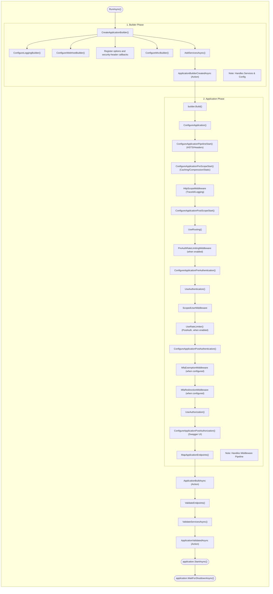

[](https://github.com/duranserkan/DRN-Project/actions/workflows/master.yml)
[](https://github.com/duranserkan/DRN-Project/actions/workflows/develop.yml)
[](https://sonarcloud.io/summary/new_code?id=duranserkan_DRN-Project)

[](https://sonarcloud.io/summary/new_code?id=duranserkan_DRN-Project)
[](https://sonarcloud.io/summary/new_code?id=duranserkan_DRN-Project)
[](https://sonarcloud.io/summary/new_code?id=duranserkan_DRN-Project)
[](https://sonarcloud.io/summary/new_code?id=duranserkan_DRN-Project)
[](https://sonarcloud.io/summary/new_code?id=duranserkan_DRN-Project)
[](https://sonarcloud.io/summary/new_code?id=duranserkan_DRN-Project)

# DRN.Framework.Hosting

> Application shell for DRN web applications with security-first design, structured lifecycle, and type-safe routing.

## TL;DR

- **Secure by Default (`DrnDefaults`)** - Fail-closed MFA, nonce-based script CSP, and HSTS outside Development
- **Opinionated Startup** - `DrnProgramBase` with 20+ overrideable lifecycle hooks
- **Type-Safe Routing** - Typed `Endpoint` and `Page` accessors replace magic strings
- **Local Infrastructure** - Opt-in local Postgres provisioning via `DRN.Framework.Testing`
- **Frontend Integration** - Razor-activated TagHelpers for Vite manifests, HTMX CSRF, and secure assets

## Table of Contents

- [QuickStart: Beginner](#quickstart-beginner)
- [QuickStart: Advanced](#quickstart-advanced)
- [Directory Structure](#directory-structure)
- [Lifecycle & Execution Flow](#lifecycle--execution-flow)
- [DrnProgramBase Deep Dive](#drnprogrambase-deep-dive)
- [Configuration](#configuration)
- [Security Features](#security-features)
- [Endpoint Management](#endpoint-management)
- [Razor TagHelpers](#razor-taghelpers)
- [Developer Diagnostics](#developer-diagnostics)
- [Modern HTTP Standards](#modern-http-standards)
- [Static Asset Pre-Warming](#static-asset-pre-warming)
- [Local Development](#local-development-infrastructure)
- [Hosting Utilities](#hosting-utilities)
- [Global Usings](#global-usings)
- [Related Packages](#related-packages)

---

## QuickStart: Beginner

Inherit from `DrnProgramBase<TProgram>` and register application services. Configure `Environment` and `NLog` before calling `RunAsync`; see [Configuration](#configuration).

```csharp
using DRN.Framework.Hosting.DrnProgram;
using DRN.Framework.Hosting.HealthCheck;
using DRN.Framework.Utils.DependencyInjection;
using DRN.Framework.Utils.Logging;
using DRN.Framework.Utils.Settings;
using Microsoft.AspNetCore.Builder;
using Microsoft.AspNetCore.Mvc;

namespace Sample.Hosted;

public class Program : DrnProgramBase<Program>, IDrnProgram
{
    public static async Task Main(string[] args) => await RunAsync(args);

    protected override Task AddServicesAsync(
        WebApplicationBuilder builder,
        IAppSettings appSettings,
        IScopedLog scopedLog)
    {
        builder.Services.AddServicesWithAttributes();
        return Task.CompletedTask;
    }
}

// WeatherForecastControllerBase supplies [AllowAnonymous] and [HttpGet].
[Route("[controller]")]
public class WeatherForecastController : WeatherForecastControllerBase;
```

## QuickStart: Advanced

Test your application using `DRN.Framework.Testing` to spin up the full pipeline including databases.

```csharp
public class WeatherForecastTests
{
    [Theory, DataInline]
    public async Task WeatherForecast_Should_Return_Data(DrnTestContext context)
    {
        var client = await context.ApplicationContext.CreateClientAsync<Program>();
        var response = await client.GetAsync("WeatherForecast");

        response.StatusCode.Should().Be(HttpStatusCode.OK);
        var data = await response.Content.ReadFromJsonAsync<IEnumerable<WeatherForecast>>();
        data.Should().NotBeEmpty();
    }
}
```

`ApplicationContext` automatically uses the active xUnit v3 output helper when each application is created, but only
while a debugger is attached to preserve the log privacy gate. Do not request `ITestOutputHelper` as a `[DataInline]`
theory parameter for application logging: AutoFixture supplies an interface substitute, not xUnit's runner-owned
helper.

## Directory Structure

```text
DRN.Framework.Hosting/
├── DrnProgram/          # DrnProgramBase, options, actions, conventions
├── Endpoints/           # EndpointCollectionBase, PageForBase, type-safe accessors
├── Auth/                # Policies, MFA configuration, requirements
├── BackgroundServices/  # StaticAssetWarmService (pre-warm compressed assets)
├── Consent/             # GDPR cookie consent management
├── Extensions/          # Configuration, controller context, endpoint helpers
├── HealthCheck/         # WeatherForecastControllerBase for quick health checks
├── Identity/            # Identity integration and scoped user middleware
├── Middlewares/         # HttpScopeMiddleware, exception handling, security middlewares
├── Nexus/               # Nexus HTTP request and client helpers
├── RateLimiting/        # Pre-auth and post-auth rate-limit rules
├── TagHelpers/          # Razor TagHelpers (Vite, Nonce, CSRF, Auth-Only, Anon-Only)
├── Utils/               # AppStartupStatus, ServerSettings, Vite manifest, ResourceExtractor
├── Areas/               # Framework-provided Razor Pages (e.g., Error pages)
├── buildTransitive/     # NuGet publish integration
├── wwwroot/             # Framework style and script assets
```

## Lifecycle & Execution Flow

`DrnProgramBase` builds, configures, validates, and starts the host. Lifecycle logs use the host logger. Failures before the host exists use an NLog bootstrap logger. `DrnProgramActions` supplies callbacks at the marked phases.


```mermaid
flowchart TD
    subgraph CONTAINER [" "]
        direction TB
        Start(["RunAsync()"]) --> CAB["CreateApplicationBuilder()"]
        
        subgraph BUILDER ["1. Builder Phase"]
            direction TB
            B_NOTE["Note: Handles Services & Config"]
            CAB --> CLB["ConfigureLoggingBuilder()"]
            CAB --> CWHB["ConfigureWebHostBuilder()"]
            CAB --> OPTIONS["Register options and security-header callbacks"]
            CAB --> CMVCB["ConfigureMvcBuilder()"]
            CAB --> ASA["AddServicesAsync()"]
            ASA --> ABC["ApplicationBuilderCreatedAsync (Action)"]
        end

        ABC --> Build["builder.Build()"]
        
        subgraph APPLICATION ["2. Application Phase"]
            direction TB
            A_NOTE["Note: Handles Middleware Pipeline"]
            Build --> CA["ConfigureApplication()"]
            CA --> CAPS["ConfigureApplicationPipelineStart() (HSTS/Headers)"]
            CAPS --> CAPR["ConfigureApplicationPreScopeStart() (Caching/Compression/Static)"]
            CAPR --> HSM["HttpScopeMiddleware (TraceId/Logging)"]
            HSM --> CPSS["ConfigureApplicationPostScopeStart()"]
            CPSS --> UR["UseRouting()"]
            UR --> PRL["PreAuthRateLimitingMiddleware (when enabled)"]
            PRL --> CAPREA["ConfigureApplicationPreAuthentication()"]
            CAPREA --> AUTH["UseAuthentication()"]
            AUTH --> SUM["ScopedUserMiddleware"]
            SUM --> PARL["UseRateLimiter() (PostAuth, when enabled)"]
            PARL --> CAPOSTA["ConfigureApplicationPostAuthentication()"]
            CAPOSTA --> MFAE["MfaExemptionMiddleware (when configured)"]
            MFAE --> MFAR["MfaRedirectionMiddleware (when configured)"]
            MFAR --> UA["UseAuthorization()"]
            UA --> CPSTAZ["ConfigureApplicationPostAuthorization() (Swagger UI)"]
            CPSTAZ --> MAE["MapApplicationEndpoints()"]
        end

        MAE --> ABA["ApplicationBuiltAsync (Action)"]
        ABA --> VE["ValidateEndpoints()"]
        VE --> VSA["ValidateServicesAsync()"]
        VSA --> AVA["ApplicationValidatedAsync (Action)"]
        AVA --> StartApplication(["application.StartAsync()"])
        StartApplication --> WaitForShutdown(["application.WaitForShutdownAsync()"])
    end
```

Temporary applications build and configure the request pipeline, then enter the service-validation phase, which honors `DrnDevelopmentSettings:SkipValidation`. They skip endpoint validation and endpoint-accessor population, and return before the host calls `StartAsync`.

## DrnProgramBase Deep Dive

Override these hooks to customize startup and request processing.

### 1. Configuration Hooks (Builder Phase)

These hooks register services or customize configuration. Options callbacks run when their options are created. Security-header callbacks run when the policy provider builds its policies.

| Category | Method | Purpose |
| :--- | :--- | :--- |
| **Logging** | `ConfigureLoggingBuilder` | Configure logging providers (clears defaults, applies config section, and registers NLog only when the `NLog` section exists; `RunAsync` still requires the section for bootstrap logging). |
| **WebHost** | `ConfigureWebHostBuilder` | Configure Kestrel options (suppresses Server header, applies optional Kestrel section, registers static web assets). |
| **OpenAPI** | `ConfigureSwaggerOptions` | Customize Swagger UI title, version, and visibility settings. |
| **MVC** | `ConfigureMvcBuilder` | Add `ApplicationParts`, custom formatters, or MVC/Razor options. Razor edit loops use Hot Reload, not runtime compilation. |
| **MVC** | `ConfigureMvcOptions` | Add global filters, conventions, or customize model binding. |
| **Auth** | `ConfigureAuthorizationOptions` | Define security policies. **Note**: Sets MFA as the default/fallback by default. |
| **Security** | `ConfigureDefaultSecurityHeaders` | Define global headers (HSTS, CSP, FrameOptions). |
| **Security** | `ConfigureDefaultCsp` | Customize CSP directives (Script, Image, Style sources). |
| **Security** | `ConfigureSecurityHeaderPolicyBuilder` | Advanced conditional security policies (e.g., per-route CSP). |
| **Cookies** | `ConfigureCookiePolicy` | Set GDPR consent logic and security attributes for all cookies. |
| **Cookies** | `ConfigureCookieTempDataProvider` | Configure TempData cookie settings (HttpOnly, IsEssential). |
| **Identity** | `ConfigureSecurityStampValidatorOptions(SecurityStampValidatorOptions, IAppSettings, MfaClaimConfig)` | Customize security stamp validation and claim preservation using the DI-resolved MFA marker. |
| **Infras.** | `ConfigureStaticFileOptions` | Customize caching (default: 1 year) and HTTPS compression. |
| **Infras.** | `ConfigureForwardedHeadersOptions` | Configure proxy/load-balancer header forwarding. |
| **Infras.** | `ConfigureRequestLocalizationOptions` | Configure culture providers and supported cultures. |
| **Infras.** | `ConfigureHostFilteringOptions` | Configure allowed hosts for host header validation. |
| **Infras.** | `ConfigureResponseCachingOptions` | Configure server-side response caching with sensible defaults (16MB max body size, case-insensitive paths). |
| **Infras.** | `ConfigureResponseCompressionOptions` | Configure response compression (Brotli/Gzip) for MIME types (extending default types with font formats) with HTTPS compression disabled (`EnableForHttps = false`) for BREACH mitigation. Static files enable HTTPS compression via `ConfigureStaticFileOptions`. |
| **Infras.** | `ConfigureCompressionProviders` | Configure Brotli and Gzip compression provider options including compression levels. |
| **Infras.** | `ConfigureBrotliCompressionLevel` | Customize Brotli compression level (default: SmallestSize). |
| **Infras.** | `ConfigureGzipCompressionLevel` | Customize Gzip compression level (default: SmallestSize). |
| **Global** | `AddServicesAsync` | **[Required]** The primary place to register your application services. |

### Razor Development

DRN uses Razor SDK build-time and publish-time compilation. For local `.cshtml` iteration, use IDE Hot Reload or `dotnet watch` instead of `Microsoft.AspNetCore.Mvc.Razor.RuntimeCompilation`; runtime compilation is obsolete in .NET 10 and disables Hot Reload.

References:

- [Razor runtime compilation is obsolete](https://learn.microsoft.com/en-us/aspnet/core/breaking-changes/10/razor-runtime-compilation-obsolete)
- [.NET Hot Reload support for ASP.NET Core](https://learn.microsoft.com/en-us/aspnet/core/test/hot-reload)

### 2. Pipeline Hooks (Application Phase)

These hooks define the request processing middleware sequence.

| Order | Hook | Typical Usage |
| :--- | :--- | :--- |
| **1** | `ConfigureApplicationPipelineStart` | `UseForwardedHeaders`, `UseHostFiltering`, `UseCookiePolicy`. |
| **2** | `ConfigureApplicationPreScopeStart` | `UseResponseCaching`, `UseResponseCompression`, `UseStaticFiles`. Caching placed before compression for efficiency. |
| **3** | `ConfigureApplicationPostScopeStart` | Add middleware that needs access to `IScopedLog` but runs before routing. |
| **4** | `ConfigureApplicationPreAuthentication` | `UseRequestLocalization`. The built-in pre-auth rate limiter runs after routing and before this hook when enabled. |
| **5** | `ConfigureApplicationPostAuthentication` | `MfaExemptionMiddleware`, then `MfaRedirectionMiddleware`. The built-in post-auth `UseRateLimiter()` runs after `ScopedUserMiddleware` and before this hook when enabled. |
| **6** | `ConfigureApplicationPostAuthorization` | `UseSwaggerUI`. Runs after access is granted but before the final endpoint. |
| **7** | `MapApplicationEndpoints` | `MapControllers`, `MapRazorPages`, `MapHubs`. |

### 3. Verification Hooks

| Hook | Purpose |
| :--- | :--- |
| `ValidateEndpoints` | Binds and validates controller endpoint accessors against mapped routes and records mapped page endpoints. |
| `ValidateServicesAsync` | Scans the container for `[Attribute]` based registrations and ensures they are resolvable at startup via `ValidateServicesAddedByAttributesAsync`. |

For MFA hooks and examples, see [MFA](#mfa).

### 4. Internal Wiring (Automatic)

* **Service Validation**: Calls `ValidateServicesAsync` to scan `[Attribute]`-registered services and ensure they are resolvable at startup.
* **JSON Encoding**: MVC uses `HtmlSafeWebJsonDefaults` for HTML-safe JSON encoding.
* **Endpoint Accessor**: Registers `IEndpointAccessor` for typed access to `EndpointCollectionBase`.

### 5. Properties

| Property | Default | Purpose |
|----------|---------|---------|
| `AppBuilderType` | `DrnDefaults` | `DrnDefaults` applies the complete DRN hosting and security pipeline. `Empty`, `Slim`, and `Default` are advanced opt-out modes; the application must configure its required services, middleware, and endpoints. |
| `DrnProgramSwaggerOptions` | (Object) | Toggles Swagger generation. Defaults to `IsDevelopmentEnvironment`. |
| `NLogOptions` | (Object) | Controls NLog bootstrapping (e.g., replace logger factory). |

## Configuration

> [!TIP]
> **Configuration Precedence**: command line and mounted settings override environment variables, which override User Secrets and appsettings files.
> Always use `User Secrets` for local connection strings to avoid committing credentials.

### Layering

1.  `appsettings.json`
2.  `appsettings.{Environment}.json`
3.  **User Secrets** when the application assembly can be loaded
4.  **Environment Variables** (`ASPNETCORE_`, `DOTNET_`, then unprefixed)
5.  **Mounted Directories** (default: `/appconfig`)
6.  **Command Line Arguments**

`Environment` is required and must be `Development`, `Staging`, or `Production`. DRN reads and validates this value before loading `appsettings.{Environment}.json`; missing, `NotDefined`, or unknown values fail startup with `ConfigurationException`.

### Host Filtering

`AllowedHosts` must be configured outside Development and cannot be `*`. Development may fall back to `*` for local convenience; production and staging should use explicit host names such as `example.com;api.example.com`.

### Reference Configurations

#### NLog (Logging)

Minimal NLog configuration for console output. Add and route a Graylog target if your deployment uses Graylog. Logging providers are cleared and NLog is added during host construction only when the `NLog` configuration section exists, while `RunAsync` still requires the section for bootstrap logging.

```json
{
  "NLog": {
    "throwConfigExceptions": true,
    "targets": {
      "async": true,
      "console": {
        "type": "Console",
        "layout": "${longdate}|${level:uppercase=true}|${logger}|${message} ${exception:format=tostring}"
      }
    },
    "rules": [
      { "logger": "*", "minLevel": "Info", "writeTo": "console" }
    ]
  }
}
```

#### Kestrel (Server)

```json
{
  "Kestrel": {
    "EndpointDefaults": { "Protocols": "Http1" },
    "Endpoints": {
      "All": { "Url": "http://*:5988" }
    }
  }
}
```

#### Forwarded Headers (Reverse Proxy & Gateway)

`ConfigureForwardedHeadersOptions` configures ASP.NET Core `ForwardedHeadersOptions` for reverse proxy, load balancer, and gateway header forwarding.

DRN trusts loopback and RFC 1918 networks (`10.0.0.0/8`, `172.16.0.0/12`, `192.168.0.0/16`) with `ForwardLimit = 2`. This supports private-network proxies. Without trusted forwarding, requests can share the proxy IP and its rate-limit quota.

- **Remove private-network defaults** with `TrustPrivateNetworks: false`:
  ```json
  {
    "ForwardedHeaders": {
      "TrustPrivateNetworks": false
    }
  }
  ```
  With no other entries configured, this retains loopback (`127.0.0.0/8`, `::1/128`).

- **Configure networks and proxies**:
  ```json
  {
    "ForwardedHeaders": {
      "ForwardLimit": 2,
      "KnownIPNetworks": [
        "10.244.0.0/16",
        { "BaseAddress": "192.168.1.0", "PrefixLength": 24 }
      ],
      "KnownProxies": [ "10.0.0.100" ]
    }
  }
  ```

  A nonempty `KnownIPNetworks` list replaces the network defaults. `KnownProxies` adds individual proxies and does not clear existing proxies or networks. For an exact allowlist, override the options callback and clear both collections before adding trusted entries.

## Security Features

The defaults in this section apply to `AppBuilderType.DrnDefaults` when the base lifecycle hooks are preserved. Other builder modes require the application to configure its complete security and middleware pipeline.

### MFA

The default and fallback authorization policies require completed MFA. The result handler rechecks MFA for role-only attributes, direct policy metadata, and named policies. Named policies retain their authentication schemes.

Use `[AllowAnonymous]` for public endpoints such as login. Authenticated endpoints have two separate MFA exemption paths:

| Path | Requirement |
| --- | --- |
| `AuthPolicy.MfaExempt` | Authentication only. The built-in policy has no scheme restriction and skips global MFA without scheme-exemption proof. |
| `ConfigureMFAExemption` | Valid proof from an eligible scheme selected by the endpoint policy or default authentication scheme. |

For restricted enrollment or challenge access, use the Identity policies below. They add scheme and credential-state checks.

Sample and Nexus register `Identity.BearerAndApplication` as their default through `AddIdentityApiEndpoints`. It tries bearer authentication first, then application cookies when no bearer token is present. An invalid bearer token does not fall back to cookies. See the [ASP.NET Core implementation](https://github.com/dotnet/aspnetcore/blob/v10.0.11/src/Identity/Core/src/IdentityServiceCollectionExtensions.cs#L176-L190).

#### Configuration

Configure MFA behavior by overriding these hooks in your `DrnProgramBase` implementation:

```csharp
// Page accessors from Sample.Hosted.
protected override MfaRedirectionConfig ConfigureMFARedirection()
    => new(
        mfaSetupUrl: Get.Page.User.Management.EnableAuthenticator,
        mfaLoginUrl: Get.Page.User.LoginWith2Fa,
        loginUrl: Get.Page.User.Login,
        logoutUrl: Get.Page.User.Logout,
        appPages: Get.Page.All
    );

// Optional: use the MFA marker emitted by your identity provider.
// The default is MfaClaimConfig.AspNetIdentity (amr=mfa).
protected override MfaClaimConfig ConfigureMFAClaim()
    => new("acr", "urn:example:authentication:mfa");

// Eligible schemes must also be selected for authentication.
protected override MfaExemptionConfig ConfigureMFAExemption()
    => new() { ExemptAuthSchemes = ["ApiKey", "Certificate"] };
```

`ConfigureMFAClaim` selects an exact claim type and value per application. It applies to authorization, redirection, `MfaFor.MfaCompleted`, and MFA policies used by `policy-only`. Multiple claim values are supported. `authorized-only` checks authentication alone.

`ConfigureMFAExemption` lists eligible schemes. Only schemes selected by the endpoint policy or default authentication scheme can supply exemption evidence. Forwarding targets are included. Authorization checks that evidence against the final principal; `IScopedUser.Exemption` is a compatibility view, not the authorization source.

Setup and pending-login credentials cannot prove completed MFA. Multiple authenticated identities must identify the same subject and issuer. Transformed exemption identities must also match the authentication type. Map external subjects to `sub` or the configured name identifier. Authentication handlers must validate token signatures, issuers, and audiences.

For example, register `ApiKey`, add it to the exemption list, and select it in an API policy that requires an API scope. Listing `ApiKey` alone does not let it access default endpoints using `Identity.BearerAndApplication`. Programmatic MFA checks without an HTTP policy context require completed MFA.

Shared MFA authorization does not require ASP.NET Core Identity or its database. External providers need trusted authentication handlers and claim mapping. Local browser redirection is opt-in; return `null` from `ConfigureMFARedirection` to omit it.

#### Renewal and assurance

Cookie security-stamp renewal and bearer refresh preserve authenticated `amr` values and the configured MFA marker with their original issuer and metadata. Claims from different issuers remain distinct. Unrelated values of a custom claim type are omitted. Overrides of `ConfigureSecurityStampValidatorOptions` must call the base method with `options`, `appSettings`, and `mfaClaimConfig` to retain preservation.

Renewal preserves valid, account-bound `auth_time` with its claim metadata. It removes factory-generated timestamps first. Timestamps must be nonnegative integer Unix seconds within `DateTimeOffset` range. Conflicting values, provenance, or account identities cause omission.

When the renewed MFA marker shares the timestamp's issuer, both must exist on one original identity. For example, a timestamp on identity A and MFA on identity B cannot become recent-MFA evidence through renewal. Renewal does not reset authentication age or establish when MFA occurred.

`MfaPrincipal.IsRecent` and `IsPhishingResistant` are opt-in assurance checks. The default MFA policy does not require either. Trusted handlers must issue the supporting evidence; a generic MFA marker alone does not prove phishing resistance.

#### Audit events

With global MFA enabled, the result handler logs these Information-level events. Names describe the event; stable IDs support log filters and alerts.

| Event name | ID | Meaning |
| --- | --- | --- |
| `MfaAuthorizationChallenge` | 7401 | Authentication challenge. |
| `MfaAuthorizationForbid` | 7402 | Access denied. |
| `MfaAuthorizationExemption` | 7403 | Effective policy or scheme exemption. |

`HostingLogEvents` in `DRN.Framework.Hosting.Logging` exposes these public `EventId` fields. See [Logging conventions](#logging-conventions) for consumer catalogs and filtering.

MFA decisions use the shared scope-event API:

```csharp
scopedLog.WithEvent(new ScopeEvent(
    HostingLogEvents.MfaAuthorizationForbid,
    Outcome: "forbid",
    Reason: "mfa_required"));
```

`ScopeEvent` comes from `DRN.Framework.Utils.Logging`. The first event supplies the scoped log's `EventId`, `EventName`, `EventOutcome`, and `EventReason` properties. Later events go into `AdditionalEvents`. Trace correlation is supplied by the scoped log. Completed MFA alone does not emit an exemption event.

Use scoped logs for request diagnostics. Dedicated audit events remain separate so sinks can filter by event ID without receiving the full request log. Audit fields exclude credentials, claims, account identifiers, and URLs; other request-log fields may contain identifiers. Configure sink fields and retention accordingly.

#### Identity Revocation Contract

Under the default Identity handlers, credential revocation depends on the credential type:

| Credential | After a persisted security-stamp change |
| --- | --- |
| Refresh token | The next `/Refresh` request rejects it; expiration is checked independently. |
| Application cookie | Rejected on the next request eligible for stamp validation: elapsed time since ticket issuance must be **greater than** `SecurityStampValidatorOptions.ValidationInterval`. This is request-driven, not a background deadline. |
| Opaque bearer access token | Remains usable until its own expiration, unless the application adds rejection checks. Stamp rotation alone does not invalidate it. |

Cookie timing follows [SecurityStampValidator](https://github.com/dotnet/aspnetcore/blob/v10.0.11/src/Identity/Core/src/SecurityStampValidator.cs); access-token timing follows [BearerTokenHandler](https://github.com/dotnet/aspnetcore/blob/v10.0.11/src/Security/Authentication/BearerToken/src/BearerTokenHandler.cs). Configured handlers, stores, validation intervals and token lifetimes can change these bounds.

`UpdateSecurityStampAsync`, factor enable/disable, authenticator-key reset, and password reset rotate the stamp. Recovery-code generation and redemption do **not**. To revoke sessions after recovery, rotate the stamp and account for outstanding access-token lifetime. See [UserManager](https://github.com/dotnet/aspnetcore/blob/v10.0.11/src/Identity/Extensions.Core/src/UserManager.cs).

`MfaRevocationTests` covers stamp changes, cookie validation intervals, and token expiration with a controlled clock.

#### Identity API MFA Setup Flow

With global MFA enabled, password login without an enrolled factor issues a five-minute `MfaSetupRequired` credential:

*   **Cookie requests**: Return an empty HTTP 200 response and set a non-persistent cookie with refresh disabled.
*   **Bearer requests**: Return an HTTP 200 `AccessTokenResponse` containing the setup access token, `ExpiresIn = 300`, and an empty `RefreshToken`.

Use the credential with `IdentityManagementControllerBase.TwoFactorAuth` to retrieve a shared key and enroll with a valid code. Discard it after enrollment. Call `Login` again with the password and an authenticator or recovery code to obtain completed MFA.

A setup credential cannot satisfy MFA, even with an MFA marker or an exempt authentication scheme.

With global MFA disabled, users without a factor can enroll using an ordinary login credential. Once enrolled, factor management requires completed MFA.

After registering Identity authentication, register its MFA policies explicitly:

```csharp
// Namespace: DRN.Framework.Hosting.Identity
services.AddDrnIdentityMfaPolicies();
```

`IdentityMfaPolicy.Enrollment` uses the Identity cookie/bearer composite. `BrowserEnrollment` and `Challenge` use application cookies only. Pass `identityApiScheme` to select an equivalent application-owned composite.

`TwoFactorAuth` checks enrollment state against the final authorized `User`. After enrollment, reading or resetting the key, disabling the factor, and regenerating recovery codes require completed MFA. Denied operations return HTTP 403.

The Sample browser setup page applies this guard to GET and POST. Its challenge matches the pending sign-in account to the selected cookie account. Other management endpoints, including `GetInfo` and `PostInfo`, retain default/fallback MFA enforcement.

#### Remaining MFA work

These items remain open in [the source phase map](Auth/Policies/MFA.cs):

| ID | Remaining work |
| --- | --- |
| MFA-01 | Atomic replay prevention, attempt limits, and fresh proof before factor changes. Keep step-up compatible with clients. |
| MFA-03 | Lost-factor and admin recovery controls, single-use recovery credentials, and notifications. |
| MFA-05 | Passkey enrollment and authentication, verified user verification, and recovery that resists assurance downgrades. |
| MFA-07 | Trusted provider-specific OIDC mappings, evidence issuance, and interoperability tests. |
| MFA-06 | Factor-change, recovery, and revocation audit events at the owning operations. |

#### Disabling global MFA

In your existing `DrnProgramBase` subclass, replace both default policies with an authenticated-user policy. Explicit MFA policies still apply. Remove any redirection or exemption overrides, or return `null` from them.

```csharp
protected override void ConfigureAuthorizationOptions(AuthorizationOptions options)
{
    base.ConfigureAuthorizationOptions(options);
    var policy = new AuthorizationPolicyBuilder()
        .RequireAuthenticatedUser()
        .Build();
    options.DefaultPolicy = policy;
    options.FallbackPolicy = policy;
}
```

### Browser security

DRN generates a request-specific cryptographic nonce.

*   **Baseline**: `default-src 'none'`; script elements require the request nonce. Other directives permit same-origin styles, images, fonts, connections, media, manifests, and workers, plus inline style attributes, `data:` images and fonts, and `blob:` workers.
*   **Automatic Protection**: Inline scripts and inline style elements without a matching nonce are blocked. Inline style attributes remain allowed by the default policy.
*   **Usage**: Activate and use the `NonceTagHelper` below to add the request nonce.

Standard security headers are injected into responses:

*   **HSTS**: Strict-Transport-Security (2 years, includes subdomains) outside Development.
*   **FrameOptions**: `DENY` (prevents clickjacking).
*   **ContentTypeOptions**: `nosniff`.
*   **ReferrerPolicy**: `strict-origin-when-cross-origin`.
*   **Cross-Origin**: COOP `same-origin`, COEP `credentialless`, and CORP `same-site`.
*   **PermissionsPolicy**: Secure default directives with fullscreen limited to self.

### Cookies and consent

Cookies use `SameSite=Strict`. `Secure` is `Always` outside Development and `SameAsRequest` in Development. Antiforgery and TempData cookies are `HttpOnly`; the global policy does not force it for client-readable cookies.

`CheckConsentNeeded = true` withholds nonessential response cookies until consent is granted. `ConsentContext` exposes the current request's preferences. Applications decide which scripts need consent and which cookies are essential.

For example, load an application-owned analytics entry only after analytics consent:

```razor
@using DRN.Framework.Hosting.Consent

@if (ConsentContext.ConsentCookie.Values.AnalyticsConsent == true)
{
    <script src="buildwww/app/js/analytics.js"
            crossorigin="anonymous"></script>
}
```

### Route-specific security headers

Customize security headers for specific routes by overriding `ConfigureSecurityHeaderPolicyBuilder`:

```csharp
protected override void ConfigureSecurityHeaderPolicyBuilder(
    SecurityHeaderPolicyBuilder builder,
    IServiceProvider serviceProvider,
    IAppSettings appSettings)
{
    base.ConfigureSecurityHeaderPolicyBuilder(builder, serviceProvider, appSettings);
    
    // Allow legacy inline scripts on /legacy routes.
    var legacyPolicy = new HeaderPolicyCollection();
    ConfigureDefaultSecurityHeaders(legacyPolicy, serviceProvider, appSettings);
    legacyPolicy.Remove("Content-Security-Policy");
    legacyPolicy.AddContentSecurityPolicy(csp =>
    {
        ConfigureDefaultCspBase(csp);
        csp.AddFrameAncestors().Self();
        csp.AddScriptSrc().Self().UnsafeInline(); // Only for selected legacy routes
    });
    builder.AddPolicy("legacy-inline-csp", legacyPolicy);
    builder.SetPolicySelector(selector =>
        selector.HttpContext.Request.Path.StartsWithSegments("/legacy")
            ? selector.ConfiguredPolicies["legacy-inline-csp"]
            : selector.DefaultPolicy);
}
```

### Rate Limiting

DRN Hosting adds two composable limiter phases:

- **Pre-auth** runs after routing and before authentication. It evaluates singleton rules only and uses a coarse IP default to reject obvious abuse before auth and MFA work. Add a custom singleton rule for trusted-header partitioning behind a correctly configured edge proxy.
- **Post-auth** runs after `ScopedUserMiddleware`. It can use singleton and scoped rules, including user, tenant, account, claim, or endpoint partitions.

Defaults are token buckets: 1,000 tokens/minute for pre-auth IP partitions and 100 tokens/minute for post-auth authenticated users or the anonymous IP fallback. Rejections return `429 Too Many Requests`; `Retry-After` is included only when the rejecting limiter supplies retry metadata.

> [!IMPORTANT]
> DRN's built-in limiter state is process-local. In horizontally scaled production deployments, enforce coarse limits at the edge (WAF/CDN/API gateway/load balancer) or add a distributed/custom limiter for quotas that must hold across every application instance.

Endpoint metadata behavior:

- `[DisableRateLimiting]` bypasses DRN pre-auth and post-auth limiting, plus ASP.NET Core post-auth policies.
- `[EnableRateLimiting("policy-name")]` selects ASP.NET Core named post-auth policies. DRN pre-auth remains global; DRN rules with matching `PolicyName` compose with the named policy.
- Static files served before routing are naturally outside the limiter path.

When many users share an edge IP, raise the pre-auth quota or use a trusted-header rule. Use scoped post-auth rules for account or tenant quotas, as shown below.

#### Settings Quick Reference

Configure defaults under `DrnAppFeatures:DrnRateLimit`. Read them through `IAppSettings.Features.RateLimit`. Changes require restart. Shared bucket values must be positive; phase overrides can be `0` to inherit them.

| Setting group | Default | Used by | Meaning |
|---|---:|---|---|
| `Disabled` | `false` | Both phases | Disables DRN pre-auth and post-auth rate limiting. |
| `PartitionLogMode` | `KeyedHash` | Both phases | Hashes rate-limit-specific rejected IP and partition fields for correlation. It does not anonymize the complete request log. Use `PlainText` only in controlled development or dedicated encrypted audit sinks. |
| `TokenLimit`, `ReplenishmentSeconds`, `TokensPerPeriod` | `100`, `60`, `100` | Shared fallback | Base token bucket values for both phases. |
| `PreAuthTokenLimit`, `PreAuthReplenishmentSeconds`, `PreAuthTokensPerPeriod` | `1000`, `60`, `1000` | Pre-auth | Coarse IP limits before authentication. `0` inherits the shared value. |
| `PostAuthTokenLimit`, `PostAuthReplenishmentSeconds`, `PostAuthTokensPerPeriod` | `0`, `0`, `0` | Post-auth | Authenticated user or anonymous IP limits after `ScopedUserMiddleware`. `0` inherits the shared value. |

#### Rule Extension Points

Add rules by deriving from `SingletonRateLimitRule` or `ScopedRateLimitRule`; the base classes include attribute-based DI registration. Direct interface implementations must opt into multi-registration with `[Singleton<ISingletonRateLimitRule>(tryAdd: false)]` or `[Scoped<IScopedRateLimitRule>(tryAdd: false)]`.

Rules run by ascending `Order`; framework defaults run last. Matching rules compose through .NET's chained limiter, so tenant + user + IP policies can all apply to one request. `ScopedRateLimitRule` is post-auth only.

| Return value | Effect |
|---|---|
| `null` | Rule does not apply. |
| `RateLimitRuleResult.TokenBucket(key, ...)` | Applies a token bucket to this partition. |
| `RateLimitRuleResult.AllowRequest("partition-key")` | Skips later rules in this phase. Earlier limits and native policies still apply. |
| `RateLimitRuleResult.DenyRequest("partition-key")` | Rejects immediately with 429. |
| Any result with `stopRemainingRules: true` | Applies this result and skips later rules. |

Partition helpers include `TokenBucket`, `FixedWindow`, `SlidingWindow`, `ConcurrencyLimiter`, and `CustomPartition`. `RateLimitRuleResult.Action` is `Limit`, `Allow`, or `Deny`; `StopRemainingRules` only controls whether later rules compose after this result.

Set `PolicyName` to match `[EnableRateLimiting("policy-name")]`, or leave it `null` for a global rule. Empty names are invalid. Native policies registered through `AddRateLimiter` run alongside DRN rules. A rejecting DRN rule receives `OnRejectedAsync`; native policy rejections use the ASP.NET Core callback.

Use `ShortCircuitOnMatch` and lower `Order` for allow/deny rules that must bypass quota checks. Rules with the same `Order` evaluate short-circuit rules first; if a short-circuit rule returns `null`, later rules still evaluate.

Partition identities are internally namespaced by phase and rule type:

```text
({phase}, {rule type}, {your partition key})
```

The namespacing keeps metrics/logs diagnosable and prevents accidental key collisions between rules. Your rule still returns a simple key like `tenant:acme-corp`; DRN handles the namespace.

> [!WARNING]
> Partition option factories are cached by .NET per partition key. Do not capture `HttpContext` or scoped services inside factory lambdas; pass only immutable values.

Dynamic tenant plans belong in rules, not global settings. Rule evaluation is synchronous, so do not perform database, Redis, or `HybridCache` I/O inside `EvaluatePreAuth` / `EvaluatePostAuth`. Load plan data earlier in the request or maintain an in-memory snapshot refreshed in the background. `HybridCache` and `IDistributedCache` can share policy data, but they are not hard distributed counters by themselves.

```csharp
// Sample.Hosted/Helpers/RateLimitFor.cs
public class RateLimitFor
{
    public string? AccountPartition => Get.Claim.Account.Id == null ? null : $"account:{Get.Claim.Account.Id:N}";
    public string? TenantPartition => Get.Claim.Tenant.Id == null ? null : $"tenant:{Get.Claim.Tenant.Id:N}";
}

public class AccountRateLimitRule(DrnAppFeatures features) : ScopedRateLimitRule
{
    public override RateLimitRuleResult? EvaluatePostAuth(HttpContext context)
    {
        var partitionKey = Get.RateLimit.AccountPartition;
        if (partitionKey == null)
            return null;

        var tokenLimit = features.RateLimit.TokenLimit;
        var period = TimeSpan.FromSeconds(features.RateLimit.ReplenishmentSeconds);
        var tokensPerPeriod = features.RateLimit.TokensPerPeriod;
        return RateLimitRuleResult.TokenBucket(partitionKey, _ => new TokenBucketRateLimiterOptions
        {
            TokenLimit = tokenLimit,
            ReplenishmentPeriod = period,
            TokensPerPeriod = tokensPerPeriod,
            QueueLimit = 0,
            AutoReplenishment = true
        });
    }
}
```

#### Telemetry

DRN emits OpenTelemetry-friendly metrics through the `DRN.Framework.Hosting.RateLimiting` meter:

| Metric | Tags |
|--------|------|
| `drn.rate_limiting.requests` | `drn.rate_limiting.phase`, `aspnetcore.rate_limiting.policy`, `aspnetcore.rate_limiting.result`, `drn.rate_limiting.action`, `drn.rate_limiting.rule` |
| `drn.rate_limiting.rejections` | `drn.rate_limiting.phase`, `aspnetcore.rate_limiting.policy`, `aspnetcore.rate_limiting.result`, `drn.rate_limiting.action`, `drn.rate_limiting.rule` |
| `drn.rate_limiting.active_request_leases` | `drn.rate_limiting.phase`, `aspnetcore.rate_limiting.policy`, `aspnetcore.rate_limiting.result`, `drn.rate_limiting.action`, `drn.rate_limiting.rule` |
| `drn.rate_limiting.request_lease.duration` | `drn.rate_limiting.phase`, `aspnetcore.rate_limiting.policy`, `aspnetcore.rate_limiting.result`, `drn.rate_limiting.action`, `drn.rate_limiting.rule` |

DRN emits requests, active leases, and lease duration for pre-auth only. Rejections cover both phases. ASP.NET Core supplies the post-auth request and lease metrics.
The `action` tag is `limit`, `allow`, `deny`, or `unknown`; this makes whitelist, blocklist, and quota decisions visible without inspecting rule names.
When a native ASP.NET Core named policy rejects after DRN's global limiter succeeds, DRN records the rejection without a DRN rule tag because no DRN rule caused the failed lease.
By default, rate-limit-specific IP and partition fields are written as deterministic keyed hashes with a `blake3-keyed:` prefix. This supports correlation but does not anonymize the complete request log; standard request and user fields may still contain raw identifiers. Treat logs as sensitive, and enable `PlainText` only for controlled development or a dedicated encrypted audit sink.

#### Overriding Defaults

Override `CreatePreAuthRateLimiter` or `ConfigurePostAuthRateLimiterOptions` in `DrnProgramBase` to change global algorithms, add named policies, or preserve custom `RateLimiterOptions` callbacks:

```csharp
protected override void ConfigurePostAuthRateLimiterOptions(
    RateLimiterOptions options,
    IServiceProvider serviceProvider,
    IAppSettings appSettings)
{
    base.ConfigurePostAuthRateLimiterOptions(options, serviceProvider, appSettings);
    options.AddTokenBucketLimiter("strict", opt =>
    {
        opt.TokenLimit = 10;
        opt.ReplenishmentPeriod = TimeSpan.FromSeconds(60);
        opt.TokensPerPeriod = 10;
        opt.QueueLimit = 0;
    });
}
```

#### References

- [ASP.NET Core rate limiting middleware](https://learn.microsoft.com/en-us/aspnet/core/performance/rate-limit?view=aspnetcore-10.0)
- [RateLimiterOptions API](https://learn.microsoft.com/en-us/dotnet/api/microsoft.aspnetcore.ratelimiting.ratelimiteroptions)
- [RateLimitPartition API](https://learn.microsoft.com/en-us/dotnet/api/system.threading.ratelimiting.ratelimitpartition)
- [HybridCache library in ASP.NET Core](https://learn.microsoft.com/en-us/aspnet/core/performance/caching/hybrid?view=aspnetcore-10.0)
- [Distributed caching in ASP.NET Core](https://learn.microsoft.com/en-us/aspnet/core/performance/caching/distributed?view=aspnetcore-10.0)
- [Redis token bucket rate limiter with .NET](https://redis.io/docs/latest/develop/use-cases/rate-limiter/dotnet/)
- [RFC 6585 Section 4: 429 Too Many Requests](https://www.rfc-editor.org/rfc/rfc6585#section-4)
- [RFC 9110: Retry-After header](https://www.rfc-editor.org/rfc/rfc9110#field.retry-after)

## Endpoint Management

DRN provides compile-time-typed accessor members for controller endpoints and Razor Page paths. Controller endpoint accessors are bound to mapped routes and validated at startup. Razor Page accessors are convention-generated path strings; keep them synchronized with page routes.

### 1. Define Accessors

Create application-owned endpoint and page collections:

```csharp
public sealed class AppEndpoints : EndpointCollectionBase<Program>
{
    public UserEndpoints User { get; } = new();
}

public sealed class UserEndpoints()
    : ControllerForBase<UserController>("/Api/User/[controller]")
{
    // Property names match controller action method names.
    public ApiEndpoint Login { get; private set; } = null!;
    public ApiEndpoint Profile { get; private set; } = null!;
}

public sealed class AppPages : PageCollectionBase<AppPages>
{
    public UserPages User { get; } = new();
}

public sealed class UserPages : PageForBase
{
    protected override string[] PathSegments { get; } = ["User"];
    public string Login { get; init; } = string.Empty;
}

public static class Get
{
    public static AppEndpoints Endpoint { get; } =
        (AppEndpoints)EndpointCollectionBase<Program>.EndpointCollection!;

    public static AppPages Page { get; } =
        PageCollectionBase<AppPages>.PageCollection;
}
```

### 2. Usage in Code

Use the typed accessor members with IDE completion:

```csharp
// Get the typed endpoint object
ApiEndpoint endpoint = Get.Endpoint.User.Login;

// Return the mapped controller route.
string url = endpoint.Path();

// For an action route containing {id:guid}
Guid userId = Guid.NewGuid();
string profileUrl = Get.Endpoint.User.Profile.Path(userId);
```

```razor
<a asp-page="@Get.Page.User.Login">Log in</a>
```

## Razor TagHelpers

Activate the framework TagHelpers in `Pages/_ViewImports.cshtml`:

```razor
@addTagHelper *, Microsoft.AspNetCore.Mvc.TagHelpers
@addTagHelper *, DRN.Framework.Hosting
```

Without the DRN directive, Vite resolution, CSP nonces, HTMX CSRF headers, active-page marking, and visibility helpers do not run.

| TagHelper | Target | Purpose |
| :--- | :--- | :--- |
| `ViteScriptTagHelper` | `<script src="buildwww/...">` | Resolves Vite manifest entries and adds subresource integrity (SRI). |
| `ViteLinkTagHelper` | `<link href="buildwww/...">` | Resolves Vite manifest entries for CSS assets, adds SRI. |
| `NonceTagHelper` | `<script>`, `<style>`, `<link>`, `<iframe>` | Automatically injects the request-specific CSP nonce. |
| `CsrfTokenTagHelper` | `hx-post`, `hx-put`, etc. | Automatically adds `RequestVerificationToken` to HTMX headers for non-GET requests. |
| `AuthorizedOnlyTagHelper` | `*[authorized-only]` | Renders the element only if the user is authenticated. |
| `AnonymousOnlyTagHelper` | `*[anonymous-only]` | Renders the element only if the user is **not** authenticated. |
| `PolicyOnlyTagHelper` | `*[policy-only="PolicyName"]` | Renders the element only when the current request user satisfies the named authorization policy. Accepts an optional `policy-resource`. |
| `PageAnchorAspPageTagHelper` | `<a asp-page="...">` | Automatically adds `active` CSS class if the link matches current page. |
| `PageAnchorHrefTagHelper` | `<a href="...">` | Adds `active fw-bold` when the href path matches the Razor page identifier. Custom URL routes may differ. |
| `ScriptDefaultsTagHelper` | `<script>` | Modern defaults: `defer` for external scripts, `type="module"` for inline scripts. Opt-out via `defer="false"` or explicit `type`. |

### Authorization Visibility

Use named policies for claim, role, or resource requirements instead of duplicating authorization rules in markup:

```razor
<a policy-only="ManageUsers" asp-page="/Admin/Users">Manage users</a>
<button policy-only="EditDocument" policy-resource="@Model.Document">Edit</button>
<nav authorized-only>Signed-in navigation</nav>
<a anonymous-only asp-page="/User/Login">Sign in</a>
```

`policy-only` requires a non-blank registered policy name. Blank names and unknown policies raise errors; authorization failure suppresses the element. Policies are evaluated asynchronously through `IAuthorizationService` using `ViewContext.HttpContext.User`. `policy-resource` is passed unchanged to authorization handlers and defaults to `null`. Policy configuration determines whether authentication is required; the helper does not add that requirement itself.

This is programmatic authorization of the current user, not an access check for the destination of a link. It does not authenticate policy schemes, discover exemption proofs, or evaluate destination endpoint metadata. DRN's policy provider still adds the configured default MFA requirement to non-exempt named policies. With the default null resource (or a domain resource), MFA checks require completed MFA rather than consuming HTTP endpoint exemption evidence. Policies whose handlers need a resource must receive the appropriate `policy-resource` explicitly.

`authorized-only` and `anonymous-only` are presence-only markers: write them without values. Any value, including `"false"`, still activates the filter. Remove the attribute to omit that filter; use Razor conditionals for dynamic rendering. Both markers are removed from rendered HTML. `authorized-only` checks `ScopeContext.Authenticated`; `anonymous-only` checks its inverse. When multiple visibility helpers apply, any one can suppress the element.

By convention, endpoint policies enforce MFA while these two helpers distinguish signed-in and signed-out users. On anonymous or MFA-exempt pages, `authorized-only` can render for authenticated users whose MFA is pending or setup is incomplete. Use `policy-only` for visibility that requires a specific authorization policy. These helpers only control HTML rendering; enforce access independently through server authorization policies.

### Vite Manifest Publish Support

`DRN.Framework.Hosting` ships a transitive MSBuild target that adds `wwwroot/**/.vite/manifest.json` files to Web SDK publish output. At runtime, `ViteManifest` scans for `.vite/manifest.json` below `IWebHostEnvironment.WebRootPath`; when `WebRootPath` is empty, it resolves `ContentRootPath/wwwroot`. This keeps manifest lookup, SRI generation, and static asset pre-warming working after publish, including Vite's default dot-directory manifest location.

When changing environment defaults, Staging-from-build-output behavior, or static-web-asset content roots, verify manifest discovery against the running app, not only server startup. A Razor page can render while CSS/JS is absent if the Vite manifests are outside the active manifest root.

Disable the publish item injection when an application owns this behavior itself:

```xml
<PropertyGroup>
  <DrnHostingViteManifestPublishItemsEnabled>false</DrnHostingViteManifestPublishItemsEnabled>
</PropertyGroup>
```

## Developer Diagnostics

DRN provides startup reports and request diagnostics in Development.

### Logging conventions

`EventId` is provided by .NET's `Microsoft.Extensions.Logging`. It holds a numeric ID and an optional name. Use it with a public static `<Module>LogEvents` catalog. For example, `HostingLogEvents.MfaAuthorizationChallenge` carries ID `7401` and name `MfaAuthorizationChallenge`.

- Define events as `public static readonly EventId` fields in the owning module's `Logging` namespace.
- Give each event a descriptive name and an ID unique within its module. Do not renumber, rename, or reuse published events for different meanings.
- Filter dedicated logs by logger category and event ID. Numeric IDs are not globally unique across applications or libraries.
- Use `ScopeEvent` and `IScopedLog.WithEvent` instead of event dictionaries. Standard fields are `EventId`, `EventName`, `EventOutcome`, and `EventReason`.
- Consumers can define a companion catalog, such as `SampleLogEvents`. Reuse Hosting definitions only for the same event meaning.

Use `IScopedLog` for request and operation diagnostics. Direct `ILogger` calls are appropriate for scope flushing, bootstrap failures, and dedicated audit events. Keep request audit decisions in the scoped log too. Dedicated audit events must not include the full request log.

Every `ScopedLog` has a stable `CorrelationId`. Its `TraceId` is captured from an active W3C activity, or left absent. HTTP `TraceIdentifier` remains separate. `LogScoped` emits the primary event ID with the aggregate. Dedicated audit records use `EventOutcome`, `EventReason`, nullable `TraceId`, and `CorrelationId`. See [Utils OpenTelemetry correlation](../DRN.Framework.Utils/README.md#opentelemetry-correlation).

### Startup Exception Reports

In Development, if the application fails during `RunAsync`, DRN Hosting attempts to write `StartupExceptionReport.html` beside the application assembly. Report generation is best effort; when no report can be created, use the startup logs. Production and staging use normal startup logs only.

When generated, the report can include:
-   Full stack traces with source code highlighting (if symbols available).
-   Environment details and configuration snapshots.
-   Scoped logs leading up to the crash.

### Custom Error Pages

The framework includes built-in Razor Pages for developer-time exception handling:
-   **RuntimeExceptionPage**: Detailed breakdown of unhandled exceptions with request state and logs.
-   **CompilationExceptionPage**: Visualizes Razor or code compilation errors with line-specific highlighting.

### Request Body Buffering

`HttpScopeMiddleware` enables request buffering for POST, PUT, and PATCH bodies with a known `Content-Length` within the configured limit. Error pages read the buffered body through `RequestBufferingState.ReadBodyAsync`. Unknown or excessive lengths are skipped. Buffer limits and Kestrel request-size limits still apply.

**Configuration** via `DrnAppFeatures` (in `appsettings.json`):

| Key                       | Type   | Default        | Effect                                               |
|---------------------------|--------|----------------|------------------------------------------------------|
| `DisableRequestBuffering` | `bool` | `false`        | Disables this diagnostic buffering feature |
| `MaxRequestBufferingSize` | `int`  | `0` (→ 30,000) | Max bytes to buffer. Values below 10,000 are ignored |

```json
{
  "DrnAppFeatures": {
    "DisableRequestBuffering": false,
    "MaxRequestBufferingSize": 50000
  }
}
```

> [!NOTE]
> Skipped reads return a reason, such as `"Content-Length exceeded limit"`.

## Modern HTTP Standards

DRN applies these response defaults:

-   **303 See Other**: Middleware converts `302 Found` to `303 See Other`. For example, a redirect after form submission uses GET for the destination.
-   **Secure Caching Default**: Dynamic responses that do not set their own `Cache-Control` receive `no-store, no-cache, must-revalidate`. Explicit response caching directives take precedence, while static assets opt into public caching.

## Static Asset Pre-Warming

`StaticAssetWarmService` is a best-effort hosted service that requests Vite assets after the host starts so response caching can store Brotli and Gzip variants.

**How it works**:
1. Waits for the host to fully start via `IAppStartupStatus`
2. Reads all entries from the Vite manifest
3. Requests each asset with `Accept-Encoding: br` and `Accept-Encoding: gzip` against the loopback address (via `IServerSettings`)
4. Eligible responses can be cached as compressed variants keyed on `Vary: Accept-Encoding`

The warm-up client only accepts loopback base addresses before installing its certificate-bypass handler. Wildcard server bindings are normalized to localhost; non-loopback bindings are ignored for warm-up.

**Compression defaults**: Brotli and Gzip use `CompressionLevel.SmallestSize`. Static assets allow HTTPS compression and caching of eligible variants. Dynamic HTTP responses can also be compressed. Dynamic HTTPS compression is disabled by default.

| Provider | Default Level | Override Hook |
|----------|--------------|---------------|
| Brotli | `SmallestSize` | `ConfigureBrotliCompressionLevel()` |
| Gzip | `SmallestSize` | `ConfigureGzipCompressionLevel()` |

> After a successful warm-up, subsequent requests can use cached compressed variants. Warm-up runs after startup and is best effort, so early requests may perform compression themselves.

## Local Development Infrastructure

Use `DRN.Framework.Testing` to provision Postgres during local Development without manual Docker management. The following setup keeps Testcontainers dependencies in Debug builds and explicitly enables local dependency launch.

### 1. Add the Debug-Only Package

NuGet consumers should reference the `DRN.Framework.Testing` version matching `DRN.Framework.Hosting`:

```xml
<ItemGroup Condition="'$(Configuration)' == 'Debug'">
    <!-- Replace VERSION with the DRN.Framework.Hosting version in use. -->
    <PackageReference Include="DRN.Framework.Testing" Version="VERSION" />
</ItemGroup>
```

Repository contributors may use the sibling project reference instead.

### 2. Enable External Dependency Launch

Add the explicit opt-in to `appsettings.Development.json`:

```json
{
  "DrnDevelopmentSettings": {
    "LaunchExternalDependencies": true
  }
}
```

External dependencies launch only for a Development host with this setting enabled. Test and temporary hosts are excluded.

### 3. Configure Startup Actions

Implement `DrnProgramActions` to launch the configured local dependencies.

```csharp
#if DEBUG
using DRN.Framework.Testing.Extensions;

public class SampleProgramActions : DrnProgramActions
{
    public override async Task ApplicationBuilderCreatedAsync<TProgram>(
        TProgram program, WebApplicationBuilder builder,
        IAppSettings appSettings, IScopedLog scopedLog)
    {
        var options = new ExternalDependencyLaunchOptions
        {
            PostgresContainerSettings = new() 
            { 
                Reuse = true, // Faster restarts
                HostPort = 6432 // Avoid conflicts with local Postgres
            }
        };

        // When enabled, starts missing containers and updates AppSettings.
        await builder.LaunchExternalDependenciesAsync(scopedLog, appSettings, options);
    }
}
#endif
```

## Hosting Utilities

### IAppStartupStatus

Singleton gate for background services that need to wait until the host has fully started before executing.

```csharp
using DRN.Framework.Hosting.Utils;
using DRN.Framework.Utils.DependencyInjection.Attributes;
using Microsoft.Extensions.Hosting;

[HostedService]
public sealed class MyWorker(IAppStartupStatus startupStatus) : BackgroundService
{
    protected override async Task ExecuteAsync(CancellationToken stoppingToken)
    {
        if (!await startupStatus.WaitForStartAsync(stoppingToken))
            return;

        // The application has started.
    }
}
```

`[HostedService]` is discovered when the worker's assembly is registered with `AddServicesWithAttributes()`.

### IServerSettings

Resolves bound server addresses from Kestrel. Normalizes wildcard hosts (`0.0.0.0`, `[::]`, `+`, `*`) to `localhost` for internal self-requests. Prefers HTTP over HTTPS to avoid TLS overhead.

```csharp
using DRN.Framework.Hosting.Utils;

public class MyService(IServerSettings server)
{
    public void LogAddresses()
    {
        var loopback = server.GetLoopbackAddress();   // e.g. "http://localhost:5988"
        var all = server.GetAllAddresses();            // All normalized bound addresses
    }
}
```

## Global Usings

Suggested global usings for Hosted applications to reduce boilerplate:
```csharp
global using DRN.Framework.Hosting.DrnProgram;
global using DRN.Framework.Hosting.Endpoints;
global using DRN.Framework.Utils.DependencyInjection;
global using DRN.Framework.Utils.Logging;
global using DRN.Framework.Utils.Settings;
global using Microsoft.AspNetCore.Mvc;
```

---

## Related Packages

- [DRN.Framework.SharedKernel](https://www.nuget.org/packages/DRN.Framework.SharedKernel/) - Domain primitives and exceptions
- [DRN.Framework.Utils](https://www.nuget.org/packages/DRN.Framework.Utils/) - Configuration and DI utilities
- [DRN.Framework.EntityFramework](https://www.nuget.org/packages/DRN.Framework.EntityFramework/) - EF Core integration
- [DRN.Framework.Testing](https://www.nuget.org/packages/DRN.Framework.Testing/) - Testing utilities

For complete examples, see [Sample.Hosted](https://github.com/duranserkan/DRN-Project/tree/master/Sample.Hosted).

---

Documented with the assistance of [DiSC OS](https://github.com/duranserkan/DRN-Project/blob/develop/.agent/rules/DiSCOS.md)

---
**Semper Progressivus: Always Progressive**
