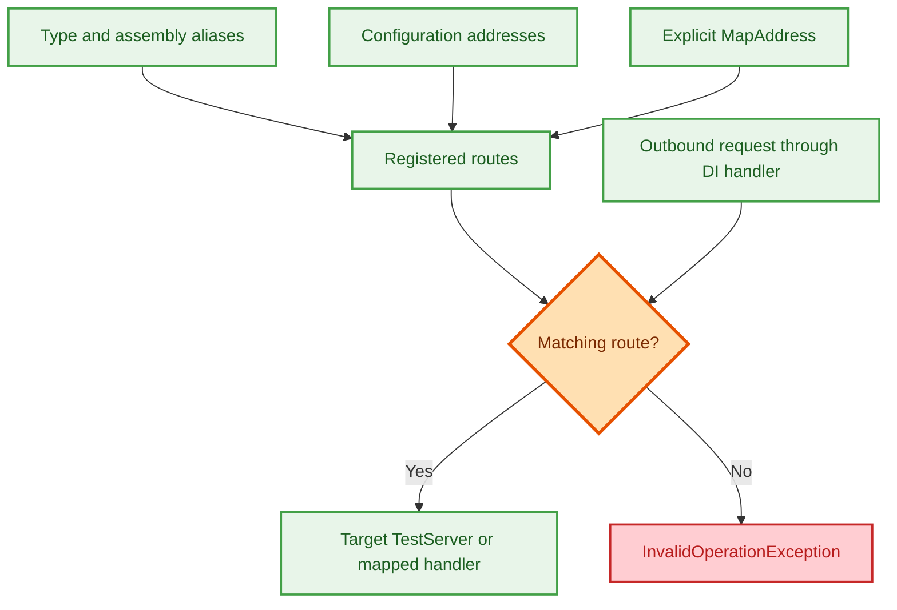

[](https://github.com/duranserkan/DRN-Project/actions/workflows/master.yml)
[](https://github.com/duranserkan/DRN-Project/actions/workflows/develop.yml)
[](https://sonarcloud.io/summary/new_code?id=duranserkan_DRN-Project)


[](https://sonarcloud.io/summary/new_code?id=duranserkan_DRN-Project)
[](https://sonarcloud.io/summary/new_code?id=duranserkan_DRN-Project)
[](https://sonarcloud.io/summary/new_code?id=duranserkan_DRN-Project)
[](https://sonarcloud.io/summary/new_code?id=duranserkan_DRN-Project)
[](https://sonarcloud.io/summary/new_code?id=duranserkan_DRN-Project)
[](https://sonarcloud.io/summary/new_code?id=duranserkan_DRN-Project)
[](https://sonarcloud.io/summary/new_code?id=duranserkan_DRN-Project)

# DRN.Framework.Testing

> Practical, effective testing helpers with data attributes, test context, and container orchestration for unit and integration tests.

## TL;DR

- **Auto-Mocking** - `[DataInline]` / `[DataInlineUnit]` provide requested context objects and auto-mock interface parameters with NSubstitute
- **Container Context** - Postgres migration binding on demand; RabbitMQ is available as an explicit opt-in container helper
- **Application Context** - `WebApplicationFactory` integration that syncs services/configuration and binds Postgres dependencies before client creation
- **File Conventions** - Settings and data resolve from the test's namespace-based output folder, then global folders
- **DTT Pattern** - Integration-first tests with minimal setup, AwesomeAssertions, and MTP-friendly execution

## Table of Contents

- [QuickStart: Beginner](#quickstart-beginner)
- [QuickStart: Advanced](#quickstart-advanced)
- [DrnTestContext](#drntestcontext)
- [ContainerContext](#containercontext)
- [ApplicationContext](#applicationcontext)
- [Local Development Experience](#local-development-experience)
- [Connection String Resolution](#connection-string-resolution)
- [Data Attributes](#data-attributes)
- [Unit Testing](#unit-testing)
- [DebugOnly Tests](#debugonly-tests)
- [DI Health Validation](#di-health-validation)
- [JSON Utilities](#json-utilities)
- [FlurlHttpTest Integration](#flurlhttptest-integration)
- [Providers](#providers)
- [Example Test Project](#example-test-project-csproj-file)
- [Test Snippet](#test-snippet)
- [Testing Guide and DTT Approach](#testing-guide-and-dtt-approach)
- [Global Usings](#global-usings)
- [Telemetry Opt-Out](#telemetry-opt-out)
- [Related Packages](#related-packages)

---

## QuickStart: Beginner

For parameterless unit tests without context or generated parameters, standard `[Fact]` is preferred.

Use `[DataInlineUnit]` for unit tests and `[DataInline]` for integration tests. The examples below share the model definitions that follow. Hosted examples use the repository's `SampleProgram`; custom programs must meet the [entry point constraints](#applicationcontext).

```csharp
    // Unit test: uses DataInlineUnit with DrnTestContextUnit (lightweight, no container overhead)
    [Theory]
    [DataInlineUnit(100)]
    public void DataInlineUnitDemonstration(DrnTestContextUnit context, int maxLimit, IMockable autoInlinedDependency)
    {
        context.ServiceCollection.AddApplicationServices();
        // Context-managed service resolution applies auto-inlined substitutes to matching dependencies
        var dependentService = context.GetRequiredService<DependentService>();
        
        autoInlinedDependency.Max.Returns(maxLimit); // Inlined data & NSubstitute mock
        dependentService.Max.Should().Be(100);
    }

    // Integration test: uses DataInline with full DrnTestContext, ApplicationContext, and auto-mocking
    [Theory]
    [DataInline("/Api/Sample/WeatherForecast", 100)]
    public async Task DataInlineIntegrationDemonstration(DrnTestContext context, string endpoint, int maxLimit, IMockable autoInlinedDependency)
    {
        autoInlinedDependency.Max.Returns(maxLimit); // Dependency auto-mocked by NSubstitute and synced to ApplicationContext

        // Builds application host with mocked services, binds dependencies/migrations, and creates HttpClient
        var client = await context.ApplicationContext.CreateClientAsync<SampleProgram>();

        var response = await client.GetAsync(endpoint);
        response.Should().BeSuccessful();
    }
```

### Testing models used in the QuickStart

```csharp

public static class ApplicationModule
{
    public static void AddApplicationServices(this IServiceCollection serviceCollection)
    {
        // Context resolution prefers the test's substitute for IMockable.
        serviceCollection.AddTransient<IMockable, ToBeRemovedService>();
        serviceCollection.AddTransient<DependentService>();
    }
}

public interface IMockable
{
    public int Max { get; }
}

public class ToBeRemovedService : IMockable
{
    public int Max { get; set; }
}

public class DependentService : IMockable
{
    private readonly IMockable _mockable;

    public DependentService(IMockable mockable)
    {
        _mockable = mockable;
    }

    public int Max => _mockable.Max;
}
```

## QuickStart: Advanced

Combine explicit values, generated data and a substitute. See [Data Attributes](#data-attributes) for parameter ordering and row controls.

```csharp
[Theory]
[DataInlineUnit(99)]
public void TestContext_Should_Be_Created_From_DrnTestContextData(DrnTestContextUnit context, int inlineData, Guid autoInlinedData, IMockable autoInlinedMockable)
{
    inlineData.Should().Be(99);
    autoInlinedData.Should().NotBeEmpty();
    autoInlinedMockable.Max.Returns(int.MaxValue);

    context.ServiceCollection.AddApplicationServices();
    var serviceProvider = context.BuildServiceProvider();
    serviceProvider.GetRequiredService<IMockable>().Should().BeSameAs(autoInlinedMockable);

    var dependentService = serviceProvider.GetRequiredService<DependentService>();
    dependentService.Max.Should().Be(int.MaxValue);
}
```

## DrnTestContext

Choose the smallest context the test needs. Both contexts implement `IKeyedServiceProvider`; data attributes supply them only when requested as the first parameter.

| Capability | `DrnTestContextUnit` | `DrnTestContext` |
|---|---|---|
| Method metadata, row data and substitutes | `MethodContext` | `MethodContext` |
| Dependency injection (DI) and DRN utilities | `ServiceCollection`, `BuildServiceProvider()`, context service resolution | Same |
| Configuration | `BuildConfigurationRoot()`, `AddToConfiguration()`, `IConfiguration`, `IAppSettings` | Same |
| Settings/data files | `GetSettingsPath()`, `GetSettingsData()`, `GetData()` | Same |
| Temporary directory | `GetTempPath()` or `MethodContext.GetTempPath()` | Same |
| Attribute registration validation | `ValidateServicesAsync(ignore: ...)` | `ValidateServicesAsync()` |
| PostgreSQL and RabbitMQ | None | [ContainerContext](#containercontext) |
| Hosted applications | None | [ApplicationContext](#applicationcontext) |
| Flurl request mocking | None | [FlurlHttpTest](#flurlhttptest-integration) |
| One-time startup jobs | None | `StartupJobRunner` runs `ITestStartupJob` implementations |

Register services and configuration before resolving them. Context-managed resolution applies generated substitutes to matching interface or abstract dependencies. Calling `context.ServiceCollection.BuildServiceProvider()` directly bypasses that step.

`BuildServiceProvider()` replaces the previous context-owned provider. It adds DRN utilities, configuration and logging with no output providers. Services can resolve `ILogger<T>` without emitting logs through that default setup. Hosted logging has separate [debugger conditions](#test-output-logging).

xUnit disposes attribute-provided contexts after use. `DrnTestContext` disposes application factories before its own providers and containers. Factories own their host providers. Rebuilding a context-owned provider does not dispose an active host provider.

`GetTempPath()` creates a directory under `AppConstants.TempPath`, scoped by test type, method and a unique ID. Disposal attempts to delete it even if another cleanup step fails. Cleanup errors are reported; deletion is not guaranteed when the filesystem rejects it.

See [Providers](#providers) for file lookup rules and examples.

## ContainerContext

`ContainerContext` manages real PostgreSQL dependencies and exposes RabbitMQ helpers. Container tests require a working Docker-compatible container runtime.

### PostgreSQL Container

```csharp
    [Theory]
    [DataInline]
    public async Task QAContext_Should_Add_Category(DrnTestContext context)
    {
        context.ServiceCollection.AddSampleInfraServices();
        await context.ContainerContext.Postgres.ApplyMigrationsAsync();
        var qaContext = context.GetRequiredService<QAContext>();

        var category = new Category("dotnet");
        qaContext.Categories.Add(category);
        await qaContext.SaveChangesAsync();
        category.Id.Should().BePositive();
    }
```
Register the application's infrastructure module before binding. Discovery selects registered `DbContext` service types marked with `DrnContextServiceRegistrationAttribute`. Inheriting from `DrnContext` alone does not register a context for discovery.

Binding starts the shared PostgreSQL container on demand and injects named connection strings. Shared migrations run once per discovered context type. Each binding refreshes the connection strings and disables Npgsql pooling so closed operations release physical sessions.

### RabbitMQ Container

You can start a RabbitMQ container for testing message queue integrations:

```csharp
[Fact]
public async Task RabbitMQ_Integration_Test()
{
    var container = await RabbitMQContext.StartAsync();
    var connectionString = container.GetConnectionString();
    
    connectionString.Should().NotBeNullOrWhiteSpace();
}
```

### Advanced Container Configuration

For per-test customization, pass `PostgresContainerSettings` to an isolated container. Set
`PostgresContext.PostgresContainerSettings` only for a process-wide shared default, before the shared container is first initialized.

```csharp
[Theory]
[DataInline]
public async Task Custom_Container_Verification(DrnTestContext context)
{
    var settings = new PostgresContainerSettings
    {
        Database = "custom_db"
    };
    
    var container = await context.ContainerContext.Postgres.Isolated.ApplyMigrationsAsync(settings);
    container.GetConnectionString().Should().Contain("custom_db");
}
```

### Isolated Containers

By default, `DrnTestContext` shares a single Postgres container across tests for performance. For scenarios requiring complete isolation (e.g., changing global system state), use `PostgresContextIsolated`:

```csharp
[Theory]
[DataInline]
public async Task Isolated_Test_Run(DrnTestContext context)
{
    // Starts a FRESH, exclusive container for this test
    var container = await context.ContainerContext.Postgres.Isolated.ApplyMigrationsAsync();
    
    container.GetConnectionString().Should().NotBeNullOrWhiteSpace();
}
```

### Rapid Prototyping (No Migrations)

For rapid development where migrations are not yet created, register the target `DrnContext<TContext>` through its application
or infrastructure module, then use `EnsureDatabaseAsync` to create the schema directly from the model. It calls `EnsureCreatedAsync` for one selected registered context and does not apply migrations. It does not support creating multiple context schemas in the same database.

```csharp
    await context.ContainerContext.Postgres.Isolated.EnsureDatabaseAsync<MyDrnContext>();
```


## ApplicationContext

`ApplicationContext` synchronizes `DrnTestContext` service collections and configuration with `DrnWebApplicationFactory<TProgram>`.

- **Entry Point Constraints**: Hosted programs must satisfy `where TProgram : DrnProgramBase<TProgram>, IDrnProgram, new()`.
- **Concurrent Multi-App Hosting**: Supports running multiple distinct applications concurrently (e.g. `SampleProgram` and `NexusProgram`) in a single test context.
- **Single Instance Per Type Lifecycle**: Manages one active instance per application type. Re-creating the same entry point type (via `CreateApplication` or `CreateClientAsync`) disposes and replaces only that specific instance.
- **Factory & Client Access**:
  - *Pattern 1 (Recommended)*: `var client = await context.ApplicationContext.CreateClientAsync<T>();` then inspect DI via `var factory = context.ApplicationContext.GetCreatedApplication<T>();`.
  - *Pattern 2*: `var app = await context.ApplicationContext.CreateApplicationAndBindDependenciesAsync<T>();` and `var client = app.CreateClient();`.
- **In-Memory Routing**: `ApplicationContextRouterHandler` routes outbound calls made through the configured `IInternalRequest`, `IExternalRequest`, and `IHttpClientFactory` handlers. Requests with no matching route throw `InvalidOperationException`.
- **Custom DNS & Aliases**: Use `CreateClientForServiceAsync<TProgram>("service-alias")` or `ApplicationContext.MapAddress<TProgram>("service-alias")` for custom service routing.
- **HTTPS Client Option**: `CreateClientAsync<TProgram>` has one signature with an optional first parameter, `bool https = false`. Use `https: true` for `https://localhost`; omitted or false defaults to `http://localhost`. Explicit `clientOptions` take precedence over the flag and remain unchanged. Use named arguments when supplying `outputHelper`, `clientOptions`, or `additionalAddresses` without the flag.
- **External Dependencies**: `CreateClientAsync<TProgram>()` calls `ContainerContext.BindExternalDependenciesAsync()`. PostgreSQL discovery follows the [registration rules](#postgresql-container) above; RabbitMQ remains opt-in.
- **Test Output Logging**: Captures application lifecycle logs only when a debugger is attached and `Xunit.TestContext.Current.TestOutputHelper` is available.
- **Environment Isolation**: `TestEnvironment.DrnTestContextEnabled = true` prevents local development provisioning during integration tests.

### Multi-Program Test Support Assemblies

Keep reusable test host programs in an SDK Web support project with `IsTestProject=false`, such as `DRN.Test.Utils`. Keep assertions in `DRN.Test.Integration`. Do not define custom hosted entry points inside the MTP test executable.

`DrnWebApplicationFactory<TProgram>` resolves secondary `IDrnProgram` entry points in support assemblies. Programs that meet its type constraints can be hosted with `CreateClientAsync<TProgram>()`.

### Multi-Application & In-Memory Service Routing

Run multiple applications and route HTTP calls between them in-memory without physical network sockets or port allocation:

```csharp
[Theory]
[DataInline]
public async Task MultiApp_Should_Route_Between_Services(DrnTestContext context)
{
    // Host Nexus and Sample concurrently with service aliases
    var nexusClient = await context.ApplicationContext.CreateClientForServiceAsync<NexusProgram>("nexus-service");
    var sampleClient = await context.ApplicationContext.CreateClientForServiceAsync<SampleProgram>("sample-service");

    // Access the underlying factory for DI inspection if needed
    var sampleApp = context.ApplicationContext.GetCreatedApplication<SampleProgram>();
    using var scope = sampleApp!.Services.CreateScope();

    // Map additional address aliases at any time:
    context.ApplicationContext.MapAddress<NexusProgram>("custom-nexus-host");

    // Outbound requests via IInternalRequest or HttpClient in SampleProgram route to NexusProgram in-memory
    var forecasts = await sampleClient.GetFromJsonAsync<WeatherForecast[]>("/Api/Sample/WeatherForecast/Nexus");
    forecasts.Should().NotBeNull();
}
```

#### Address Resolution & Routing Architecture

`ApplicationContextRouterHandler` intercepts outbound HTTP calls (`IHttpClientFactory`, `IInternalRequest`, `IExternalRequest`, and Flurl calls made through request wrappers) and resolves targets through three complementary mechanisms:



##### 1. Automatic Type & Assembly Conventions

When an application is created (e.g., `CreateApplication<NexusProgram>()`), the router automatically registers convention-based aliases:

| Convention | Rule | Input Example | Generated Route Aliases |
|---|---|---|---|
| **Simple Type Name** | Exact class name | `NexusProgram` | `http://NexusProgram/...` |
| **Short Name** | Strips suffixes `Program`, `App`, `Host`, `Hosted`, `Server`, `Service` | `NexusProgram`<br>`OrderService` | `http://nexus/...`<br>`http://order/...` |
| **Assembly Segments** | Registers meaningful assembly-name segments (filters out `DRN`, `Framework`, `Hosted`, `Host`, `App`, `Server`, `Service`, `Test`, `Utils`, `Integration`, `Unit`) | `DRN.Nexus.Hosted`<br>`Company.Billing.Service` | `http://Nexus/...`<br>`http://Company/...`, `http://Billing/...` |
| **Single-App Fallback** | When exactly one application is hosted, handles `localhost` / `127.0.0.1` if earlier routing rules do not match | `SampleProgram` | `http://localhost/...`, `http://127.0.0.1/...` |

##### 2. Configuration Discovery Rules

When an application starts, `ApplicationContext` inspects `IConfiguration` and binds configured endpoints to that application's handler:

1. **Kestrel Endpoints**: Any URL defined under `Kestrel:Endpoints:*:Url` (e.g., `http://localhost:5988`).
2. **Settings Keys**: Keys ending with `Address`, `Url`, or `Uri` where the key segment matches the target entry point type name or short name:

| Configuration Key | Config Value | Entry Point | Match Status | Bound Host / Port |
|---|---|---|---|---|
| `NexusAppSettings:NexusAddress` | `localhost:5988` | `NexusProgram` | **Match** (suffix `NexusAddress`) | `localhost:5988`, `127.0.0.1:5988`, `5988` |
| `Services:Nexus:Url` | `http://nexus-host` | `NexusProgram` | **Match** (parent segment `Nexus`) | `nexus-host` |
| `NexusProgram:Address` | `http://nexus-prog` | `NexusProgram` | **Match** (parent segment `NexusProgram`) | `nexus-prog` |
| `Custom:NexusUrl` | `http://nexus-custom` | `NexusProgram` | **Match** (suffix `NexusUrl`) | `nexus-custom` |
| `ExternalNexusAddress` | `http://ext-nexus` | `NexusProgram` | **No Match** (substring in segment) | Not registered by this key |
| `ExternalPaymentUrl` | `http://ext-pay` | `NexusProgram` | **No Match** (unrelated segment) | Not registered by this key |
| `Nexus:Name` | `nexus-instance` | `NexusProgram` | **No Match** (not an address/URL key) | Ignored |

##### 3. Address Normalization & Port Aliasing

When any address is registered (via discovery, conventions, or `MapAddress`), it is normalized:

* **Scheme and Path Stripping**: `https://custom-host:5988/api/v1` → normalized to `custom-host:5988`.
* **Port Aliasing**: Registering a port (e.g., `5988`) automatically registers `5988`, `localhost:5988`, `127.0.0.1:5988`, and `[::1]:5988`.
* **IPv6 Support**: IPv6 addresses (e.g., `[::1]:5988`) register bracketed and unbracketed host aliases.
* **Wildcard Hosts**: Bindings on `*`, `+`, or `0.0.0.0` (e.g., `http://*:5988`) register port aliases without mapping the wildcard literal as a host.

##### 4. Explicit Overrides (`MapAddress` & `CreateClientForServiceAsync`)

Use explicit mappings for custom service aliases or third-party provider simulation:

```csharp
// 1. Alias an in-memory application at creation
await context.ApplicationContext.CreateClientForServiceAsync<NexusProgram>("nexus-service");

// 2. Map an additional alias to an already-created application
context.ApplicationContext.MapAddress<NexusProgram>("custom-nexus-host");

// 3. Map a third-party host to an in-memory mock handler
context.ApplicationContext.MapAddress("api.stripe.com", mockStripeHandler);
```

##### 5. Router Resolution Priority

When an HTTP request is sent, `ApplicationContextRouterHandler` resolves the target in the following order:

1. **Exact Authority**: Matches `uri.Authority` (e.g. `localhost:5988` or `nexus:80`).
2. **Host + Port**: Matches `uri.Host:uri.Port`.
3. **Host Name**: Matches `uri.Host` (e.g. `nexus`, `sample-service`).
4. **Port Alone**: Matches non-default port `uri.Port` (e.g. `5988`).
5. **Host Header**: Matches HTTP `Host` header if present.
6. **Single-App Fallback**: Routes `localhost` / `127.0.0.1` to the single hosted app.
7. **No Matching Route**: Throws `InvalidOperationException` listing registered addresses and application types.

A hostname without its own mapping can still match a registered non-default port or `Host` header. Treat these as routing rules, not a hostname allowlist.

#### Handling External & Third-Party Requests

For outbound calls to external dependencies (e.g. `IExternalRequest`, payment gateways, OAuth providers, notification services), two testing approaches are supported:

1. **In-Memory Mock Applications (`ApplicationContext.MapAddress` / `CreateClientForServiceAsync`)**:
   - Host a lightweight mock application or Minimal API mapped directly to the external hostname (e.g. `api.stripe.com`).
   - Use this for stateful provider simulation, headers, status codes, payload negotiation and webhook callbacks. The example assumes an application-defined `MockPaymentProviderProgram` that satisfies the entry point constraints.
   ```csharp
   // Map an in-memory mock app directly to the third-party domain:
   await context.ApplicationContext.CreateClientForServiceAsync<MockPaymentProviderProgram>("api.stripe.com");
   // Outbound requests to "https://api.stripe.com/..." route in-memory to MockPaymentProviderProgram
   ```

2. **Declarative Flurl Mocking (`FlurlHttpTest`)**:
   - Intercept and stub responses declaratively via `context.FlurlHttpTest.ForCallsTo(...)`.
   - Use this for payload assertions, error responses and call counts without another application host.
   ```csharp
   context.FlurlHttpTest.ForCallsTo("https://api.stripe.com/*")
       .RespondWithJson(new { id = "ch_123", status = "succeeded" }, 200);
   ```

> [!NOTE]
> Requests through the configured router fail if no route matches. Direct `new HttpClient()` calls bypass this router. For standalone Flurl calls, use `context.FlurlHttpTest` to provide mock responses. These helpers do not intercept every network API in the process.

### Basic Usage

```csharp
    [Theory]
    [DataInline]
    public async Task ApplicationContext_Should_Provide_Configuration_To_Program(DrnTestContext context)
    {
        var webApplication = context.ApplicationContext.CreateApplication<SampleProgram>();
        await context.ContainerContext.Postgres.ApplyMigrationsAsync();
        
        var client = webApplication.CreateClient();
        var forecasts = await client.GetFromJsonAsync<WeatherForecast[]>("/Api/Sample/WeatherForecast");
        forecasts.Should().NotBeNull();

        var appSettingsFromWebApplication = webApplication.Services.GetRequiredService<IAppSettings>();
        var connectionString = appSettingsFromWebApplication.GetRequiredConnectionString(nameof(QAContext));
        connectionString.Should().NotBeNull();

        var appSettingsFromDrnTestContext = context.GetRequiredService<IAppSettings>();
        appSettingsFromWebApplication.Should().BeSameAs(appSettingsFromDrnTestContext);//resolved from same service provider
    }
```

### Test Output Logging

`ApplicationContext` automatically captures application logs only while a debugger is attached and
`Xunit.TestContext.Current.TestOutputHelper` is available. If either condition is false, automatic logging remains disabled.
No constructor injection or helper argument is required:

```csharp
    [Theory]
    [DataInline]
    public async Task Test_With_Logging(DrnTestContext context)
    {
        var app = await context.ApplicationContext
            .CreateApplicationAndBindDependenciesAsync<SampleProgram>();
        
        // Automatic logs appear only with a debugger and an available current xUnit output helper
    }
```

Do not declare `ITestOutputHelper` as a `[DataInline]` theory-method parameter for this purpose. AutoFixture creates an
NSubstitute value for interface parameters; that value is not xUnit's runner-owned helper. Existing callers may still
pass a real helper to the optional compatibility parameters. Those overrides still require an attached debugger. New callers should omit them.

## Local Development Experience

Hosted applications can use `LaunchExternalDependenciesAsync` to provision local PostgreSQL dependencies.

### Setup

To use this feature in your main application (not in test projects), you must add a reference to `DRN.Framework.Testing` that is **only active in Debug configuration**. This prevents test dependencies from leaking into production builds.

```xml
<ItemGroup Condition="'$(Configuration)' == 'Debug'">
    <ProjectReference Include="..\DRN.Framework.Testing\DRN.Framework.Testing.csproj" />
</ItemGroup>
```

### LaunchExternalDependenciesAsync

This extension method on `WebApplicationBuilder` launches Postgres Testcontainers when the application starts in a development environment and the launch feature is enabled.

```csharp
// In your DrnProgramActions implementation (e.g., SampleProgramActions.cs)
#if DEBUG
public override async Task ApplicationBuilderCreatedAsync<TProgram>(
    TProgram program, WebApplicationBuilder builder,
    IAppSettings appSettings, IScopedLog scopedLog)
{
    var launchOptions = new ExternalDependencyLaunchOptions
    {
        PostgresContainerSettings = new PostgresContainerSettings
        {
            Reuse = true, // Keep container running across restarts
            HostPort = 6432 // Bind to a specific port to avoid conflicts
        }
    };
    
    // Automatically starts containers if they are not already running
    await builder.LaunchExternalDependenciesAsync(scopedLog, appSettings, launchOptions);
}
#endif
```

### Launch Conditions

The extension launches containers only when all four conditions are met:
1. **Environment**: Must be `Development`.
2. **Launch Flag**: `AppSettings.DevelopmentSettings.LaunchExternalDependencies` must be `true`.
3. **Not in Test**: `TestEnvironment.DrnTestContextEnabled` must be `false` (prevents collision with test containers).
4. **Not Temporary**: `AppSettings.DevelopmentSettings.TemporaryApplication` must be `false`.

The default `ExternalDependencyLaunchOptions` uses `Reuse = true` and `HostPort = 5432`. The example chooses port `6432`. Ordinary `PostgresContainerSettings` defaults to `Reuse = false` and `HostPort = 0` for an assigned host port.

---

## Connection String Resolution

The framework uses different strategies for connection string resolution. See the current environment resolution table in [DRN.Framework.EntityFramework README](https://github.com/duranserkan/DRN-Project/blob/master/DRN.Framework.EntityFramework/README.md#connection-string-resolution-by-environment).

### Key Scenarios

| Scenario | Connection Source | Settings Used |
|----------|-------------------|---------------|
| **Production/Staging** | `ConnectionStrings:{ContextName}` | Explicit config only |
| **Local Debug** | `LaunchExternalDependenciesAsync()` | `PostgresContainerSettings` |
| **Development without a named connection** | `DrnContextDevelopmentConnection`, including Docker/Kubernetes deployments | `DrnContext_Dev*` and `postgres-password` |
| **DrnTestContext** | `ContainerContext.Postgres` | `PostgresContainerSettings` defaults |

In Development, `ConnectionStrings:{ContextName}` takes precedence over `DrnContext_Dev*` and `postgres-password`. Test binding and local launch inject these named strings using `PostgresContainerSettings`. They do not read the fallback keys to configure containers.

Setting `LaunchExternalDependencies = true` alone does not inject a connection string. The host must call the extension, and all [launch conditions](#launch-conditions) must pass.

---

### Configuration Settings Reference

#### Development Connection Fallback

`DrnContextDevelopmentConnection` uses these settings in Development when no named connection exists. `ContainerContext` and `LaunchExternalDependenciesAsync` use their own container settings.

| Setting | Default | Source |
|---------|---------|--------|
| `DrnContext_DevHost` | `drn` | DbContextConventions.DevHostKey |
| `DrnContext_DevPort` | `5432` | DbContextConventions.DevPortKey |
| `DrnContext_DevUsername` | `drn` | DbContextConventions.DevUsernameKey |
| `DrnContext_DevDatabase` | `drn` | DbContextConventions.DevDatabaseKey |
| `postgres-password` | *(required)* | DbContextConventions.DevPasswordKey |

#### Migration and Workflow Settings

Usually set by `appsettings.Development.json`, environment variables, or config maps.

| Setting | Default | Source | Purpose |
|---------|---------|--------|---------|
| `DrnDevelopmentSettings:AutoMigrateDevelopment` | `true` | DrnDevelopmentSettings.AutoMigrateDevelopment | Auto-migrate in Development |
| `DrnDevelopmentSettings:AutoMigrateStaging` | `false` | DrnDevelopmentSettings.AutoMigrateStaging | Auto-migrate in Staging; migrations only |
| `DrnDevelopmentSettings:Prototype` | `false` | DrnDevelopmentSettings.Prototype | Development-only DB recreation on model changes |
| `DrnDevelopmentSettings:LaunchExternalDependencies` | `false` | DrnDevelopmentSettings.LaunchExternalDependencies | Launch local PostgreSQL Testcontainers |
| `DrnDevelopmentSettings:TemporaryApplication` | `false` | DrnDevelopmentSettings.TemporaryApplication | Marks a temporary application; not a general test marker |

#### Container Defaults

PostgreSQL defaults used by `ContainerContext.Postgres` and `LaunchExternalDependencies`:

| Property | Default |
|----------|---------|
| `DefaultImage` | `"postgres"` |
| `DefaultVersion` | `"18.6-alpine3.24"` |
| `DefaultDigest` | `"sha256:d3e1620b530c944afa6e887d22eb899824da68e19c52024bf98f5220c88a65b2"` |
| `DefaultPassword` | `"drn"` |
| `Database` | `"drn"` |
| `Username` | `"drn"` |

The default image/tag pair is resolved with `DefaultDigest`. Per-instance custom image tags remain tag-based unless `Digest` is supplied. When replacing the static image/version defaults, set a matching `DefaultDigest` to pin that new pair.

RabbitMQ defaults used when a test explicitly calls `RabbitMQContext.StartAsync()`:

| Property | Default |
|----------|---------|
| `DefaultImage` | `"rabbitmq"` |
| `DefaultVersion` | `"4.3.5-management-alpine"` |
| `DefaultDigest` | `"sha256:e2f08f846de10bb09649a8b020f286ed362a8f72ee45e5a8d043851f1533fda8"` |
| `Username` | unset |
| `Password` | unset |

The default image/tag pair is resolved with `DefaultDigest`. Set `Digest` when a custom RabbitMQ image must also be immutable.

RabbitMQ is explicit: it is not started by `CreateClientAsync`, `BindExternalDependenciesAsync`, or PostgreSQL binding.

### Test Isolation Settings

`DrnTestContext` sets `TestEnvironment.DrnTestContextEnabled = true` before application hosts are built. This is the test
marker that prevents local development provisioning from colliding with tests.

`TemporaryApplication` defaults to `false` and is used only when an application is intentionally created as temporary.
Do not use it to detect general test execution.


See [DrnDevelopmentSettings.cs](https://github.com/duranserkan/DRN-Project/blob/master/DRN.Framework.Utils/Settings/DrnDevelopmentSettings.cs) for the complete class definition.

## Data Attributes

The `Data` prefix groups these attributes in autocomplete. Use `[Fact]` when a test needs no row data, generated parameters or context.

| Data source | Unit attribute | Integration attribute | Usage |
|---|---|---|---|
| Inline constants | `[DataInlineUnit]` | `[DataInline]` | Like xUnit `InlineData`, with generated missing values |
| Static member | `[DataMemberUnit]` | `[DataMember]` | Like xUnit `MemberData`, including complex values |
| Custom attribute | Derive from `DataSelfUnitAttribute` | Derive from `DataSelfAttribute` | Call `AddRow(...)` in the constructor; at least one row is required |

Parameter order is optional context first, explicit row values next, then generated missing values. Unit attributes recognize `DrnTestContextUnit`; integration attributes recognize `DrnTestContext`. AutoFixture fills missing parameters and uses NSubstitute for interface or abstract dependencies.

Request a context only when the test uses it. Resolve through the context or `ApplicationContext` to apply generated substitutes. Instantiate the concrete class when its own implementation is the behavior under test.

### Theory Row Metadata

DRN data wrappers preserve xUnit theory-row metadata after AutoFixture reconstructs the row. Metadata resolves in this order:

1. Non-null metadata on an `ITheoryDataRow` returned by a member source.
2. Metadata on the outer `DataInline*`, `DataMember*`, or `DataSelf*` attribute.
3. Metadata on the generated row returned by the inner AutoFixture provider.
4. Remaining null values inherit from `[Theory]`.

This order applies to `DisableParallelization`, `Explicit`, `Label`, `Skip`, conditional skip settings, `TestDisplayName`, and `Timeout`. The first level with a non-null `Skip` owns `SkipType`, `SkipUnless`, and `SkipWhen` as one group, preventing conditions from different levels from being mixed. Traits combine across every level; trait names are case-insensitive and retain every distinct value. Integration and unit variants use the same rules, with or without their optional test context.

### Member Data

The example uses this model:

```csharp
public record ComplexInline(int Count);
```

```csharp
[Theory]
[DataMember(nameof(DrnTestContextInlineMemberData))]
public void DrnTestContextMember_Should_Inline_And_Auto_Generate_Missing_Test_Data(DrnTestContext testContext,
    int inline, ComplexInline complexInline, Guid autoGenerate, IMockable mock)
{
    testContext.Should().NotBeNull();
    testContext.MethodContext.TestMethod.Name.Should().Be(nameof(DrnTestContextMember_Should_Inline_And_Auto_Generate_Missing_Test_Data));
    inline.Should().BeGreaterThan(10);
    complexInline.Count.Should().BeLessThan(10);
    autoGenerate.Should().NotBeEmpty();
    mock.Max.Returns(75);
    mock.Max.Should().Be(75);
}

public static IEnumerable<object[]> DrnTestContextInlineMemberData => new List<object[]>
{
    new object[] { 11, new ComplexInline(8) },
    new object[] { int.MaxValue, new ComplexInline(-1) }
};
```

### Self Data

```csharp
public class DataSelfUnitAttributeTests
{
    [Theory]
    [DataSelfUnitTestData]
    public void DrnTestContextClassData_Should_Inline_And_Auto_Generate_Missing_Test_Data(DrnTestContextUnit testContext,
        int inline, ComplexInline complexInline, Guid autoGenerate, IMockable mock)
    {
        testContext.Should().NotBeNull();
        testContext.MethodContext.TestMethod.Name.Should().Be(nameof(DrnTestContextClassData_Should_Inline_And_Auto_Generate_Missing_Test_Data));
        inline.Should().BeGreaterThan(98);
        complexInline.Count.Should().BeLessThan(1001);
        autoGenerate.Should().NotBeEmpty();
        mock.Max.Returns(44);
        mock.Max.Should().Be(44);
    }
}

public class DataSelfUnitTestData : DataSelfUnitAttribute
{
    public DataSelfUnitTestData()
    {
        AddRow(99, new ComplexInline(100));
        AddRow(199, new ComplexInline(1000));
    }
}
```

See [QuickStart: Advanced](#quickstart-advanced) for inline values combined with generated data and substitutes.

## Unit Testing

For pure unit tests that do not need container orchestration or full application startup, use the corresponding **Unit**
attributes. Request `DrnTestContextUnit` only when the test needs its configuration, data, DI, temp-path, or metadata services.

The [attribute matrix](#data-attributes) lists unit variants. The [context comparison](#drntestcontext) lists their capabilities. In this repository, use `DrnTestContextUnit` in `DRN.Test.Unit` and keep full `DrnTestContext` coverage in `DRN.Test.Integration`.

### Test Consolidation

Combine tests when setup and behavior match and failure diagnosis remains clear.

#### Parameterized

When multiple test cases share identical test bodies and differ only in input/expected-output, consolidate them into a single `[Theory]` with multiple data attribute rows instead of writing separate methods.

One parameterized method can cover positive, negative, zero and cancellation cases:

```csharp
[Theory]
[DataInlineUnit(2, 3, 5)]     // positive + positive
[DataInlineUnit(-1, -2, -3)]  // negative + negative
[DataInlineUnit(0, 0, 0)]     // zeros
[DataInlineUnit(-1, 1, 0)]    // cancellation
public void Add_Should_Return_Correct_Sum(int a, int b, int expected)
{
    (a + b).Should().Be(expected);
}
```

#### Flow

Continue one coherent flow when assertions share container initialization, migrations and service registration. This avoids repeating setup. Keep structurally different behaviors separate.

**Reference**: [QAContextTagTests.cs](https://github.com/duranserkan/DRN-Project/blob/master/DRN.Test.Integration/Tests/Sample/Infra/QA/QAContextTagTests.cs) validates IDs, JSON model queries, date filters and materialization with shared setup.

#### Guidelines

- Put the expected result last among explicit row values so each row states its expectation.
- Name the behavior under test rather than one input case.
- Comment inline values only when their meaning is unclear.
- Extract shared setup into private helpers when it improves readability.
- Omit values that AutoFixture/NSubstitute can generate.
- Omit the context parameter when unused.
- **Don't consolidate when** test bodies differ structurally or separate failure messages aid debugging more than parameterization


## DebugOnly Tests

`[FactDebuggerOnly]` and `[TheoryDebuggerOnly]` skip tests unless a debugger is attached. Debug or Release build configuration does not decide whether they run.

## DI Health Validation

`ValidateServicesAsync()` resolves attribute-registered services and runs their configured validation. Register the owning module first. The manually registered QuickStart model is not an attribute-registration example.

Validation returns without checking services when `DrnDevelopmentSettings:SkipValidation` is true. `DrnTestContextUnit` also accepts an optional `ignore` predicate for selected lifetime attributes.

```csharp
[Theory]
[DataInline]
public async Task Dependency_Injection_Should_Be_Healthy(DrnTestContext context)
{
    context.ServiceCollection.AddSampleInfraServices();
    await context.ContainerContext.Postgres.ApplyMigrationsAsync();
    await context.ValidateServicesAsync();
}
```

## JSON Utilities

`JsonObjectExtensions` checks object round-trip equivalence using the default `System.Text.Json` options.
It does not verify an API's JSON wire shape or production serializer configuration.

### ValidateObjectSerialization

The example supplies a DTO through AutoFixture, then checks serialization and deserialization:

```csharp
[Theory]
[DataInlineUnit]
public void Contract_Should_RoundTrip_Successfully(MyContractDto dto)
{
    // AutoFixture fills dto, then we verify round-trip
    dto.ValidateObjectSerialization();
}

public record MyContractDto(Guid Id, string Name);
```

## FlurlHttpTest Integration

`DrnTestContext` provides built-in support for mocking requests made through
[Flurl.Http](https://flurl.dev/docs/testable-http/). It does not intercept arbitrary `HttpClient` or
`IHttpClientFactory` traffic.

### Basic Usage

The following examples assume your application defines `IExternalApiClient` and `ExternalApiClient`, with a Flurl-based `GetStatusAsync()` method. Its response has a `Status` property. Register that application service before resolving it.

```csharp
[Theory]
[DataInline]
public async Task External_API_Should_Be_Mocked(DrnTestContext context)
{
    // Setup mock response
    context.FlurlHttpTest.RespondWith("{ \"status\": \"ok\" }", 200);
    
    context.ServiceCollection.AddSingleton<IExternalApiClient, ExternalApiClient>();
    var client = context.GetRequiredService<IExternalApiClient>();
    
    var result = await client.GetStatusAsync();
    
    result.Status.Should().Be("ok");
    
    // Verify the request was made
    context.FlurlHttpTest.ShouldHaveCalled("https://api.example.com/status")
        .WithVerb(HttpMethod.Get)
        .Times(1);
}
```

### Simulating Failures

```csharp
[Theory]
[DataInline]
public async Task Service_Should_Handle_API_Failure(DrnTestContext context)
{
    // Simulate server error
    context.FlurlHttpTest.RespondWith(status: 500);
    
    context.ServiceCollection.AddSingleton<IExternalApiClient, ExternalApiClient>();
    var client = context.GetRequiredService<IExternalApiClient>();
    
    var act = async () => await client.GetStatusAsync();
    
    await act.Should().ThrowAsync<FlurlHttpException>();
}
```

### Sequential Responses

```csharp
context.FlurlHttpTest
    .RespondWith(status: 503)
    .RespondWith("{ \"status\": \"ok\" }", 200);
```

This queues a failure followed by success. Invoke your application's retry operation, assert its result, and verify the call count. Queuing responses does not implement or exercise retry logic by itself.

## Providers

For context-assisted lookup, the test-local directory is derived from the test type's namespace relative to its assembly name, under the assembly output directory. It is not read from the source file's physical location. Keep namespaces, folders and copied files aligned.

| Lookup order | Settings | Data |
|---|---|---|
| 1 | File in the test-local directory | File in the test-local directory |
| 2 | Test-local `Settings/` | Test-local `Data/` |
| 3 | Current working directory's `Settings/` | Current working directory's `Data/` |

Copy fixture files to output as shown in the [project example](#example-test-project-csproj-file). These are selected-directory lookups, not a recursive search through parent folders.

### SettingsProvider

Without an explicit directory, `SettingsProvider` uses the global `Settings/` folder. The default base name is `settings`, passed to `AddDrnSettings`. Supply a base name without `.json` to `GetConfiguration`, `GetAppSettings` or context configuration methods. `GetSettingsPath` and `GetSettingsData` also accept the extension.

These examples assume `settings.json` contains `AllowedHosts`, `Bar` and the `Foo` connection string, and `secondaryAppSettings.json` contains the alternate values shown:
```csharp
    [Fact]
    public void SettingsProvider_Should_Return_IAppSettings_Instance()
    {
        var appSettings = SettingsProvider.GetAppSettings();

        appSettings.GetRequiredSection("AllowedHosts").Value.Should().Be("*");
        appSettings.TryGetSection("Bar", out _).Should().BeTrue();
        appSettings.TryGetSection("Foo", out _).Should().BeFalse();
        appSettings.GetRequiredConnectionString("Foo").Should().Be("Bar");
        appSettings.TryGetConnectionString("Bar", out _).Should().BeFalse();
    }

    [Fact]
    public void SettingsProvider_Should_Return_IConfiguration_Instance()
    {
        var configuration = SettingsProvider.GetConfiguration("secondaryAppSettings");

        configuration.GetRequiredSection("AllowedHosts").Value.Should().Be("*");
        configuration.GetSection("Foo").Exists().Should().BeTrue();
        configuration.GetSection("Bar").Exists().Should().BeFalse();
        configuration.GetConnectionString("Bar").Should().Be("Foo");
    }
```

### DataProvider

Without an explicit directory, `DataProvider` uses the global `Data/` folder. Include the file extension. `DataProviderResult` exposes `Data`, `DataExists` and path details; a missing file produces null data and `DataExists = false`.

For `Data/Test.txt` containing `Foo`:

```csharp
    [Fact]
    public void DataProvider_Should_Return_Data_From_Test_File()
    {
        DataProvider.Get("Test.txt").Data.Should().Be("Foo");
    }
```

Use the context for test-local fixtures. These rows assume the named files contain the expected text:

```csharp
[Theory]
[DataInlineUnit("data.txt", "Atatürk")]
[DataInlineUnit("alternateData.txt", "Father of Turks")]
public void Test_Local_Data_Should_Match(
    DrnTestContextUnit context, string path, string expected)
{
    context.GetData(path).Data.Should().Be(expected);
}
```

### CredentialsProvider

`GenerateCredentials()` creates a new test username and a 12-character password. `CredentialsProvider.Credentials` caches one generated pair. `TestUserCredentials.EmailAddress` uses the generated username at `example.com`.

```csharp
    [Fact]
    public void CredentialsProvider_Should_Generate_Test_User()
    {
        var credentials = CredentialsProvider.GenerateCredentials();
        credentials.Username.Should().StartWith("testuser_");
        credentials.Password.Length.Should().BeGreaterThanOrEqualTo(12);
    }
```

### xUnit Runner Configuration

Use an optional `xunit.runner.json` to configure xUnit diagnostics and parallelization. Copy it to output:

```json
{
  "$schema": "https://xunit.net/schema/current/xunit.runner.schema.json",
  "diagnosticMessages": true,
  "parallelizeAssembly": true,
  "parallelizeTestCollections": true
}
```

### MTP Execution

Run test projects directly with Microsoft Testing Platform (MTP). Do not use `.slnx` for test execution. Repository contributors run unit and analyzer tests before integration tests, and execute these commands only when authorized.

```bash
dotnet run --project DRN.Test.Unit/DRN.Test.Unit.csproj
dotnet run --project DRN.Test.Analyzer/DRN.Test.Analyzer.csproj
dotnet run --project DRN.Test.Integration/DRN.Test.Integration.csproj
```

See [Multi-Program Test Support Assemblies](#multi-program-test-support-assemblies) for hosted entry-point placement.

## Example Test Project .csproj File

This .NET 10 project consumes the testing package and xUnit MTP runner. It requires the .NET 10 SDK. Repository contributors may use the sibling project reference instead. Examples involving Sample or Nexus types also require references to those applications and their namespaces.
```xml
<Project Sdk="Microsoft.NET.Sdk">

    <PropertyGroup>
        <TargetFramework>net10.0</TargetFramework>
        <ImplicitUsings>enable</ImplicitUsings>
        <Nullable>enable</Nullable>
        <IsPackable>false</IsPackable>
        <IsTestProject>true</IsTestProject>
        <OutputType>Exe</OutputType>
        <UseMicrosoftTestingPlatformRunner>true</UseMicrosoftTestingPlatformRunner>
    </PropertyGroup>

    <ItemGroup>
        <PackageReference Include="DRN.Framework.Testing" Version="0.10.0" />
        <PackageReference Include="xunit.v3.mtp-v2" Version="4.0.0" />
    </ItemGroup>

    <ItemGroup>
        <None Update="Settings\settings.json">
            <CopyToOutputDirectory>Always</CopyToOutputDirectory>
        </None>
        <None Update="Data\Test.txt">
            <CopyToOutputDirectory>Always</CopyToOutputDirectory>
        </None>
        <None Update="Settings\secondaryAppSettings.json">
          <CopyToOutputDirectory>Always</CopyToOutputDirectory>
        </None>
        <None Update="xunit.runner.json">
            <CopyToOutputDirectory>Always</CopyToOutputDirectory>
        </None>
    </ItemGroup>

</Project>
```

## Test Snippet

**dtt** snippet for creating tests with a test context.
```csharp
[Theory]
[DataInline]
public async Task $name$(DrnTestContext context)
{
    $END$
}
```

## Testing Guide and DTT Approach

DTT (Duran's Testing Technique) is a **context-oriented testing** approach developed to make testing a natural part of software development. Instead of scattering setup across fixtures, factories, and lifecycle hooks, DTT places a single test context at the center of the test. The context adapts to the test's scope. It is lightweight for unit tests (`DrnTestContextUnit`), full-stack for integration tests (`DrnTestContext`).

DTT is built upon two core ideas:

* Writing unit or integration tests and supplying their settings and data should be as easy, effective, and encouraging as possible.
* Tests should reflect actual usage.

`DrnTestContext` supports these goals by:

- tracking test metadata and providing settings and data by convention;
- managing service registration, resolution, and validation;
- coordinating external dependencies through `ContainerContext`;
- hosting applications through `ApplicationContext`.

The context is opt-in: declare it as a parameter when the test needs it, omit it for pure logic tests that require no context. Data attributes inject the context only when the method signature requests it.

The test context supports the following integration-testing approaches:

1. Data attributes can supply NSubstitute mocks, which context-managed service resolution uses by default.
2. Test containers can be used as actual dependencies instead of mocking them.
3. With FactDebuggerOnly and TheoryDebuggerOnly attributes, cautiously written tests can use real databases and dependencies to debug production usage.

### Setup Responsibilities

| Responsibility | Manual setup | DTT equivalent and example |
|---|---|---|
| Row data and mocks | Create values and `Substitute.For<T>()` instances | [Data attributes](#data-attributes) provide rows and missing parameters |
| DI | Register mocks, build and dispose a provider | [QuickStart](#quickstart-beginner) registers the module and resolves through the context |
| Settings and files | Locate files and build configuration | [Providers](#providers) use test-local and global conventions |
| Database | Start a container, set connections, apply migrations, own cleanup | [ContainerContext](#containercontext) binds registered contexts to shared or isolated PostgreSQL |
| Application | Configure a factory and coordinate dependency startup | [ApplicationContext](#applicationcontext) creates clients after binding dependencies |
| Lifecycle | Dispose providers, factories and temporary resources | Attribute-provided contexts own their setup and cleanup |

Keep assertions focused on behavior. Use [test consolidation](#test-consolidation) when rows or a shared integration flow remove duplicate setup without obscuring failures.

## Global Usings

```csharp
global using Xunit;
global using Xunit.v3;
global using AutoFixture;
global using AutoFixture.AutoNSubstitute;
global using AutoFixture.Xunit3;
global using AwesomeAssertions;
global using Flurl.Http;
global using NSubstitute;
global using Microsoft.AspNetCore.Hosting;
global using Microsoft.AspNetCore.Mvc.Testing;
global using Microsoft.EntityFrameworkCore;
global using Microsoft.Extensions.DependencyInjection;
global using Microsoft.Extensions.DependencyInjection.Extensions;
global using Microsoft.Extensions.Configuration;
global using DRN.Framework.Testing;
global using DRN.Framework.Testing.Contexts;
global using DRN.Framework.Testing.Contexts.Application;
global using DRN.Framework.Testing.Contexts.Postgres;
global using DRN.Framework.Testing.Contexts.RabbitMQ;
global using DRN.Framework.Testing.DataAttributes;
global using DRN.Framework.Testing.Extensions;
global using DRN.Framework.Testing.Providers;
global using DRN.Framework.Testing.TestAttributes;
global using DRN.Framework.Utils.Extensions;
global using DRN.Framework.Utils.Settings;
global using DRN.Framework.SharedKernel;
global using DRN.Framework.Utils.DependencyInjection;
global using Testcontainers.PostgreSql;
global using System.Net.Http.Json;
global using System.Reflection;
global using System.IO;
global using System.Linq;
global using System.Collections;
```

## Telemetry Opt-Out

Add the following to your shell profile (e.g., `~/.zshrc` or `~/.bashrc`) to opt out of telemetry:

```bash
# Opt out of .NET CLI telemetry
export DOTNET_CLI_TELEMETRY_OPTOUT=1

# Opt out of .NET Testing Platform telemetry
export TESTINGPLATFORM_TELEMETRY_OPTOUT=1
```

**References:**

- [.NET SDK Telemetry](https://learn.microsoft.com/en-us/dotnet/core/tools/telemetry)
- [Microsoft.Testing.Platform Telemetry](https://learn.microsoft.com/en-us/dotnet/core/testing/microsoft-testing-platform-telemetry)

---

## Related Packages

- [DRN.Framework.SharedKernel](https://www.nuget.org/packages/DRN.Framework.SharedKernel/) - Domain primitives and exceptions
- [DRN.Framework.Utils](https://www.nuget.org/packages/DRN.Framework.Utils/) - Configuration and DI utilities
- [DRN.Framework.EntityFramework](https://www.nuget.org/packages/DRN.Framework.EntityFramework/) - EF Core integration
- [DRN.Framework.Hosting](https://www.nuget.org/packages/DRN.Framework.Hosting/) - Web application hosting

For complete examples, see [Sample.Hosted](https://github.com/duranserkan/DRN-Project/tree/master/Sample.Hosted).

---

Documented with the assistance of [DiSC OS](https://github.com/duranserkan/DRN-Project/blob/develop/.agent/rules/DiSCOS.md)

---
**Semper Progressivus: Always Progressive**
