# Task Clarification: Evolve DRN Frontend to Islands Architecture

**Source**: User request to evolve DRN frontend integrations to an Astro-style Islands Architecture, specifically utilizing `drnOnmount` for lifecycle management, a native EventTarget framework-agnostic Event Bus, and supporting React along with the potential for Vue, Svelte, etc.

## Table of Contents
- [Raw Input](#raw-input)
- [Enrichment Context](#enrichment-context)
- [Clarification Q&A](#clarification-qa)
- [Summary](#summary)
- [Assumptions & Open Items](#assumptions--open-items)
- [Discovery & Guidance](#discovery--guidance)
- [Requirements](#requirements)
- [Product Backlog](#product-backlog)
- [Dependency Map](#dependency-map)
- [Priority Stack Validation](#priority-stack-validation)

## Raw Input

If you want to evolve your DRN.React library to act as a practical and complete alternative to Astro without leaving .NET, here is your roadmap. Note this is not a strict replacement, so straightforward CSR mounting is preferred over complex SSR hydration:

1. Implement Declarative Auto-Mounting via `onmount`
Use `drnOnmount` to scan the DOM for data attributes and auto-mount. Instead of custom observer loops, leverage the existing library to manage attach and detach lifecycles.

```html
<!-- In Razor Page -->
<div data-drn-island="react/HelloReact">
  <script type="application/json" class="drn-props">
    @Json.Serialize(new { title = "Hello" })
  </script>
</div>
```

1. Introduce a Framework-Agnostic Global Event Bus (Native EventTarget)
Inject a typed Publisher/Subscriber bus powered by native `EventTarget` into all islands, agnostic to React/Vue/Svelte.

## Enrichment Context

### Codebase Findings

- **Current Mount Strategy**: `Sample.Hosted/buildwww/app/js/drn/drnOnmount.js` provides `drnOnmount.registerFull('[data-drn-island]')` to cleanly attach behavior to elements and automatically clean up when elements are removed (which integrates natively with HTMX).
- **Native / Event Bus**: A native `EventTarget` wrapper is perfect for a global framework-agnostic messaging platform with zero bundle size overhead.

### Knowledge Items

- Island architecture isolates components. By using a framework-agnostic bus, multiple frameworks (React, Vue, Svelte) can safely co-exist and exchange events on the same `.cshtml` host page.

### Relevant Skills

- `overview-drn-framework`
- `frontend-buildwww-vite`
- `frontend-razor-pages-shared`

### External References

- Astro Islands Architecture concepts.

### Initial Observations

- Using `drnOnmount` drastically reduces the complexity of handling `htmx` swaps or DOM mutations, removing the need for a custom MutationObserver for lifecycle.
- The Event Bus must be pure TypeScript/JS (native `EventTarget`) without any React-specific bindings at its core.

## Clarification Q&A

### Round 1

**Questions:**

1. **Framework Agnostic Implementation**: To support React, Vue, Svelte, etc., the auto-mounter needs to know which framework to invoke. Should the `data-drn-island` attribute specify the framework prefix (e.g., `react/HelloReact`, `vue/HelloVue`) so it can delegate to the correct framework adapter?
1. **Prop Updates**: Since we use a `<script type="application/json">` block, do we need a `MutationObserver` to watch for prop changes on existing islands?
1. **Event Bus**: Since we are using standard `EventTarget`, do we dynamically cache the last emitted event internally to simulate a `BehaviorSubject` for late-mounting islands?

**Answers** _(by: /answer)_:

1. **Framework Agnostic Implementation**: Yes, use a `{framework}/{component}` naming convention in the attribute (e.g., `react/HelloReact`). The core `drnOnmount` integration splits this value to identify the framework adapter from a registry (`window.DRN.registerIslandAdapter('react', adapterFn)`). The adapter function signature should be `(componentId, element, initialProps) => teardownFn`.
1. **Prop Updates**: No specific `MutationObserver` for props is required. Propagating updates should be done either via full HTMX node replacement (which seamlessly unmounts/remounts via `drnOnmount`) or by explicitly calling the imperative `.drnIsland.updateProps()` API. This avoids unnecessary client-side observation complexity.
1. **Event Bus**: Utilize native `EventTarget` strictly. A lightweight wrapper mapping to events ensures zero bundle overhead while providing full cross-framework compatibility. Event names should follow a standardized prefix domain pattern (e.g., `drn:{domain}:{action}`) to avoid global name collisions across different interactive areas.
1. **Bidirectional Communication DX**: Yes. Preserve bidirectional communication by mapping framework callback props to native DOM `CustomEvent`s dispatched from the island's mount element (e.g., `element.addEventListener('drn:onCardClick')`). For host-to-component, extend the DOM element with a `drnIsland` property exposing `.updateProps()`. This gives native HTML DX while keeping the framework completely decoupled.

### Round 2

**Questions:**

1. **Dynamic Loading & Code Splitting**: How do we prevent monolithic bundle compilation? Should components be loaded upfront, or on-demand to ensure lightweight bundles and isolated recompilation?

**Answers** _(by: /answer)_:

1. **Dynamic Loading & Code Splitting**: Components must be registered via dynamic async imports. Consider utilizing Vite's `import.meta.glob` (e.g., `const components = import.meta.glob('./components/**/*.tsx')`) to automatically build the component registry rather than manually maintaining a map of all components. The island mounter should inherently await these chunks before mounting. This leverages Vite's chunking algorithm natively: (A) only the necessary components are initialized on demand minimizing page payload, and (B) changing a specific component only triggers a localized recompilation and cache invalidation as opposed to regenerating the primary shared registry bundle. *(Note: This necessitates transitioning Vite's React module to output ESM chunks to support code-splitting, removing the strict IIFE constraint).*

## Summary

Migrate the frontend integrations from manual setup scripts to declarative, Astro-inspired islands. This architecture provides a practical and complete alternative to Astro (not a 1:1 replacement), intentionally prioritizing straightforward Client-Side Rendering (CSR) mounts over complex Server-Side Rendering (SSR) hydration loops. By using `drnOnmount` combined with `data-drn-island` attributes, we drastically simplify usage in Razor Pages, massively improve Time to Interactive (TTI), and achieve full micro-frontend decoupling via a framework-agnostic native Event Bus capable of bridging React, Svelte, Vue, or native Web Components.

## Assumptions & Open Items

- [Accepted] We will build only the React adapter for now, but design the registry interface to accept any framework rendering function.

## Discovery & Guidance

### Lifecycle Architecture Diagram

```mermaid
flowchart TD
    subgraph CONTAINER ["Island Architecture Lifecycle"]
        direction TB
        
        HTMX["HTMX DOM Swap"] --> MOUNT["drnOnmount.register()"]
        
        subgraph MOUNT_FLOW ["Mount Lifecycle"]
            direction TB
            PARSE["Parse data-drn-island"] --> REGISTRY{Adapter Found?}
            REGISTRY -->|✓ Yes| PROPS["Parse JSON Props"]
            REGISTRY -->|✗ No| ERR_MOUNT(["Log Error & Skip"])
            PROPS --> IMPORT["Dynamic import() Component"]
            IMPORT --> EXEC["Execute Framework Adapter"]
        end
        
        MOUNT --> MOUNT_FLOW
        
        subgraph BUS_FLOW ["Event Bus & Interaction"]
            direction TB
            EXEC --> RENDER["Component Renders"]
            RENDER --> CLICK["Action (e.g., Click)"]
            CLICK --> EMIT["Adapter Context Bus Emit"]
            EMIT --> GLOBAL["DRN.bus / CustomEvent Proxy"]
        end
        
        subgraph UNMOUNT_FLOW ["Unmount Lifecycle"]
            direction TB
            HTMX_NEW["Next HTMX Swap (Element Removed)"] --> DISPOSE["drnOnmount default unregister"]
            DISPOSE --> ADAP_DISP["Adapter dispose()"]
            ADAP_DISP --> UNBIND["Unbind Event Listeners"]
            UNBIND --> CLEAN(["Memory Cleaned"])
        end
        
        GLOBAL -.->|State Change| HTMX_NEW
    end

    %% Outer Container
    style CONTAINER fill:#F0F8FF,stroke:#B0C4DE,stroke-width:2px,color:#4682B4

    %% Subgraph Backgrounds
    style MOUNT_FLOW fill:#E1F5FE,stroke:#0288D1,stroke-width:2px,color:#01579B
    style BUS_FLOW fill:#E8F5E9,stroke:#43A047,stroke-width:2px,color:#1B5E20
    style UNMOUNT_FLOW fill:#E8EAF6,stroke:#3F51B5,stroke-width:2px,color:#1A237E

    %% Node Styles
    classDef devNode fill:#FFFFFF,stroke:#0288D1,stroke-width:2px,color:#01579B
    classDef testNode fill:#FFFFFF,stroke:#43A047,stroke-width:2px,color:#1B5E20
    classDef prodNode fill:#FFFFFF,stroke:#3F51B5,stroke-width:2px,color:#1A237E
    classDef errNode fill:#FFCDD2,stroke:#C62828,stroke-width:2px,color:#B71C1C
    classDef decision fill:#FFE0B2,stroke:#E65100,stroke-width:3px,color:#E65100
    classDef infoNode fill:#FFFFFF,stroke:#00ACC1,stroke-width:2px,color:#006064

    class HTMX,HTMX_NEW infoNode
    class MOUNT,PARSE,PROPS,IMPORT,EXEC devNode
    class REGISTRY decision
    class ERR_MOUNT errNode
    class RENDER,CLICK,EMIT,GLOBAL testNode
    class DISPOSE,ADAP_DISP,UNBIND,CLEAN prodNode
```



- **Context/Files to Read**:
  - `Sample.Hosted/buildwww/app/js/drn/drnOnmount.js`
  - `Sample.Hosted/buildwww/lib/react/drnReactBus.ts`
  - `Sample.Hosted/Pages/HomeAnonymous.cshtml`
- **Architectural Notes**:
  - **Core Lifecycle**: Use `drnOnmount.register('[data-drn-island]', mountCallback)`. `drnOnmount.register` provides a default unmount callback that automatically calls `.dispose()` or `.destroy()` on disposable items. The mount callback must return an object shaped like `{ disposable: { dispose: () => void } }` (wrapping the adapter's teardown, e.g., executing React's `root.unmount()`) so that `drnOnmount`'s built-in cleanup executes it securely and seamlessly. (*Note: `drnOnmount.registerFull` remains available if a specific framework adapter requires deep or custom unmount behavior beyond a simple `dispose()` call*).
  - **Framework Abstraction**: An Island component registry stores framework adapters. The mounter parses `data-drn-island="framework/Component"` and delegates mounting to the registered adapter for `framework`. Ensure that the global registry `window.DRN.registerIslandAdapter` exposes a strictly typed TypeScript interface so future framework integrations (Vue/Svelte) have a "Pit of Success".
  - **Bidirectional DX**: Host-to-Component via `element.drnIsland = { updateProps: (newProps) => ... }`. Component-to-Host proxies known framework event props via `new CustomEvent('drn:{eventName}')`.
  - **CSS Encapsulation**: To prevent microfrontend CSS bleed without needing complex Shadow DOM encapsulation, island styles should embrace practical boundaries: leveraging the installed **Tailwind CSS** (for atomic utility scoping), locally scoped CSS Modules out of the Vite build, or strict BEM prefixes mirroring the `{component}` name.
  - **Event Bus Scoping**: Expose a tied `EventBus` instance per island (e.g., `adapterContext.bus`) that proxies event bindings and automatically unbinds all its listeners during the `dispose()` phase. This is an optimal "pit of success" compared to relying on manual `useEffect` cleanup across frameworks.
- **Risks/Gotchas**:
  - **Cumulative Layout Shift (CLS)**: Because islands are client-side rendered over Razor HTML, there's a risk of layout jarring when they mount. Mitigate this early by explicitly reserving space with HTML skeleton loaders or `min-height` applied to the `[data-drn-island]` wrapper inside the Razor View.
  - **Microfrontend CSS Bleed**: Avoiding a fully isolated Shadow DOM simplifies SSR limits and data passing, but risks global namespace pollution. Strong developer discipline around Vite CSS modules or BEM syntax validation must be maintained.
  - **Auto-Mounter Fragility**: If an adapter is missing, or the `<script>` props are invalid JSON, an uncaught exception could stop subsequent islands from mounting. The `drnOnmount` iteration must wrap the parsing of the JSON props and the dynamic import call in a `try/catch` block that securely logs the error without aborting other islands from mounting.
  - **Memory leaks on HTMX Swaps**: Structurally prevented. Because `drnOnmount.register` provides a default unmount callback, HTMX swap memory leaks (like drifting React Roots) are mitigated by design, provided the framework adapter correctly binds its teardown logic to the `dispose()` interface `drnOnmount` expects. Additionally, any component global bus subscriptions executed via `adapterContext.bus` will automatically be disposed during this teardown phase, significantly reducing standard SPA memory leakage vectors.
  - **Late Subscriber Desync**: Because the Global Event Bus uses native `EventTarget` (rather than a stateful `BehaviorSubject`), components that mount *after* an event has fired will miss it. We **will not** implement client-side hydration. Late-mounting components rely 100% on their initial `<script type="application/json">` props injected by the server during the HTMX swap to establish their current state. The Event Bus is strictly for real-time future events.
  - **Strict Build Isolation (Vite Multi-builds)**: While transitioning to ESM for chunks, the React build remains a distinct separate pipeline from the core `app/` bundle. Attempting to explicitly `import` the adapter registry from `app/` into `react/` will inherently duplicate `drnOnmount` code into the React bundle.
    - **Fix**: Expose the registry to the global scope `window.DRN.registerIslandAdapter = function(...)`. Then, `reactBundle.tsx` relies on that global context instead of importing it: `window.DRN.registerIslandAdapter('react', reactAdapter)`.

## Requirements

| ID | Type | Description | Acceptance Criteria | Priority | Source |
|---|---|---|---|---|---|
| REQ-001 | Functional | `onmount` Integration | `drnOnmount.register('[data-drn-island]')` manages mounting and correctly returns `{ disposable: adapterContext }` to utilize default dispose unmounting lifecycles cleanly. | Must | Raw Input |
| REQ-002 | Functional | Framework Agnostic Adapter Registry | Auto-mounter parses `{framework}/{component}` and looks up `framework` in a registry of `(componentId, element, initialProps) => teardownFn` adapters to delegate mounting. Must degrade gracefully omitting the single island on parse/adapter error. | Must | Raw Input |
| REQ-003 | Functional | Native Event Bus | Global `window.DRN.bus` built on native `EventTarget` without framework dependencies. | Must | Raw Input |
| REQ-004 | Functional | Dynamic Props | Complex island properties are parsed from a child `<script type="application/json" class="drn-props">` element rather than HTML attributes to prevent XSS and DOM bloat. | Must | Q&A |
| REQ-005 | Functional/DX | Component to Host Events | Framework callback props must be intercepted and fired as standard DOM `CustomEvent`s (e.g., `drn:onCardClick`) on the island element. | Must | Q&A |
| REQ-006 | Functional/DX | Host to Component API | Expose a self-documenting `.drnIsland.updateProps(newProps)` method directly on the mounting DOM element. | Must | Q&A |
| REQ-007 | Performance | Dynamic Code Splitting | Framework components must be registered via dynamic imports (e.g., explicitly utilizing `import.meta.glob` to automatically build the registry) to leverage Vite code splitting, ensuring on-demand network loading and isolated compiler chunk invalidation. | Must | Q&A |

## Product Backlog

| ID | Epic | Title | User Story | Acceptance Criteria | Priority | Size | Dependencies | Context | Assumptions |
|---|---|---|---|---|---|---|---|---|---|
| PBI-001 | — | Native Global Event Bus | As a developer, I want a framework agnostic native bus to decouple islands. | `DRN.bus` created with native `EventTarget` publish/subscribe API. | Must | S | None | `drnEventBus.ts` | None |
| PBI-002 | — | Framework-Agnostic Island Auto-Mounter | As a dev, I want `drnOnmount` to mount islands using a generic adapter pattern. | Parses `framework/component`; extracts JSON; utilizes `try/catch` fallback routing for bad payloads/missing adapters; returns `{ disposable: { dispose } }` from the mount callback to trigger `drnOnmount` cleanup. | Must | M | None | `islandBundle.ts` | None |
| PBI-003 | — | React Framework Adapter | As a dev, I want an adapter to mount React components within islands. | Supports React 19 createRoot/render/unmount. Must support resolving async dynamic `import()` promises for Code Splitting. Requires top-level Error Boundary. | Must | M | PBI-002 | `reactAdapter.ts` | Builds React adapter first |
| PBI-004 | — | Migrate Example Page | As a TPO, I want `HomeAnonymous` to use the new `data-drn-island` attributes. | View works properly with new declarative architecture. | Must | S | PBI-001..3 | `HomeAnonymous.cshtml` | None |

## Dependency Map

* **PBI-001 (Global Event Bus)** & **PBI-002 (Island Auto-Mounter)** can be worked on in parallel.
* **PBI-003 (React Adapter)** requires **PBI-002** to be implemented first.
* **PBI-004 (Example Page)** requires **PBI-001**, **PBI-002**, and **PBI-003** to be completed before full migration can occur.

## Priority Stack Validation

- **Security**: ✅ Utilizing `<script type="application/json">` mitigates HTML attribute escaping gaps and DOM bloat, safely segregating server-rendered states. CSP nonces/CSRF are not negatively impacted (note: islands making state-changing asynchronous API requests should explicitly utilize the existing global `DRN.App.CsrfToken` exposed in `_LayoutBase.cshtml` within the API request headers).
- **Correctness**: ✅ Meets new requirements for `onmount` and framework-agnostic capabilities. Acceptance criteria are unambiguous and testable.
- **Clarity**: ✅ Clear modular boundaries between DOM-lifecycle code, framework code, and messaging code. Architecture explicitness increased.
- **Simplicity**: ✅ Reuses existing `drnOnmount` capabilities instead of implementing a bespoke lifecycle manager. No unnecessary decomposition.
- **Performance**: ✅ Zero bundle size overhead achieved by utilizing native `EventTarget`.
